-> Anotações da cadeira
-> disciplina baseada no livro do CORMEN - Algoritmos: teoria e prática
-> Professora: Andriele Busatto do Carmo

DATA: 12/Aug/24
# Introdução - Complexidade de algoritmos, Recursos e Utilização de recursos por algoritmos
Algoritmos são *scripts*, ou passos, para a resolução de um problema qualquer (alguns são conhecidos e outros não).
Os algoritmos precisam resover problemas, certo, mas classificar um problema geralmente é um tanto complicado, por isso eles são quebrados em *instâncias*, e é nelas que os algoritmos irão agir.
Usualmente, para um algoritmo ser bem sucedido em sua função, ele precisa ser *correto* (resolve o problema da melhor forma para todas as instãncias), *eficiente* (usa *espaço* - e.g. memória - e *tempo* - literalmente - de forma decente - e.g. não explode o uso de RAM ou demora anos para finalizar) e *fácil de implementar* (preferncialmente evite dar 4 mortais, 3 piruetas e 45 cambalhotas para escrever).
Observemos o problema do caixeiro viajante. É um problema famoso que envolve passar em todas as cidades da maneira mais efetiva possível, evitando repetições e no tempo mais curto (evitando repetir rotas). A soluação desse problema existe, mas é uma busca exaustiva para cada novo cenário e pode chegar a n! permutações. Isso faz desse problema um *NP-Completo* (mais sobre isso no futuro); o que significa que algumas instâncias desse problema podem levar anos para serem completas.
Outro exemplo pode ser o do ator de cinama. Consiste no ator produzir o máximo de lucro, produzindo o máximo de filmes (todos os filmes dão o mesmo retorno). A resposta para esse problema consiste nele produzir o maior número de filmes (sem overlapping); a resposta é: sempre produzir o filme com término mais cedo de todos os disponíveis. Nesse caso, a resposta pode ser bastante rápida, uma vez que a análise é, em si, pequena.
Existem algumas formas de mostrar a corretude de um algoritmo. Uma delas pode ser por *prova e contra-exemplo*, demonstrando uma instância ou exemplo em que a resposta não é suficiente ou não pode ser aplicada. Outra forma famosa (mas mais complexa) é a *indução matemática e recursão*; induções matemáticas levam em conta *caso base*, *hipótese* e *caso geral*. Usualmene provas matemáticas são mais confiáveis e "garantem" a confiabilidade do código.

Ok, existem vários algoritmos e maneiras de mostrá-los como mais efetivos, mas qual o melhor?
Alguns fatores devem ser colocados em jogo na hora de escolher um algoritmo para uso (em algoritmos de ordenação, por exemplo):
- a quantidade de itens a ordenar
- como os elementos estão ordenados no momento
- possíveis restrições nos valores dos elementos
- a arquitetura do computador
- o tipo dos dispositivos de armazenamento utilizados: memória principal, disco
A escolha do algoritmo passa por todos esses itens (no nosso exemplo de algoritmos de ordenação). Usualmente, na comparação de 2 algoritmos, eles terão melhor desempenho em situações distintas. Assim como em limites, existe um *ponto de inflexão*. Pegue, por exemplo, o *Insertion sort* (C_1n²) e o *Merge sort* (C_2nlgn) e considere que C_1 < C_2. Para valores *n* baixos, o Insertion sort vence por ter uma constante de funcionamento menor; todavia, a natureza exponencial dele faz com que isso não mais compense para valores de n maiores que o ponto de inflexão.
-> Tenha em mente que, para valores tendendo ao infinito, logaritmos são respostas mais favoráveis.

- normalmente soluções menos eficientes tem mais facilidade de implementação
    - dificilmente acontece o contrário
    - por isso análise de complexidade é necessária
        - vai q é tão complexo que dá a volta
- alguns algoritmos não podem ter complexidades menores ou já chegaram em locais estagnados ou soluções "próximas da ideal"
- algoritmos precisam resolver independentemente da **instância**
    - instãncias -> diferentes entradas
- sempre conheça o seu problema
    - algoritmos de escalonamento -> existem vários
        - mas ainda assim casos diferentes requerem estruturas diferentes
- se a prova do algorimo funciona ele é favorável
    - abrir mão de algumas coisas pode ser ideial 
- algoritmo não é a implementação do algoritmo
    - algoritmo tem no máximo um pseudocódigo para facilitar a compreensão
    - colocar código como resposta é ruim
        - implementa algumas escritas desnecessárias pra entendimento geral do algoritmo
    - artigos entregam pseudocódigo
- casos de teste diferentes pras soluções (outas instâncias) vão calejar a solução
- a busca de uma solução absoluta geralmente leva pra um n! (fatorial)
    - busca exaustiva é caro
- prova de funcionamento de algortimo é só se for por indução matemática mesmo 
    - não-corretude funciona como provas de conceito e testes
    - ainda preciso usar isso pra provar que ele realmente tem a complexidade que eu estou dizendo que ele tem
- soluções candidatas podem não estar corretas
- historicamente implementações escolhem minimizar **espaço** ou **tempo**
- Tempo constante na análise é um tempo desvinculado
    - normalmente chama de *c*
    - tempos que o sistema usa pra operações não relacionadas com a atividade do algoritmo
    - eles podem influenciar o resultado final (podem variar entre os algoritmos)
- N suficientemente grande ou entrada suficientemente grande
    - isso aqui é pra dizer que passa do ponto de inflexão e vale a pena usar o algoritmo mais lerdo (mas que cresce mais lentamente)
    - tendência de N ao infinito

### Exercícios
- **Dê um exemplo de aplicação real em que é necessário usar ordenação:** Ordenar lista telefônica em ordem alfabética
- **Além da velocidade, que outro critério pode ser utilizado para medir eficiência?** Capacidade de processamento de instruções /s
- **Escolha uma estrutura de dados que você conhece, e liste seus prós e contras.** Pilha
Prós:
- FILO
- Ordenamento automático (coloca-se os itens na ordem)
- Fácil de implementar

Contra:
- Ordenamento precisa ser feito fora da pilha
- Inflexibilidade

- **Dê um exemplo de problema real em que somente a melhor solução é permitida, e um exemplo de problema em que uma solução próxima da melhor é “aceitável”.** 
-> apenas melhor permitida: ordenamento de ponto cirúrgico
-> aceiável passa: cara dos correios / roteamento de rede

## Perguntas
- como q faz pra ler esses livros enormes? - Realmente precisa ler os capítulos. De preferência um por vez.
- mesmo que a solução funcione, ela ainda pode ser errada? - Sim, caso ela não seja efetiva em todos os casos, assim como exposto em aula sobre as necessidades básicas de um algortimo.

DATA:19/Aug/24
# Introdução à Análise de Algoritmos: modelos RAM, análise de melhor, pior e caso médio, análise assintótica, propriedades de notações assintóticas e taxas de crescimento de funções e relações de dominância
- dependendo da forma de implementar, mesmo sendo o mesmo algoritmo
    - linguagens diferentes
    - ambientes diferentes
    - hardware diferente
    - todos afetam o tempo de execução do algoritmo
## Modelo RAM
Esse é um dos modelos base para análise *assintótica* e facilita bastante esse processo. RAM é basicamente uma máquina hipotética com memória infinita e espaço infinito. Todas as operações levam exatamente uma unidade de tempo e não há diferença entre os tipos diferentes de memória (cache, disco, etc). Essa arquitetura permite contar o tempo de execução pelo número de passos que o sistema faz para rodar o algoritmo.

- Random Memory Access
- computador hipotético
- não vincula a informação à uma máquina real
- operações simples
    - soma
    - subtração
    - atribuição
    - ...
    - 1 unidade de tempo na máquina hipotética
- laços e subrotinas são compósitos de operações simples
- armazenar 100 ou 1000 elementos
    - é o mesmo processo, mas o espaço usado é diferente
- não diferencia tipos de acesso de memória (RAM, disco, cache, etc)
- memória infinita
- conta a quantidade de operações relizadas
    - pode ser uma label mesmo
- análise de algoritmo não é implementação
    - é apenas o algoritmo
- por isso máquinas RAM não representam a realidade, só o comportamento do algoritmo
- nesse modelo tenta-se olhar para todas as instâncias (impossível)
    - só 3 importam
    - pior, melhor e médio caso
- analise dos tipos de caso precisa de alguns específico
    - para algoritmos de ordenação
        - já ordenado
        - invesamente ordenado (ao contrário)
        - aleatório
- normalmente se monta um gráfico com a cresente do número de passos
- análise sempre para o tamanho de N
- se pega alguns casos médios para traçar no gráfico e a análise ser mais completa
- a análise é sempre feita em cima do pior caso
    - se ele for razoável, estamos bem
    - mais *reliable* para implementações
- sempre relacionado à instâncias do problema

A análise dos casos vai levar em consideração o pior, melhor e caso médio. Usualmente se trabalha com o pior caso, já que dali não passa ("do chão - pior caso - não passa").
### Pior caos
- executa *todas* as instruções que o compõe

### Melhor caso
- algoritmo pula alguns passos

### Caso médio
- a média de execução mesmo
- pega o melhor e o pior e faz a média

## Análise assintótica - Big Oh Notation
Uma análise exata é, muitas vezes, complicado. Diferentes problemas podem ter variações de resultados dependendo do tamanho e da complexidade. Tenha em mente que as possibilidades de resultado geram uma curva (em todos os tipos de caso) e a análise assintótica gera uma *aproximação* geral do resultado possível.
Para a utilização desses casos de análise, utilizamos, principalmente, a **Big Oh Notation**.

### Big Oh notation
Essa notação abrange o *upper bound* (O(f(n))), *lower bound* (Ω(f(n))) e o *"middle" bound* (Θ(f(n))) - chamo de "middle" pois a notação theta é ambas a upper e lower, passando a valer quando as duas são válidas.
-> A validade de uma dessas notações depende bastante do *n significativo*, ou do n em que a curva assintótica passa a valer - basicamente, em *n* muito baixos, tem a chance da curva da função ficar fora da área upper-lower bound por algumas razões (tempo de execução, estrutura, etc), ou seja, toda análise é válida apenas à partir de um n suficientemente grande (pode ser tanto 1 quanto 1564254265426, é sempre necessária uma análise).

Sempre escreva as notações *f(n) = O(n)*, por exemplo. Nessa caso específico, desse tipo de notação, o sinal de igual (=) e o de pertence (∈) valem a mesma coisa. Escrever em outra ordem implica que a notação está dentro de uma função e isso leva à alguns problemas lógicos que vou evitar de abordar aqui.

#### Definições formais
- 1ª definição formal:
    – Denota-se f(n) = O(g(n)) → significa que c * g(n) é o limite superior na função f(n).
    – Desta forma, existe uma constante c tal que f(n) é sempre <= c * g(n), para um n suficientemente grande (ou seja, n >= n0 para alguma constante n0).

- 2a definição formal:
    – Denota-se f(n) = Ω(g(n)) → significa que c * g(n) é o limite inferior na função f(n).
    – Desta forma, existe uma constante c tal que f(n) é sempre >= c * g(n), para todo n >= n0).

- 3a definição formal:
    – Denota-se f(n) = Θ(g(n)) → significa que c1 * g(n) é o limite inferior na função f(n), para todo n >= n0.
    – Desta forma, existem as constantes c1 e c2 tal que f(n) é <= c1 * g(n) e f(n) é >= c2 * g(n). Isso significa que g(n) fornece um bom limite em f(n).

- trabalhando em termos de limites
- limites inferior e superior
- o comportamento do algoritmo oscila bastante
    - ele pode se comportar de formas diferentes dependendo do tamanho da entrada
    - dificulta nomenclatura específica dos piores casos
- n_0 = N suficientemente grande
    - a partir daqui se mostram as curvas upper bound e lower bound
    - a partir de n_0 a análise segura para N tendendo ao infinito
    - é a partir de onde o upper ou lower cobre a curva da função
- assíntota -> à medida que tende ao infinito o comportamento real e o upper bound se aproximam
- ignora constantes multiplicativas
- tempo constante é o que faz o algoritmo funcionar mas não é relacionado ao tamanho da entrada
- constantes to theta são sempre maiores que zero
    - no theta é o N_0 que serve pros 2
- cuide a ordem de apresentação
    - sempre a função = conjunto
    - notação é errada matemáticamente (sinal de pertence != do de igual, mas aqui pode, azar)
- [1 ]

### A assíntota
Lembre-se que, em geometria analítica, a assíntota é uma curva que gradualmente se aproxima de ambos os eixos x e y e, considerando um limite infinito, a assíntota virtualmente se torna parte dos eixos.
*Assintótico* é um termo que utiliza a ideia de uma assíntota de forma mais abrangente. "É usado para descrever uma situação em que algo aproxima-se de um valor específico à medida que um parâmetro aproxima-se de um limite (+- ∞)."

## Propriedades e notação
As propriedades daqui cabem à aula de lógica, uma vez que são praticamente as mesmas.
Mas aos curiosos, aqui estão elas:

-> Básicas:
- f (n)=O(f (n))
- c . f (n)=O(f (n))    se c for uma constante
- O(O (f (n)))=O(f (n))
- O(f (n)).O(g (n))=O(f (n). g (n))
- O(f (n). g(n))=f (n). O(g(n))

-> ransitividade:
- f (n)=Θ(g(n)), g(n)=Θ(h(n))→ f (n)=Θ(h(n))
- f (n)=O(g(n)), g(n)=O(h(n))→ f (n)=O(h(n))
- f (n)=Ω(g(n)), g(n)=Ω(h(n))→ f (n)=Ω(h(n))

-> Reflexividade:
- f (n)=Θ(f (n))
- f (n)=O(f (n))
- f (n)=Ω(f (n))

-> Simetria:
f (n)=Θ(g(n)) ↔ g(n)=Θ(f (n))

-> Simetria Transposta:
f (n)=O(g(n)) ↔ g (n)=Ω(f (n))

-> "...é possível fazer uma analogia entre
a comparação assintótica de duas funções f e g
e a comparação de dois números reais a e b:
- f (n)=Θ(g(n)) ≈ a=b
- f (n)=O(g(n)) ≈ a≤b
- f (n)=Ω(g(n)) ≈ a≥b

- transitividade utiliza uma notação lógica para incluir uma função dentro do domínio de outra

## Taxa de crescimento e funções e relação de dominância
Lembre-se que constantes multiplicativas são ignoradas nesse ponto, ou seja, apenas as variáveis realmente importam.
Além disso, todas as funções de uma classe em particular são equivalentes em Big Oh - se tiver f = 23n² e f = 4n²+5, ambas ainda serão O(n²).
A ordem de dominância, ao menos das funções mais básicas e presentes, se dá por:
n! ≫ 2n ≫ n3 ≫ n2 ≫ n log n ≫ n ≫ log n ≫ 1
Siga a tabela para entender a ordem de crescimento:

n/f(n)        | lg n     | n        | n lg n    | n2         | 2n            | n!
--------------|----------|----------|-----------|------------|---------------|-----------------
10            | 0,003 μs | 0,01 μs  | 0,033 μs  | 0,1 μs     | 1 μs          | 3,63 ms
20            | 0,004 μs | 0,02 μs  | 0,086 μs  | 0,4 μs     | 1 ms          | 77,1 anos
30            | 0,005 μs | 0,03 μs  | 0,147 μs  | 0,9 μs     | 1 sec         | 8,4 * 1015 anos
40            | 0,005 μs | 0,04 μs  | 0,213 μs  | 1,6 μs     | 18,3 min      |
50            | 0,006 μs | 0,05 μs  | 0,282 μs  | 2,5 μs     | 13 dias       |
100           | 0,007 μs | 0,1 μs   | 0,644 μs  | 10 μs      | 4 x 1013 anos |
1.000         | 0,010 μs | 1 μs     | 9,966 μs  | 1 ms       |               |
10.000        | 0,013 μs | 10 μs    | 130 μs    | 100 ms     |               |
100.000       | 0,017 μs | 0,10 ms  | 1,67 ms   | 10 seg     |               |
1.000.000     | 0,020 μs | 1 ms     | 19,93 ms  | 16,7 min   |               |
10.000.000    | 0,023 μs | 0,01 seg | 0,23 seg  | 1, 16 dias |               |
100.000.000   | 0,027 μs | 0,10 seg | 2.66 seg  | 115,7 dias |               |
1.000.000.000 | 0,030 μs | 1 seg    | 29,90 seg | 31,7 anos  |               |

- não existe resposta ideal na vida real
- a notação O tem uma relação de dominância dentro de um grupo
    - quadráticas
    - logaritmicas
    - ...
- tempos logarimicos normalmente estão em pesquisa binária

## Exercícios
[ 2]

## Imagens das marcações e exercícios
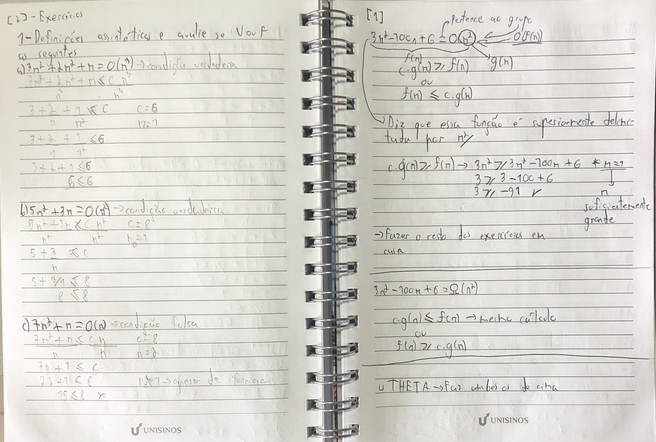
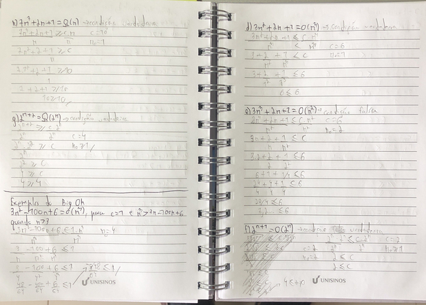
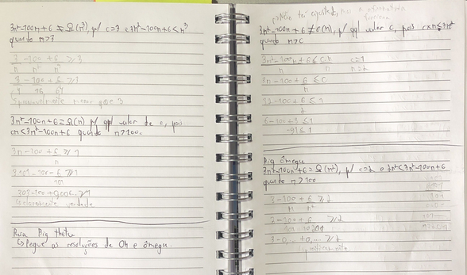

DATA:26/Agosto/2024
### Exercícios
1. Analise os trechos de código abaixo, e estime o tempo de execução para o melhor e
pior caso de cada um:

a) busca do maior valor em um array unidimensional
1. funcao maiorValor(array[] : int) {
2.      maior = array[0];
3.      para i = 1 até tamanho(array)
4.          se(maior < array[i])
5.              maior = array[i];
6.      retorna(maior);
7. }
Melhor cenário -> elemento estar na primeira posição
Pior cenário -> elemento estar na última posição
'#| operação | melhor caso | pior caso
--|----------|-------------|----------
2 | op1      | 1           | 1
3 | op2      | n           | n
4 | op3      | n - 1       | n - 1
5 | op1      | 0           | n - 1
6 | op4      | 1           | 1
melhor caso -> T(n) = op1 + nop2 + (n-1)op3 + op4 = op1 + n(op2+op3) - op3 + op4
pior caso -> T(n) = op1 + nop2 + (n-1)op3 + (n-1)op1 + op4 = n(op1 + op2) + (n-1)op3 + op4

b) trecho de cálculo
1. int aux1 = 1;
2. int aux2 = 1;
3. aux1 = aux1 * aux2;
4. aux2 = aux2 + 1;
5. aux2 = aux1 + 1;
6. aux2 = aux2 + aux1;
melhor cenário -> desimportante
pior cenário -> desimportante
'#| operação | melhor caso | pior caso
--|----------|-------------|----------
1 | op1      | 1           | 1
2 | op1      | 1           | 1
3 | op1,2    | 1           | 1
4 | op1,3    | 1           | 1
5 | op1,3    | 1           | 1
6 | po1,3    | 1           | 1
melhor caso -> T(n) = 6op1 + op2 + 3op3
pior caso -> T(n) = 6op1 + op2 + 3op3

c) busca sequencial em um array unidimensional
1. funcao buscaSequencial(array[] : int, valor : int) {
2.      achou = false;
3.      i = 0;
4.      posicao = -1;
5.      enquanto i < tamanho(array) && achou == falso
6.          se(valor == array[i]) {
7.              achou = true;
8.              posicao = i;
9.          }
10.     retorna (posicao);
11. }
melhor caso -> elemento procurado estar na primeira posição
pior caso -> elemento procurado estar na última posição
'#| operação | melhor caso | pior caso
--|----------|-------------|----------
2 | op1      | 1           | 1
3 | op1      | 1           | 1
4 | op1      | 1           | 1
5 | op2      | 2           | n+1
6 | op3      | 1           | n
7 | op1      | 1           | 1
8 | op1      | 1           | 1
10| op4      | 1           | 1
mehor caso -> T(n) = 5op1 + 2op2 + op3 + op4
pior caso -> T(n) = 5op1 + (n+1)op2 + nop3 + op4 = 5op1 + n(op2 + op3) + op2 + op4

d) somatório de valores em um array unidimensional
1. funcao somatorioArray(array[] : int) {
2.      soma = 0;
3.      i = 0;
4.      enquanto i < tamanho(array)
5.          soma = soma + vetor[i];
6.      retorna(soma);
7. }
melhor caso = pior caso -> ele precisa percorrer o vetor inteiro
'#| operação | melhor caso | pior caso
--|----------|-------------|----------
2 | op1      | 1           | 1
3 | op1      | 1           | 1
4 | op2      | n+1         | n+1
5 | op1,3    | n           | n
6 | op4      | 1           | 1
melhor caso -> T(n) = (n+2)op1 + (n+1)op2 + nop3 + op4 = n(op1 + op2 + op3) + 2op1 + op2 + op4
pior caso -> T(n) = (n+2)op1 + (n+1)op2 + nop3 + op4 = n(op1 + op2 + op3) + 2op1 + op2 + op4

e) somatório de valores de um array bidimensional (matriz de dimensões nxn)
1. funcao somatorioMatriz(matriz[][] : int) {
2.      soma = 0;
3.      i = 0;
4.      enquanto i < tamanho_linha(matriz[][]) {
5.          j = 0;
6.          enquanto j < tamanho_coluna(matriz[][]) {
7.              soma = soma + matriz[][];
8.              j = j + 1;
9.          }
10.         i = i + 1;
11.     }
12.     retorna(soma);
13. }
melhor caso = pior caso -> ele precisa percorrer a matriz inteira
'#| operação | melhor caso | pior caso
--|----------|-------------|----------
2 | op1      | 1           | 1
3 | op1      | 1           | 1
4 | op2      | n+1         | n+1
5 | op1      | n           | n
6 | op2      | n²+n        | n²+n
7 | op1,3    | n²          | n²
8 | op1,3    | n²          | n²
10| op1,3    | n           | n
12| op4      | 1           | 1
melhor caso -> T(n) = (2n²+2n+2)op1 + (n²+2n+1)op2 + (2n²+n)op3 + op4 = n²(2op1 + op2 + 2op3) + n(2op1 + 2op2 + op3) + 2op1 + op2 + op4
pior caso -> T(n) = (2n²+2n+2)op1 + (n²+2n+1)op2 + (2n²+n)op3 + op4 = n²(2op1 + op2 + 2op3) + n(2op1 + 2op2 + op3) + 2op1 + op2 + op4

#### Exercício extra
1. Analise o trecho de código abaixo, e estime o tempo de execução para o melhor e
pior casos:
a) algoritmo de ordenação por inserção
1. função OrdenaPorInserção(vetor[]:int) {
2.      para j = 1 até tamanho(vetor) {
3.          chave = vetor[j]
4.          i = j - 1
5.          enquanto i >= 0 e vetor[i] > chave { -> essa linha é um somatório
6.              vetor[i + 1] = vetor[i]
7.              i = i – 1
8.          }
9.          vetor [i + 1] = chave
10.     }
11. }
melhor caso -> vetor já ordenado
pior caso -> vetor inversamente ordenado
'#| operação | melhor caso | pior caso
--|----------|-------------|----------
2 | op1      | n           | n
3 | op2      | n           | n-1
4 | op2,3    | n-1         | n-1
5 | op4      | n-1         | n²+n
6 | op2      | 0           | n²
7 | op2,3    | 0           | n²
9 | op2      | n-1         | n-1
melhor caso -> T(n) = nop1 + 3(n-1)op2 + (n-1)op3 + (n-1)op4 = n(op1 + 3op2 + op3 + op4) - 3op2 - op3 - op4
pior caso -> T(n) = nop1 + (2n²+3n+3)op2 + (n²+n-1)op3 + (n²+n)op4 = n²(2op2 + op3 + op4) + n(3op2 + op3 + op4) + 3op2 - op3

## Pergutas
- Não existem algoritmos que mudam o bigO dependendo da entrada/execução? - não, existe um bigO para cada ponto da função
- O theta é a média do upper e do lower? - não, theta é a aplicação dos dois e no cenário que ambos funcionam
- Existem valores de O não citados na aula, certo? Eles são muito específicos para serem referenciados ou por que os exemplos (ordenação) caem nos citados? - Existem, mas eles são um pouco mais complexos e não são tão pertinentes nessa altura do campeonato
- a definição é dada olhando o algoritmo mesmo
- constantes normalmente são maiores do que 1 (principalmente c)

DATA: 02/Setembro/2024
# Análise da Complexidade de Algoritmos Iterativos
Em alguns casos não é possível simplesmente fazer o método da contagem e esperar pelo melhor, volta e meia temos algoritmos que diferenciam seu tamanho dependendo da iteração, fator que gera somatórios.

Somatórios servem de implementações de *for loops* para situações onde a quantidade de iterações varia conforme a progressão da execução.
A explicação mais simples de como um somatório funciona é realmente um *for*. O valor de baixo é a variável declarada, acima é a condição de limite e sempre vai ser i++.
A notação do somatório pode ser um tanto complexa, veja: 
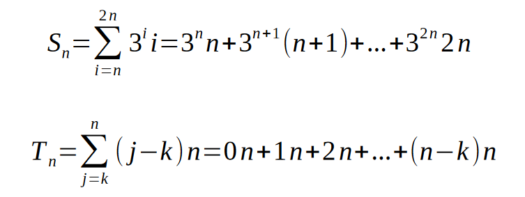

- somatório 
    - a quantidade de iterações dos laços internos mudam conforme o codigo roda 
## Somatórios
- Sigma maiúsculo
    - embaixo é origem
    - emcima é destino
- todo laço de repetição é um somatório (iteração)
    - recursividade é um somatório tbm
- x tem todos os valore iguais

### propriedades
- Associatividade
    - somatórios com intervalos iguais tem a mesma variável
    - a soma de somatórios é um somatório com soma dentro
- distributividade
    - constante multiplicando o valor alterado td iteração
    - joga isso pra fora do somatório q dá no mesmo
- comutatividade
    - ordem de soma do somatório n importa de verdade
- combinação
    - quando o término de um é o início do outro
    - menor início até o maior final
    - faz uma soma extra com a variável valendo o valor do meio (que "ligaria" os dois somatórios)
- separação
    - dá pra tirar um dos termos do somatório e somar por fora (dá no mesmo)
    - precisa cuidar o intervalo do somatório
- reindexação

### formas/fórmula fechadas
- não tem forma padrão de montar
    - pelo menos pros complexos
- único pra cada somatório
- *método da perturbação*
    - aplica todas as propriedades possíveis
- se encontra pra n+1 acha pra tds os anteriores
- normalmente
    - tira o primeiro do somatório (sai o n+1 extra)
    - readequa o índice na variável (i+1)
        - precisa disso aqui já que tirou a primeira e a última iteração
    - como agr tem uma soma +1 no exponencial, dá pra arrancar o x¹ fora e tratar ele como constante, jogando fora do somatório
    - pronto, somatório inicial, agr dá pra jogar
    - troca o somatório pro S_n e faz uma equação simples
- o objetivo é chegar no somatório original e tirar ele pelo S_n
- o teste é escolher valores de x e n e testar se os dois funcionam
    - troque por uns valore baixos
- simplificação n altera a resposta
- funciona pra casos mais simples

### exercícios
[2 ]
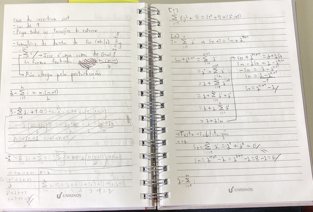
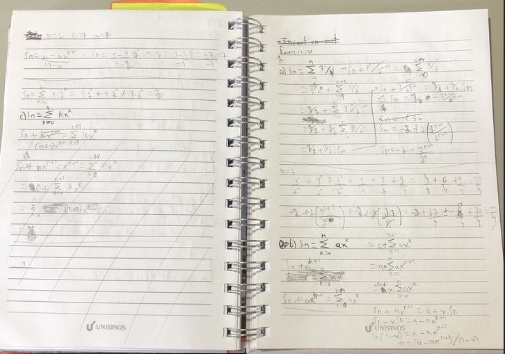

DATA:09/Set/2024
### exercícios
[1 ]
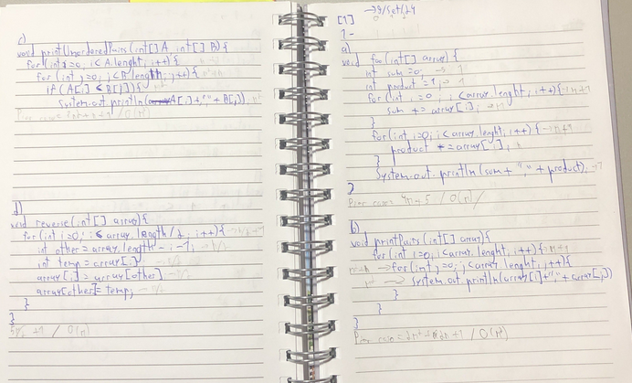
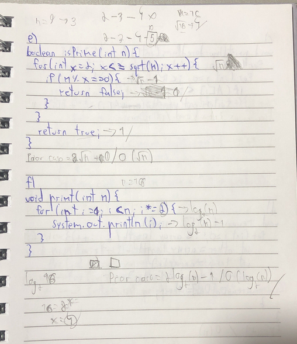

DATA: 16/Setembro/2024
# Recorrências
Esse tipo de arranjo matemático e algoritmico é normalmente encontrado em problemas recursivos.
Nesses casos, se entende que exista um caso base e outro recursivo, por exemplo:
x^n = | 1,n=0
      |x.x^(n-1),n>0
Para esse cálculo, devemos:
– identificar qual é o “n” (tamanho do problema);
– identificar o caso base;
– identificar qual é o tempo do caso base;
– identificar o termo geral da recorrência.

No exemplo anterior, "x^(n-1)" seria a nossa equação recursiva sendo repetida "x" vezes.

- equações recorrentes
- é tipo uma recursão
- necessário um conhecimeto parcial sobre o resultado
- vai formar um sistema de equações
- sempre identifique n, o caso base, o tempo do caso base e o termo geral 
    - caso base e geral ficam juntos
- precisa validar a equação enconrada com o caso base
    - depois olha pro caso indutivo
    - joga o n lá dentro

Para a resolução de tais equações, utiliza-se o **Método da Substituição**

## Método da substituição
Dada uma relação de recorrência T(n):
– substitua n por diferentes valores, até que seja
identificado um padrão;
– escreva uma fórmula em termos de n e o número
de substituições i;
– escolha um i para ser o caso base;
– resolva a soma resultante.

Essa abordagem funciona para boa parte dos problemas, mas não todos, fique atento.
Para um caso hipotético, temos que:
T(n) = |    c,n=1
       |T(n-1)+d,n>1
Sendo que para todo n>1 T(n-1)+d; então nosso primeiro passo seria encontrar um n suficientemente grande:
T(n) = T(n - 1) + d
T(n - 1) = T(n - 2) + d
T(n - 2) = T(n - 3) + d
.
.
.
T(2) = T(1) + d
T(1) = c

À partir daí implementar quantas substituições forem necessárias na mesma fórmula até encontrarmos um padrão de alteração:
T(n) = T(n - 1) + d
     = (T(n – 2) + d) + d
     = T(n – 2) + 2d
     = (T(n – 3) + d) + 2d
     = T(n – 3) + 3d

Depois de algumas substituições (i), podemos encontrar um padrão baseado em repetições de i:
T(n) = T(n - i) + id

Agora, queremos que o T(n - i) torne-se T(1), de modo á cair no caso c,n=1 e podermos retirar o T(n - i) da jogada. Nesse caso, nosso i=n-1:
T(n) = T(1) + d(n - 1)
     = dn + c - d

### Provas
Isso feito, agora precisamos provar que a soluação está correta. Comece usando a nova fórmula para encontrar T(1):
T(1) = dn + c – d
     = d * 1 + c – d
     = d + c – d
     = c -> esse resultado precisa necessariamente ser igual ao caso base, aqui c,n=1.

Agora podemos induzir a nova fórmula para identificar seu comportamento com n+1:
T(n + 1) = dn + c – d
         = d(n + 1) + c – d
         = dn + d + c – d
         = dn + c

Depois podemos pegar nossa fórmula original (T(n-1)+d,n>1) e teambém induzí-la a n+1. Essa e a anterior precisam ter o mesmo resultado:
T(n + 1) = T(n - 1) + d
         = T(n + 1 - 1) + d
         = T(n) + d
         = dn + c - d + d
         = dn + c

### Exercícios

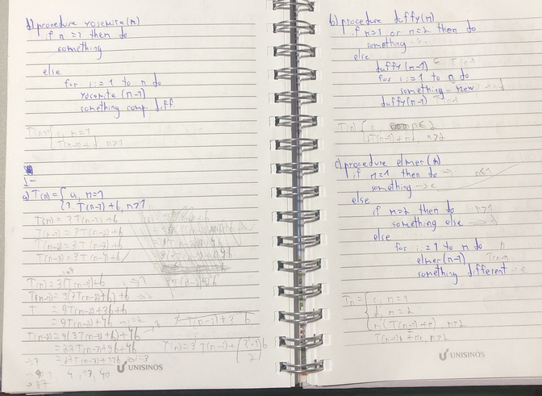
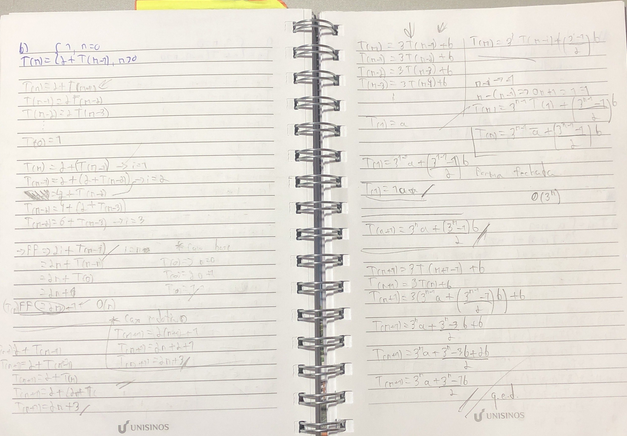

DATA: 30/Setembro/2024
### Exercícios de revisão
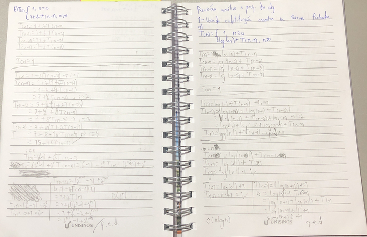
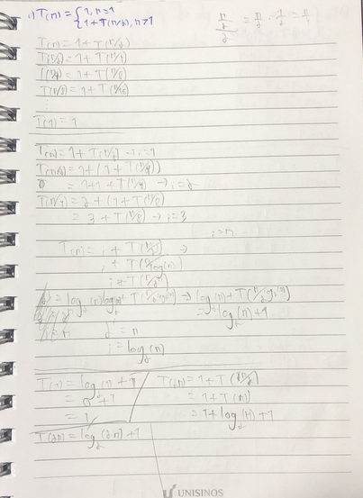

DATA: 21/Outubro/2024
# àrvores de recorrência
Essas árvores são "geradores" ou representantes da recorrência de um algoritmo.
As mais simples posuem apenas uma "branch" e são relativamente lineares e bastante semelhantes ao pensamento costumeiro da recursão (adiciona as chamadas na pilha e vai retornando).
Uma observação interessante é que parte da montagem da *árvore* é dada pelo multiplicador da função recursiva. Pro exemplo, em T(n−1) a árvore é **linear** (segue um galho só, como se sempre estivesse na *main*); mas em 2*T(n−1) temos uma árvore **binária** (cada nodo tem 2 filhos).
Fique com o exemplo de "Hello World" das árvores de recorrência:
T (n)=| 1, n=0
      |2+T (n−1), n>0
**àrvore de recorrência**
T(n) = custo 2
T(n-1) = custo 2
T(n-2) = custo 2
T(n-3) = custo 2 -> n chamadas com custo 2 - **2n**
...
T(1) = custo 2
T(0) = custo 1 -> custo 1 quando n=0; ou seja T(n) = 2n + 1 -> **O(n)**

- representação de problema rescursivo
- no problema ele pega logaritmos
    - fatoração por logaritmo
    - log(n!) <= nlog(n)
- aqui precisa se dividir o problema em partes menores e montar uma árvore de recursão dos dados
- não necessariamente o limite está bem representado nos limites do algoritmo
    - limite justo é o theta
- com tantas chamadas de recursão se abre tantas branches na árvore
- o custo é cumulativo com a quantidade de brnaches
- sempre que houver aumento de expoente se usa logaritmo (aqui se usa log como log_2)

## Teorema mestre
Esse teorema pode resolver todos as recursões com uma fórmula **T(n) = aT(n/b) + f(n)**. Divide e conquista para resolver o problema com mais velocidade.
a >= 1 e b > 1, necessariamente.
Dessa forma, encontrar os limites assintóticos vira um trabalho de analisar uma tabela, veja:
● Se f(n) = O(n^(log(_b(a−ϵ)))) para uma constante ϵ > 0, então T(n) = Θ(n^(log_b a)).
● Se f(n) = Θ(n^(log_b a)), então T(n) = Θ(n^(log_b a lg n)). -> *Lembre-se que lg, em computação, equivale a log_2 (base 2)* 
● Se f(n) = Ω(n^(log_b(a+ϵ))) para uma constante ϵ > 0, e se af(n/b) <= cf(n) para uma constante c < 1 e todos os n suficientemente grandes, então T(n) = Θ(f(n)).

*A maioria dos resultados estão em theta, então ambos os limites estão incluídos.*
*Lembre-se de que os resultados são baseados nos limites da equação sozinha para o esquema recursivo.*

- é um formato de equação pra encontrar comportamento assintótico
- só funciona pra divisão e conquista
    - se identifica por divisões dentro das fórmulas
- se n der inteiro arredonda pra baixo ou pra cima
    - geralmente é pra cima
- essa equação mestre é só um arranjo da equação recursiva
- nesses casos se calcula theta, dessa forma, se chega em big O e ômega

# Técnicas de projetos de algoritmos: Divisão e conquista
É uma técnica bastante simples de entender e bastante utilizada por diversos algoritmos, normalmente recursivos (tais como o mergesort); ela consiste em:
● Pegar um problema de entrada grande
● Quebrar a entrada em pedaços menores → divisão - *quebrar em subproblemas menores*
● Resolver cada pedaço separadamente → conquista - *resolver os problemas recursivamente*
● Combinar os resultados → combinação - *combinar as soluções todas e compor um resultado*

- quebra o problema em partes menores para resolver - divisão
- ao resolver se conquista - conquista
- junta tudo no final - combinação
- dá pra repetir as mesmas iterações não importando o tamanho da instância
- decisão de divisão e tomada de ações precisa ser padrão para toda instãncia
- usa recursividade
- geralmente é com recursividade, mas depende
    - quando é necessário descer muitos níveis de recursão se evita utiliza pra n dar stackoverflow
- 

### Referências
- The Algorithm Design Manual (Skiena) 
    - Capítulo 1 - Introduction to Algorithm Design
    - Capítulo 2
        - Seção 2.1 -> The RAM Model of Computatio
        - Seção 2.2 -> The Big Oh Notation
        - seção 2.3 -> Growth Rates and Dominance Relations
- Introduction to Algorithms (Cormen, et al.)
    - Capítulo 1 - The role of Algorithms in Computing
    - Capítulo 2
        - Seção 2.1 -> Insertion Sort
        - Seção 2.2 -> Analyzing Algorithms
    - Capítulo 3
        - Seção 3.1 -> Asymptotic Notation
- Lecture Notes on Algorithm Analysis and Computational Complexity (Ian Parberry).
- CORMEN, Thomas H. et al. Introduction to Algorithms. 3. ed. Cambridge: MIT, 2009.
- Solving Recurrences. https://web.stanford.edu/class/archive/cs/cs161/cs161.1168/lecture3.pdf
- Material de aula. Prof. Gilberto Irajá Müller (Unisinos).