Anotações gerais da cadeira

# Pertinências
- infinito não é número
    - o máximo q dá pra fzr é aproximar
    - esse é basicamente o problema do denominador ser zero
- infinito é sempre aberto
- se ainda existir linha de função onde tem marcação de aberto, segue como se fosse fechado
- o conjunto dos reais permite apenas responder quem é maior q outro
- retas q passam na origem são as lineares (retas)
- dois pontos são necessarios (2 variáveis) pq passam infinitas retas por um ponto só
    - só uma reta com aquela direçao passa por esses dois pontos
- Um software fácil de mexer é: https://www.geogebra.org/classic?lang=en
- a maioria dos avanços matemáticos são pra aumentar a margem de lucro e expandir negócios (tentativas comerciais)
- 0^0 é uma indeterminação matemática
- tempo zero é sempre o tempo onde a aplicação começa a ser considerada
- é interessante sempre manter o padrão e usar logaritmo natural pra troca de bases

# Formuletas interessantes:
- f(x) = ax + b
- a = (y2 - y1)/(x2 - x1)
- y - y1 = a(x - x1)
- f(x) = ax² + bx + c
- x = (-b +- √(b² - 4ac)) / 2a
- Xv = -b/2a
- Yv = -delta/4a -> -(b² - 4ac)/4a
- f(x) = e^x -> aparece bastante na natureza

DATA: (26/Fev/24)
# Estudo de Funções
## Conjuntos
- Eixo em flecha (não os vetores) é pra dar direção e sentido (igual um vetor)
### Pequena lista dos conjuntos básicos de números para consulta:
- Naturais (IN)
    - Lembrando dos naturais sem o zero tbm existe (IN#)
Números simples >= a zero
- Inteiros (Z)
    - Inteiros sem o zero também existe (Z#)
Numerais simples positivos e negativos
- Racionais (Q)
Designação entre razões de inteiros.
Vale lembrar que denominador zero não é aceito - resultado dá infinito
- Irracionais
Inclui os números não periódicos. Pi, Euler, algumas raízes, etc
- Reais (IR)
Inclui todos os conjuntos anteriores

## Intervalos
- conjunto de reais com deseigualdade
- [intervalo de referência de img 1]
- intervalo é sempre crescente
- Todo intervalo é infinito mas a maioria é limitado
    - intervalos ilimitados vão até o infinito
- cuidar q entre chaves é conjunto e n intervalo - {conjunto} - "[intervalo]"
- é importante ter cuidado na hora de marcar os intervalos e n deixá-los com cara de conjuntos
### Pequena lista:
Imagine uma linha com dois limites
- aberto
dois lados abertos
- fechado
dois lados fechados
- semi-aberto à direita
só direita aberta
- semi-aberto à esquerda
só esquerda aberta
- bordas infinitas
em alguns casos dá pra ir até o infinito

## Funções propriamente ditas
- funções trabalham com imagens e domínios
Essas funções seguem as regras básicas de formulações de Domínio e Imagem vistas no Ensino Médio
- normalmente o eixo y é a imagem
- Imagem em função do domínio (y em função do x, normalmente)
- lei:
    - 150x
    - identificação da função
    - f(x) = y é considerado uma lei
-  função:
    - y = 150x
    - é o fazer da lei
- dominio abrange todos os conjuntos de valores pra x
    - muita mão calcular tudo
- restrições
    - tira só o q n faz sentido colocar
    - e.g.: y=1/x -> Dom:lR - {0}
    - precisa fzr as provas (até bhaskara) pra n ficar zerado
    - raiz de denominador par 
        - n é lR, vai entrar no domínio de números complexos
        - resultado precisa ser >= 0
    - logaritmos naturais
        - logaritimando precisa ser positivo pra ser real (IR)
        - y = ln(x+8) -> x+8 > 0 -> x > 0
### Valor numérico de função 
- valor de y quando x e alguém

## Gráfico de uma função
Qualquer função na matemática terá um gráfico para lhe representar. Todavia, tenha em mente que nem todo gráfico tem uma função.
Gráficos não precisam necessariamente ter uma escala correta, apenas precisam estar coerentes escritos dentro do plano cartesiano.
### função polinomial do 1° grau
- f(x) = ax + b
- a e b são IR
- se a=0
    - f(x) = 3 -> ainda é uma função (consatante)
    - valor de x é qql coisa
    - 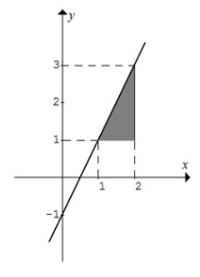
- a!=0 e b=0
    - linear
- a!=0 e b!=0
    - função afim
- pra todos esses o gráfico é uma reta sempre
- tirando a constante, tds as retas tem algum grau de inclinação
    - 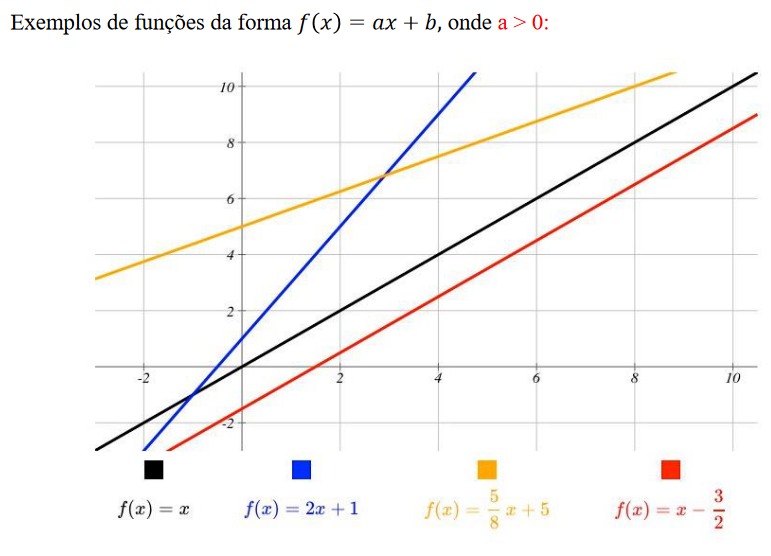
    - quem define a inclunação da reta é o a (taxa de variação)
        - 'a' é uma constante assim como 'b'
        - coeficiente angular
    - taxa de variação positiva é crescer e negativa o contrário (dã)
- coeficientes linear vai ser o 'b'
    - apesar de poder ser negativo, nas aplicações ele pode ser considerado uma posição inicial 
        - evitar resultados negativos em cenários em que eles não são possíveis
- domínios dessa função são normalmente os IR.
- y-y1 = a(x-x1)
    - sem numeração é genérico
    - pra chegar no a faz:
        a=(x2-x1)/(y2-y1)
- Com dois pontos sempre vai dar pra traçar a reta
- sempre dá o double check pra ver se a variação faz sentido com o gráfico
- Identificação da função sempre pode se dar pela definição de dois pontos. Veja, existem unfinitas retas dentro do plano, mas apenas uma com os dois pontos juntos.
Exercícios:
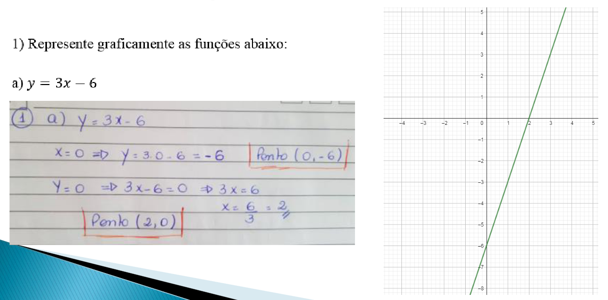
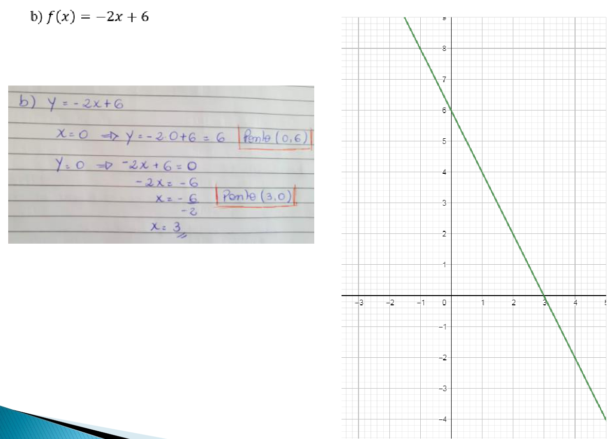
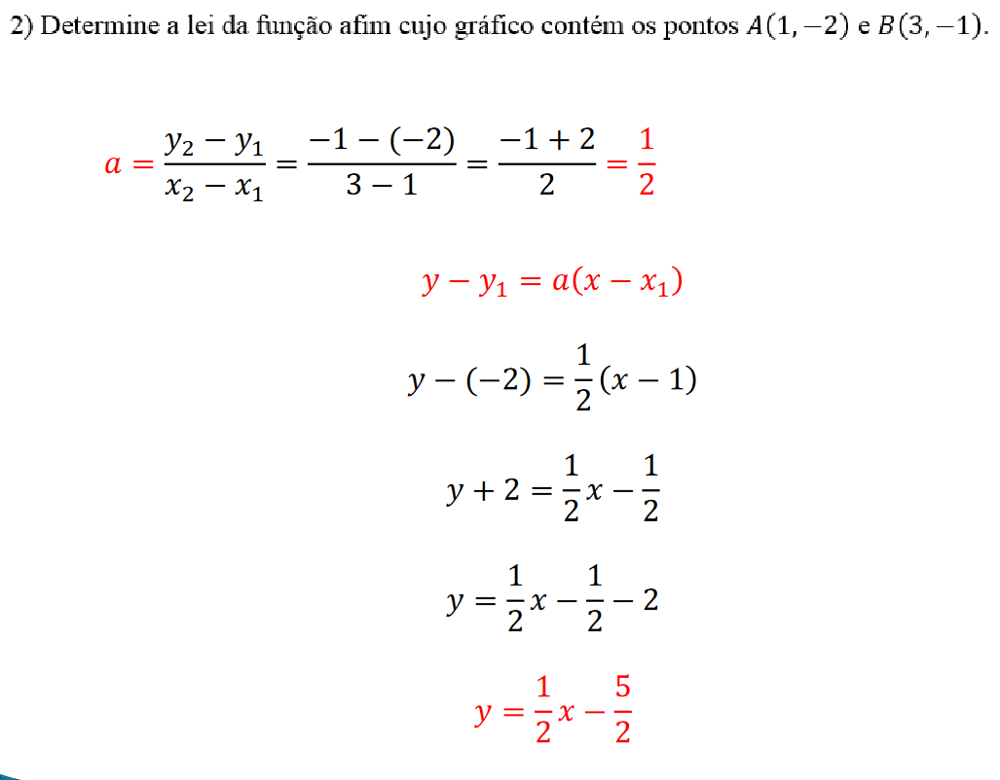
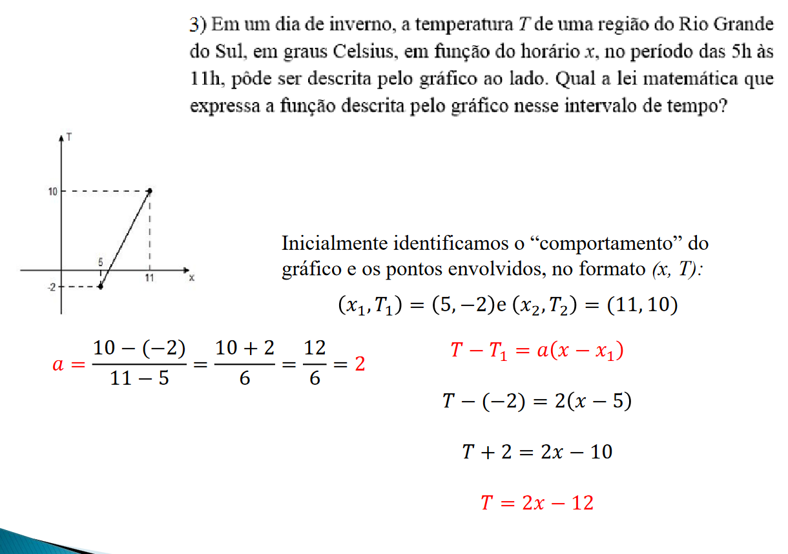

## Funções polinomiais no 2° grau
- f(x) = ax² + bx + c com a != 0
- gráfico parabólico
- n adianta ficar fzr tabela de pontos pra lidar com parábolas
- precisa ver 3 pontos apenas
    - pontos q eventualmente interceptem o eixo x
        - n necessariamente pega
        - se pega no eixo x são as raízes
        - quando y = 0
        - ax² + bx + c = 0 -> fórmula de bháskara é necessária
        - se os coeficientes tem números reais sempre tem duas raízes
            - sempre distintas, iguais ou complexas
    - coordenada de vértice
- dois lados dela são simetricos
    - se as duas raízes são inteiros a coord do vértice é o meio termo dos dois
- parábolas tem foco e uma diretriz
    - dentro dos faróis sempre tem um espelho parabólico
- valor de a positivo mostra concavidade pra cima
- [colocar imagem de referência 3]
- a é sempre coeficiente de x²
- raízes não reais indicam q a parábola n bate no x
### Vértice
Ponto mais baixo ou o mais alto de uma parábola, à depender de sua formação.
É possível encontrar as coordenadas (X, Y) através das fórmulas:
- Xv = (-b)/(2a)
- Yv = -(b² - 4ac)/4a

#### Exemplos
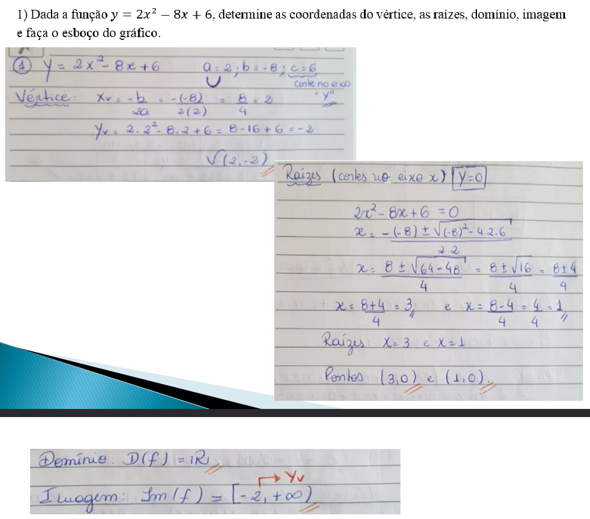
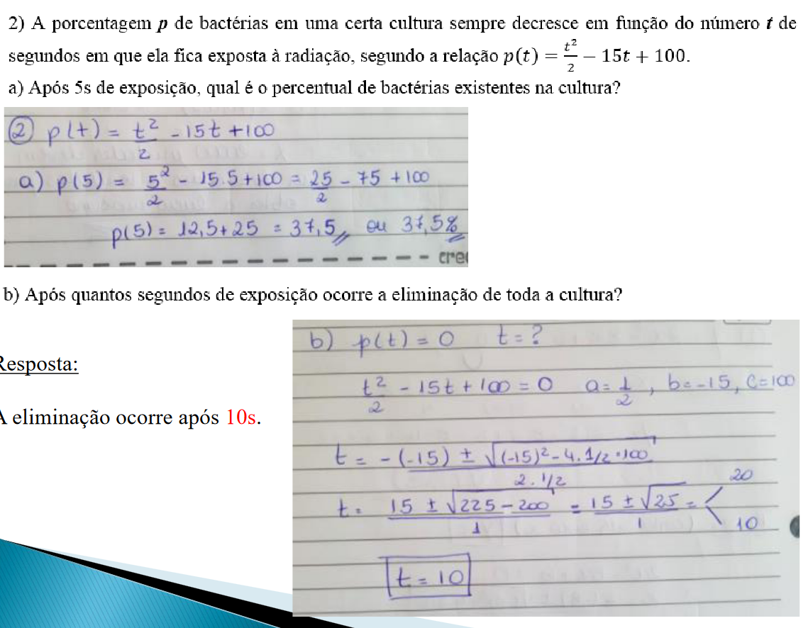
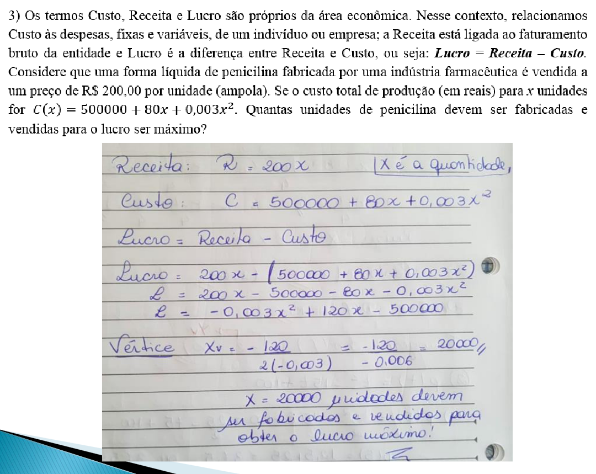

### Exercícios Aula

### Exercícios extras
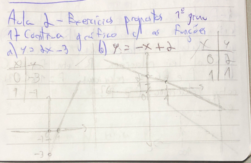
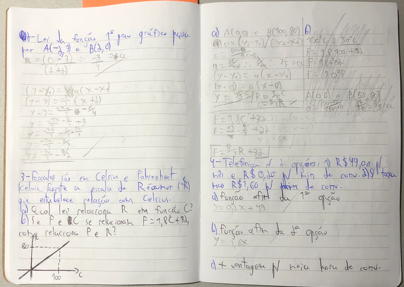
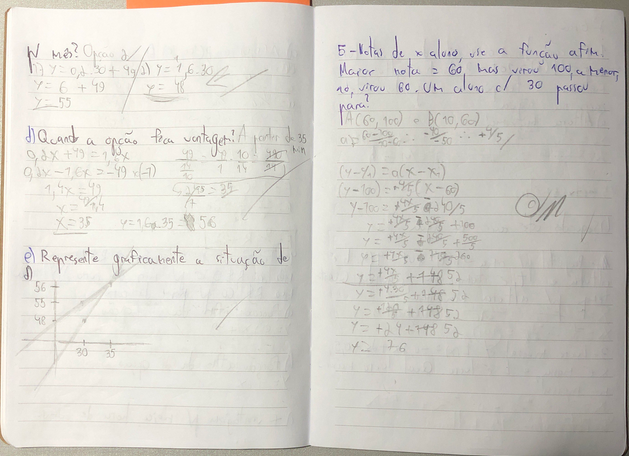
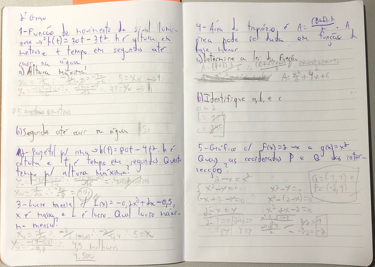

DATA: 11/03/24
## Funções exponenciais e logaritmicas: Definição, propriedades e gráficos
### surgimento do exponencial e logaritmo
- Uma é a inversa da outra
    - n necessariamente o inveso
    - Uma função inversa da outra
- [Desenho 1 caderno]
### Exercícios
[imgs exercício marker 2]
### A função exponencial
- modelagem de crescimento algo de algo
- é basicamente um cálculo para uma das curvas matemáaticas (no caso a exponencial)
[Exercício marcador 3]
- N é uma reta
    - vai ser uma curva mto loca
- geralmente a base é fator de crescimento
[Exemplo marcador 4]
- Expoente negativo n troca sinal de ngm, mas de fato o resultado é bastante pequeno
- nunca alcança o zero (expoente precisaria ser -infinito)
[Exercício marcador 5]
### Função exponencial natural
- base é o número de euler
- f(x) = e^(kz), k!=0 ão usadas como modelos de decaimento exponencial
- para f(x) = e^x, qql reta tangente, o coeficiente angular sempre tem o valor da ordenada
#### Número de euler
- e = 2.71828...

x       | 1+(1/x) | (1+(1/x))^x
:------:|:-------:|:-----------:
1       |2        |2
10      |1.1      |2.5937424601
100     |1.01     |2.7048138294215260932671947108075
1000    |1.001    |2.7169239322358924573830881219476
10000   |1.0001   |2.7181459268252248640376646749131
100000  |1.00001  |2.718268237174489668035064824426
1000000 |1.000001 |2.7182804693193768838197997084544

- lim(inf)(1+(1/x))^x

### Logaritmos
Iniciaram simplificando alguns cálculos mais complexos
- dá pra dimiur os graus de dificuldade das operações
- lê-se sempre pela linha
- depende do conhecimento de potências
    - a definição é basicamente uma potência dentro dela
- 2^x = 4
    - por qual expoente eleva pra ser verdadeiro?
    - log_2 4 = 2
    - a moral é perguntar quantas vezes precisa potencializar pra dar o resultado
- log_b a = X <=> b^x = a
- log de 'a' precisa necessariamente ser positivo
    - exponencialmente a imagem n fica negativa
    - pra evitar cair abaixo de zero nas ordenadas precisa manter > 0 (logaritimando positivo)
#### condições de existência
- a > 0
- b > 0 também
#### exercício
[Exercicios marcação 6]
#### Sistemas de logaritmos
- todos os números reais positivos
##### sistemas de logaritmos decimais
- tudo com base 10
- logaritmos comuns ou de Briggs
- indicação de log x (base 10)
- exemplos
[exemplo marcação 7]
##### sistemas de logaritmos naturais ou neperianos
- base com o número de euler
- podem fzr simplificações com eles mesmos
- exemplos
[exemplos marcaçã 8]
#### propriedades operatórias
- uma lista aqui
- logaritmo do produto dá pra abrir na soma
    - da divisão na subtração
    - da potência na multiplicação (produto)
- sempre dá pra fzr a mudança de base
- normalmente se usa o logaritmo natural mesmo
- log_3 5 = ln(5)/ln(3) -> sempre dá pra fzr td baseado nos logaritmos naturais -> 1.464973...
    - log 5/log 3 vai dar a mesma coisa
    - dá pra escolher qql base pra calcular
- na maioria das operações de usa base euler
### exercícios
[exercícios marcação 9]