Anotações gerais da cadeira

# Pertinências
- infinito não é número
    - o máximo q dá pra fzr é aproximar
    - esse é basicamente o problema do denominador ser zero
- infinito é sempre aberto
- se ainda existir linha de função onde tem marcação de aberto, segue como se fosse fechado
- o conjunto dos reais permite apenas responder quem é maior q outro
- retas q passam na origem são as lineares (retas)
- dois pontos são necessarios (2 variáveis) pq passam infinitas retas por um ponto só
    - só uma reta com aquela direçao passa por esses dois pontos
- Um software fácil de mexer é: https://www.geogebra.org/classic?lang=en
- a maioria dos avanços matemáticos são pra aumentar a margem de lucro e expandir negócios (tentativas comerciais)
- 0^0 é uma indeterminação matemática
- tempo zero é sempre o tempo onde a aplicação começa a ser considerada
- é interessante sempre manter o padrão e usar logaritmo natural pra troca de bases
- limites de polinômios
    - eles são sempre contínuos
    - o limite de tendência sempre será o valor no ponto
- limite de uma constante é sempre a constante
- limite de uma soma é a soma dos limites
- limites são resultados de y, de uma função, caso ele exista
- se o limite n zera o denominador ou mata algum dos radicandos, é só substituir pelo limite
- problemas de limites acontecem nas descontinuidades
- derivadas
    f(x) | f'(x)
    ------------
    x²   | 2x
    x³   | 3x²
    x^4  | 4x³
    x^20 | 20x^19
    x^-3 | -3x^-4
    1/x7 | x^-7
  -7/x^8 | -7x^-8

# Formuletas interessantes:
- f(x) = ax + b
- a = (y2 - y1)/(x2 - x1)
- y - y1 = a(x - x1)
- f(x) = ax² + bx + c
- x = (-b +- √(b² - 4ac)) / 2a
- Xv = -b/2a
- Yv = -delta/4a -> -(b² - 4ac)/4a
- f(x) = e^x -> aparece bastante na natureza
- a = (f(X_0+h)-f(X_0))/h
- lim(x->0) = (f(X_0+h)-f(X_0))/h

DATA: (26/Fev/24)
# Estudo de Funções
## Conjuntos
- Eixo em flecha (não os vetores) é pra dar direção e sentido (igual um vetor)
### Pequena lista dos conjuntos básicos de números para consulta:
- Naturais (IN)
    - Lembrando dos naturais sem o zero tbm existe (IN#)
Números simples >= a zero
- Inteiros (Z)
    - Inteiros sem o zero também existe (Z#)
Numerais simples positivos e negativos
- Racionais (Q)
Designação entre razões de inteiros.
Vale lembrar que denominador zero não é aceito - resultado dá infinito
- Irracionais
Inclui os números não periódicos. Pi, Euler, algumas raízes, etc
- Reais (IR)
Inclui todos os conjuntos anteriores

## Intervalos
- conjunto de reais com deseigualdade
- [intervalo de referência de img 1]
- intervalo é sempre crescente
- Todo intervalo é infinito mas a maioria é limitado
    - intervalos ilimitados vão até o infinito
- cuidar q entre chaves é conjunto e n intervalo - {conjunto} - "[intervalo]"
- é importante ter cuidado na hora de marcar os intervalos e n deixá-los com cara de conjuntos
### Pequena lista:
Imagine uma linha com dois limites
- aberto
dois lados abertos
- fechado
dois lados fechados
- semi-aberto à direita
só direita aberta
- semi-aberto à esquerda
só esquerda aberta
- bordas infinitas
em alguns casos dá pra ir até o infinito

## Funções propriamente ditas
- funções trabalham com imagens e domínios
Essas funções seguem as regras básicas de formulações de Domínio e Imagem vistas no Ensino Médio
- normalmente o eixo y é a imagem
- Imagem em função do domínio (y em função do x, normalmente)
- lei:
    - 150x
    - identificação da função
    - f(x) = y é considerado uma lei
-  função:
    - y = 150x
    - é o fazer da lei
- dominio abrange todos os conjuntos de valores pra x
    - muita mão calcular tudo
- restrições
    - tira só o q n faz sentido colocar
    - e.g.: y=1/x -> Dom:lR - {0}
    - precisa fzr as provas (até bhaskara) pra n ficar zerado
    - raiz de denominador par 
        - n é lR, vai entrar no domínio de números complexos
        - resultado precisa ser >= 0
    - logaritmos naturais
        - logaritimando precisa ser positivo pra ser real (IR)
        - y = ln(x+8) -> x+8 > 0 -> x > 0
### Valor numérico de função 
- valor de y quando x e alguém

## Gráfico de uma função
Qualquer função na matemática terá um gráfico para lhe representar. Todavia, tenha em mente que nem todo gráfico tem uma função.
Gráficos não precisam necessariamente ter uma escala correta, apenas precisam estar coerentes escritos dentro do plano cartesiano.
### função polinomial do 1° grau
- f(x) = ax + b
- a e b são IR
- se a=0
    - f(x) = 3 -> ainda é uma função (consatante)
    - valor de x é qql coisa
    - 
- a!=0 e b=0
    - linear
- a!=0 e b!=0
    - função afim
- pra todos esses o gráfico é uma reta sempre
- tirando a constante, tds as retas tem algum grau de inclinação
    - 
    - quem define a inclunação da reta é o a (taxa de variação)
        - 'a' é uma constante assim como 'b'
        - coeficiente angular
    - taxa de variação positiva é crescer e negativa o contrário (dã)
- coeficientes linear vai ser o 'b'
    - apesar de poder ser negativo, nas aplicações ele pode ser considerado uma posição inicial 
        - evitar resultados negativos em cenários em que eles não são possíveis
- domínios dessa função são normalmente os IR.
- y-y1 = a(x-x1)
    - sem numeração é genérico
    - pra chegar no a faz:
        a=(x2-x1)/(y2-y1)
- Com dois pontos sempre vai dar pra traçar a reta
- sempre dá o double check pra ver se a variação faz sentido com o gráfico
- Identificação da função sempre pode se dar pela definição de dois pontos. Veja, existem unfinitas retas dentro do plano, mas apenas uma com os dois pontos juntos.
Exercícios:

## Funções polinomiais no 2° grau
- f(x) = ax² + bx + c com a != 0
- gráfico parabólico
- n adianta ficar fzr tabela de pontos pra lidar com parábolas
- precisa ver 3 pontos apenas
    - pontos q eventualmente interceptem o eixo x
        - n necessariamente pega
        - se pega no eixo x são as raízes
        - quando y = 0
        - ax² + bx + c = 0 -> fórmula de bháskara é necessária
        - se os coeficientes tem números reais sempre tem duas raízes
            - sempre distintas, iguais ou complexas
    - coordenada de vértice
- dois lados dela são simetricos
    - se as duas raízes são inteiros a coord do vértice é o meio termo dos dois
- parábolas tem foco e uma diretriz
    - dentro dos faróis sempre tem um espelho parabólico
- valor de a positivo mostra concavidade pra cima
- [colocar imagem de referência 3]
- a é sempre coeficiente de x²
- raízes não reais indicam q a parábola n bate no x
### Vértice
Ponto mais baixo ou o mais alto de uma parábola, à depender de sua formação.
É possível encontrar as coordenadas (X, Y) através das fórmulas:
- Xv = (-b)/(2a)
- Yv = -(b² - 4ac)/4a

#### Exemplos

### Exercícios Aula

### Exercícios extras

DATA: 11/03/24
## Funções exponenciais e logaritmicas: Definição, propriedades e gráficos
### surgimento do exponencial e logaritmo
Normalmente as funções extrapolam os fatos que as montaram.
Cálculos exponenciais e logaritmicos eram usados muito mais para cálculos financeiros e taxas de crescimnento que qualquer outra coisa.
- Uma é a inversa da outra
    - n necessariamente o inveso
    - Uma função inversa da outra

Propriedades           | Exemplo
:---------------------:|:------------------------:
a^m . a^n = a^(m+n)    | 2³ . 2^5 = 2^(3+5) = 2^8
a^m/a^n = a^(m-n)      | 3^7/3² = 3^(7-2) = 3^5
(a^m)^n = a^(mn)       | (2^5)³ = 2^(5.3) = 2^15
(a/b)^m = a^m/b^m      | (3/5)² = 3²/5² = 9/25
a^m . b^m = (ab)^m     | 2^5 . 3^5 = (2.3)^5 = 6^5
a^0 = 1; a != 0        | 999^0 = 1
m^-m = 1/a^m           | 2^-3 = 1/2³ = 1/8
Atenção com sinais     | (-2)² = (-2).(-2) = 4 // -2² = -(2.2) = -4
^n√a . ^n√b = ^n√(a.b) | ³√2.³√4 = ³√(2.4) = ³√8
^n√a/^n√b = ^nv(a/b)   | ³√16/³√2 = ³√(16/2) = ³√8
^n√a^m = a^(m/n)       | ^5√2³ = 2^(3/5)
^m√(^n√a) = ^(mn)√a    | ³√^5√2 = ^(3.5)√2 = 15√2
^n√a^m = (^n√a)^m      | ³√3² = (³√5)²
^n√0 = 0               | ³√0 = 0
b.^n√a = ^n√(a.b^n)    | 2.³√5 = ³√(5.2³) = ³√40
Atenção com módulos    | se a raiz e par o resultado é módulo, se raiz ímpar o resultado carrega o sinal

### Exercícios
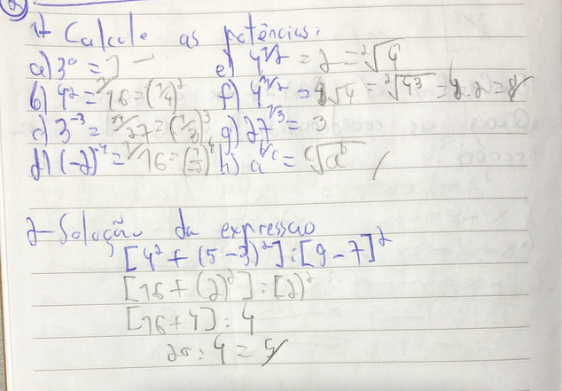

### A função exponencial
- modelagem de crescimento algo de algo
- é basicamente um cálculo para uma das curvas matemáaticas (no caso a exponencial)
- N é uma reta
    - vai ser uma curva mto loca
- geralmente a base é fator de crescimento
- Expoente negativo n troca sinal de ngm, mas de fato o resultado é bastante pequeno
- nunca alcança o zero (expoente precisaria ser -infinito)
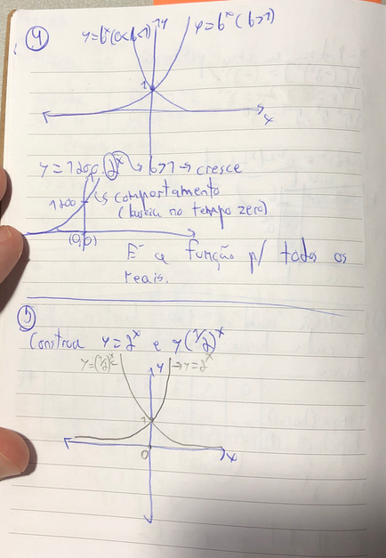

### Função exponencial natural
Esse tipo de função pega o valor da constante de euler (2,718281828...) que, assim como pi, nunca finaliza.
- base é o número de euler
- f(x) = e^(kz), k!=0 ão usadas como modelos de decaimento exponencial
- para f(x) = e^x, qql reta tangente, o coeficiente angular sempre tem o valor da ordenada

#### Número de euler
Por si a constante de euler é bastante usada para cálculos funanceiros e na substituição de bases em logaritmos. 
- e = 2.71828...

x       | 1+(1/x) | (1+(1/x))^x
:------:|:-------:|:-----------:
1       |2        |2
10      |1.1      |2.5937424601
100     |1.01     |2.7048138294215260932671947108075
1000    |1.001    |2.7169239322358924573830881219476
10000   |1.0001   |2.7181459268252248640376646749131
100000  |1.00001  |2.718268237174489668035064824426
1000000 |1.000001 |2.7182804693193768838197997084544

- lim(inf)(1+(1/x))^x -> mas isso serão cenas para o futuro

### Logaritmos
Mais uma das operações que visam diminuir a dificuldade de cálculos mais complexos.
Ela é batante usada em cálculos de taxa de juros simples de investimentos.
Iniciaram simplificando alguns cálculos mais complexos
- dá pra dimiur os graus de dificuldade das operações
- lê-se sempre pela linha
- depende do conhecimento de potências
    - a definição é basicamente uma potência dentro dela
- 2^x = 4
    - por qual expoente eleva pra ser verdadeiro?
    - log_2 4 = 2
    - a moral é perguntar quantas vezes precisa potencializar pra dar o resultado
- log_b a = X <=> b^x = a
- log de 'a' precisa necessariamente ser positivo
    - exponencialmente a imagem n fica negativa
    - pra evitar cair abaixo de zero nas ordenadas precisa manter > 0 (logaritimando positivo)
#### condições de existência
- a > 0
- b > 0 também

#### exercício
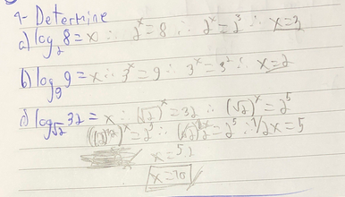

#### Sistemas de logaritmos
São chamados de sistemas de logaritmos na base **b**. Nesta base, todos os conjuntos gerados de logaritmos são positivos.

##### sistemas de logaritmos decimais
- Henry Briggs, 1561-1630, matemático inglês
- tudo com base 10
- logaritmos comuns ou de Briggs
- indicação de log x (base 10)
- exemplos
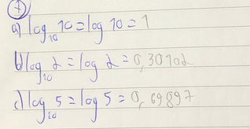

##### sistemas de logaritmos naturais ou neperianos
- Leonhard Euler, 1707-1783
- John Napier, 1550-1617
- indicado por ln(x)
- base com o número de euler
- podem fzr simplificações com eles mesmos
- exemplos
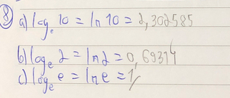

#### propriedades operatórias
- uma lista aqui
- logaritmo do produto dá pra abrir na soma
    - da divisão na subtração
    - da potência na multiplicação (produto)
- sempre dá pra fzr a mudança de base
- normalmente se usa o logaritmo natural mesmo
- log_3 5 = ln(5)/ln(3) -> sempre dá pra fzr td baseado nos logaritmos naturais -> 1.464973...
    - log 5/log 3 vai dar a mesma coisa
    - dá pra escolher qql base pra calcular
- na maioria das operações de usa base euler

Propriedade     | Cálculo
:--------------:|:--------:
log do produto  | log_b(ac) = log_b(a) + log_b(c)
log da potência | log_b(a^m) = m.log_b(a)
log da divisão  | log_b(a/c) = log_b(a) - log_b(c)
mudança de base | log_b(a) = log_c(a)/log_c(b)

A última propriedade é particularmente importante devido ao fato de a base diferente entregar o mesmo resultado e podermos trocar tudo por logaritmos naturais.

### exercícios
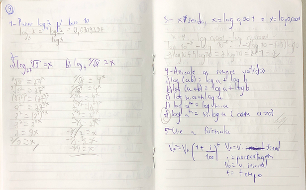
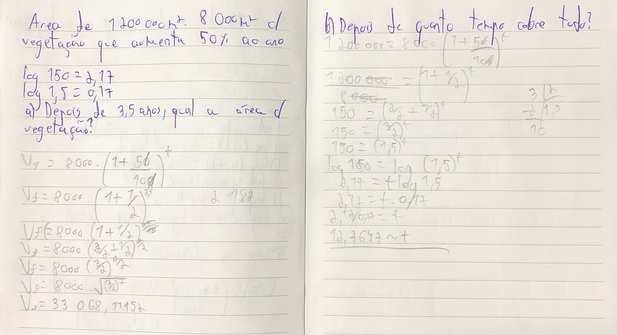

### Função logaritmica como a inversa da exponencial
**Teorema:** Se b > 0 e b != 1, então y = b^x e y = log_b(x) são funções inversas.

**Prova:** Se y=b^x, para determinarmos a inversa fazemos x=b^y. Ora, x=b^y é equivalente a log_b(x)=y. Portanto, y=log_b(x) é inversa de y = b^x.

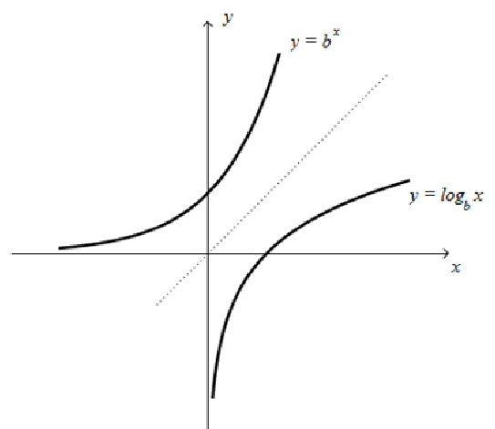

É importante se atentar ao fato de que são inversos ao ponto de terem curvas completamente diferentes umas das outras.
Tenha em mente que a diferença entre um código ter tempo x² é imensa comparado a outro com log(x) - lembre que nesse caso a base é 2.

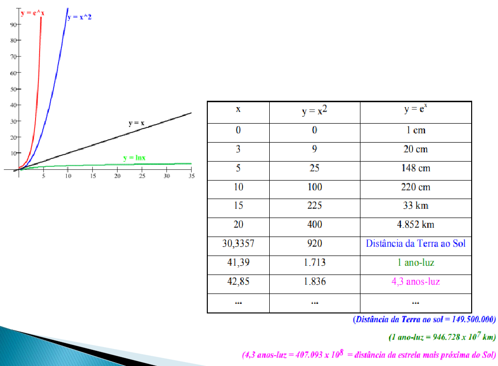

### Exercícios:

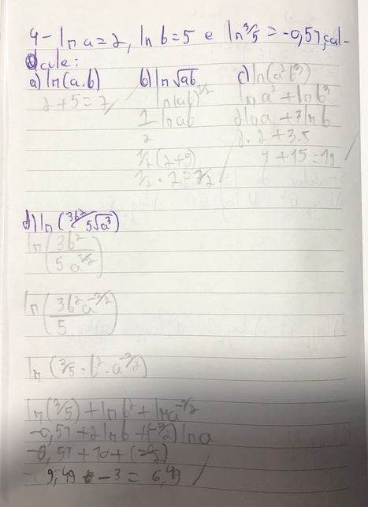

DATA: 18/Mar/24
### Exercícios
- [marcação 1 das anotações]
## Funções definidas por partes: mais de uma lei
Essas funções definidas por mais de uma lei usualmente tem mais de um tipo de função nelas.
Não são deveras complexas, mas devem ser tratadas com cuidado já que é necessário desenhar as funções e identificar os limites.
- Nem sempre as funções podem seguir apenas uma lei
- em alguns momentos elas podem trocar a lei por n razões
### Exemplos
[marcação 2 anotações]

### Exercícios
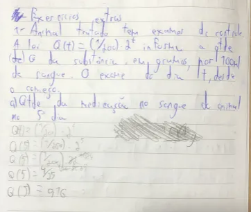
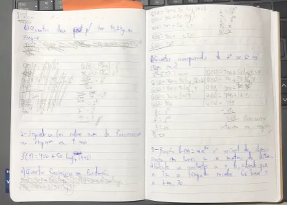
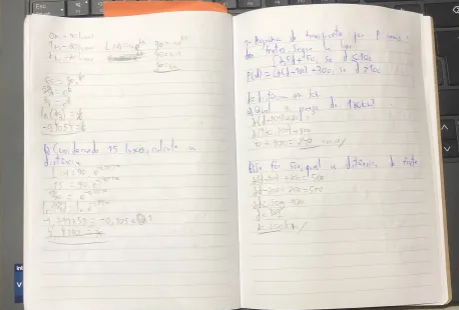
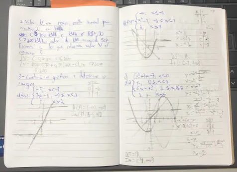
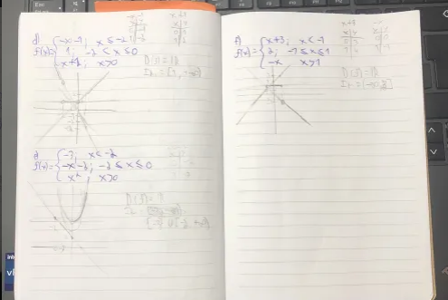

DATA: 01/Abr/2024
# Operações com limites
Operações com limites são feitas para facilitar a montagem de testes.
Normalmente as operações são levadas ao infinito.
- a ideia é entender o comportamento da função quando x
- entender comportamento ou tendência com o passar do tempo
- "limite de f(X) quando x tende ou se aproxima de a"
    - se aproxima tanto quanto ele puder
    - igual ou não realmente não importa
    - as aproximações podem ser de qualquer um dos lados
    - valores da função tendem a 2 (eixo y)
    - limite n se importa com bolas abertas ou fechadas
    - limite só existe se a aproximação vem dos dois lados
- resultados sempre vem pelo eixo y
- limite é sempre uma questão de aproximação
    - chegam o mais perto possível 

## estudo de limites
- por que estudar tendências ao infinito?
    - muito usados
    - testes de freio
    - testes de força-peso
    - extrapolar uma marcação e gerar margens de segurança
## noção intuitiva, análise via gráfico e notação
Os limites são barreiras das quais os valores não podem passar ou nem ao menos podem chegar.
o limite vai ser sempre *quase* o resultado direto, mas não será.

- evite usar aproximações numéricas
    - não são confiáveis em funções com limites (saltos entre as funções) muito pequenos

## limites laterais
Negativo vem da esquerda e positivo vem da direita.
As associações de lateralidade são com os sinais mesmo na notação do limite.
Vale lembrar que em limites infinitos a lateralidade vem apenas de um dos lados, portanto, o limite é o lateral que sobra.
Se os limites lateriais forem diferentes um do outro o limite **não existe**. Caso sejam iguai, tá tudo certo.

- para consideração de onde está vindo a comparação (limites laterais muitas vezes são distintos)
    - nessses casos o limite limite não existe
- sempre existem
    - só tem limite limite quando os dois são iguais
- a laterlidade não funciona muito bem com limites ao infinito
    - eles só podem vir pelo lado contrário mesmo
- as marcações são com uma "potência + ou - no valor do limite"

### exercícios

É importante lembrar que não dá pra determinar um limite quando temos uma onda constante à infinito porque não é possível determinar onde ela vai estar mais próxima de na posição infinito.
- se existe uma oscilação constante (e amplitude) não dá pra indicar o limite, ou seja, ele não existe

## limites - técnicas para calcular
Em alguns momentos será impossível determinar o limite, como na função f(x) = sen(pi/x) -> gera uma senoide praticamente infinita em cima de x=0 ,ou seja, não se aproxima de nenhum limite.
- é preciso testar valores próximos o suficiente para quse chegar no limite
    - mas isso não necessariamente dá o resultado
    - por mais que seja prático, não necessariamente é o método mais confiável

### Propriedades dos limites
- limite da soma
    - soma dos limites
- limite da constante
    - constante
- limites da diferença
    - diferença entre os limites
- limite do produto
    - produto entre os limites
- limite do quociente
    - quociente dos limites
    - desde que o denominador seja diferente de zero
- limite da potência
    - calcula o limite da interna e dps eleva
- limite da raiz
    - igual potência
- tudo isso também vale pra limite lateral
- vale pra um número qualquer de funções
- só se calcula as partes variáveis

#### exemplo 
Dá pra trabalhar com os limites quase como trabalhamos com logaritmos.

#### exercícios

DATA: 08/Abr/2024
## Derivada: noção intuitiva, definição, propriedades e derivada de 𝑦 = 𝑥𝑛
- principais técnicas pra cálculo de racionais
- e ainda infinito e menos infinito
    - infinito n é número, portanto tem uma técnica diferente
    - infito e só um limite

## Limites de funções quando x->a
- quocientes de 2 polinômios
- f(x) = P(x)/Q(x)
- Se Q(a) = 0

### importante
- se o resultado do limite é 0/0 é uma indeterminação
- pra resolver precisa de limite matmático -> regra de octal
    - basicamente resolve as indeterminaões
- f(x) = a(X-r_1)(X-r_2) -> encontrar as raízes q zeram a função
    - essa fatoração é uma manipulação algébrica gigante pra conseguir simplificar algumas situações

### exercícios
[marcação 1]
[marcação 2]

DATA: 15/Abr/24
# Derivadas de polinômios, funções trigonométricas, 𝑦 = 𝑒𝑥 e 𝑦 = 𝑙𝑛 (𝑥)
- Derivadas são simplesmente variações
    - velocidade, preço, etc
- é importante saber o quanto cresce/descresce
- dá a velocidade de crescimento de situação/gráfico
- vamos medir ângulos de inclinação de curvas
    - num ponto vai ser a mesma inclinação de uma reta tangente àquele ponto
    - y = ax + b -> coeficiente angular (a) mostra o ângulo
    - coeficiente angular da reta tangente naquele ponto -> **derivada**
- derivada de uma função em outra função dá uma média só
    - a derivada dá o valor instantâneo
- a derivada é um limite pra encontrar o valor *a* de uma tangente pra achar o valor imediato de uma curva
### derivada
- crecsimento é dado por uma inclinação e a medição é pela tangente no ponto (X_0, f(X_0))
    - pega um outro ponto na curva e monta a = (f(X_0+h)-f(X_0))/h
    - se a gente usar o limite 0 como o X_0, dá pra usar isso pra igualar essa fução e usar o limite
    - lim(x->0) = (f(X_0+h)-f(X_0))/h
- dy/dx -> também é uma derivada (notação de Newton)
    - deltay/deltax
- y' e f' indicam derivadas
## Interpretações de derivada
- derivadas com taxa de variação positiva - cresce - se negativa - decresce
### exemplos
[marcação 1]

## Técnicas de derivação
- são técnicas de determinação
### derivada de uma constante
- derivada vai ser zero 
- f(x) = x^n ---> f'(x) = nx^(n-1)
### derivada de função potência
- d/dx[x^n ] = n.x^(n-1)
- root(x^5) = x^(5/2) ---> (5/2)^(3/2)
- 1/rootcub(x) = x^((-1)/3) ---> -1/3x^(-4/3)
#### exemplos
[marcação 2]

### constante vezes uma função
- a constante permanece, só se deriva a função mesmo
#### exemplo
[marcação 3]

### soma ou diferença de 2 funções
- a derivada vem do limite
- é o cálculo da derivada de cada termo
#### exemplo
[marcação 4]

### Exercícios
[marcação 5]