-> Anotações pertinentes da cadeira
Professora Zeliane

DATA: 14/Aug/24
# Integração
É o problema inverso de uma derivada. Agora vamos encontrar a função de uma derivada dada.
F'(x) = f(x)
**Teorema:** 
Se F é uma antiderivada de f no intervalo I, então G é uma antiderivada de f no intervalo I se, e só se, G tem a forma
G(x) = F(x) + C , para todo x em I
onde C é uma constante.
Note que a inclusão da constante C permite incluir uma família inteira de antiderivadas (uma soma ao final da função ainda é a integral/antiderivada).

Se y = F(x) é uma antiderivada de f, diremos que F(x) é solução da equação
dy/dx = f(x)
Ao resolver uma equação deste tipo, é conveniente reescrevê-la na forma diferencial, ou seja,dy = f(x)dx

A solução geral sendo:
y = S f(x)dx = F(x)+C

A diferencial dx serve para identificar x como variável de integração. O termo integral indefinida é sinônimo de antiderivada.
Portanto, a notação:
S f(x)dx = F(x)+C

Nesse sentido, note que F'(x) = f(x), ou seja, podemos substituir na fórmula:
S F'(x)dx = F(x)+C

E se F(x) é uma antiderivada de f(x), logo:
d/dx[S f(x)dx] = f(x) -> esse f(x) sendo a função que queremos encontrar.

**Teorema da integral indefinida**
Sejam F(x) e G(x) antiderivadas de f(x) e f(x), respectivamente, e c uma constante. Então:
(a) Uma constante pode ser movida através do sinal de integração; isto é,
S cf(x)dx = cF(x)+c

(b) Uma antiderivada de uma soma é a soma das antiderivadas; isto é,
S [f(x) + g(x)]dx = F(x) + G(x) +C

(c) Uma antiderivada de uma diferença é a diferença das antiderivadas; isto é
S [f(x) - g(x)]dx = F(x) - G(x) + C

- primitiva/anti-derivada
- letra maiúscula
- F'(x) = f(x)
- inversa das derivadas
- funções podem ter mais de uma primitiva
    - somar constante ainda mantém como primitiva
- Defina sempre com uma constante - entrega a família
[1 ]

## Integral indefinida
- resultado se entrega na forma diferencial
    - separa a derivada como se fosse uma fração
[2 ]
- O S da integral é realmente um S (de soma)
[3 ]
- Derivar uma integral te entrega a função (tipo exponenciar uma raiz)

## Fórmula básica de integração
- pra uma exponenciação simples, soma o expoente e divide -> bem o contrário da derivação nesse caso que multiplica e diminui o expoente
- Eu preciso achar a fórmula básica, logo, pra integrar alguma coisa e chegar na original, preciso integrar a derivação do negócio (ou considerar que a fórmula que tenho é uma derivada)
- Sf(x)dx = F(x)+C
    - S da integral
    - f(x) = F'(x) -> f(x) é a derivada de F(x), que é a fórmula que preciso
    - dx serve pra ser a representação da variável
        - não vai usar ele pra muita coisa
    - C -> representação da constante pra abrigar todas as famílias de repostas -> dá pra somar qualquer constante que a integral ainda é a mesma

## Anotações
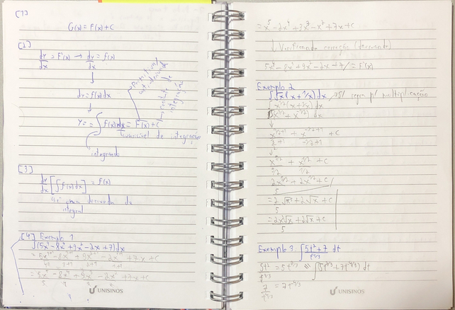
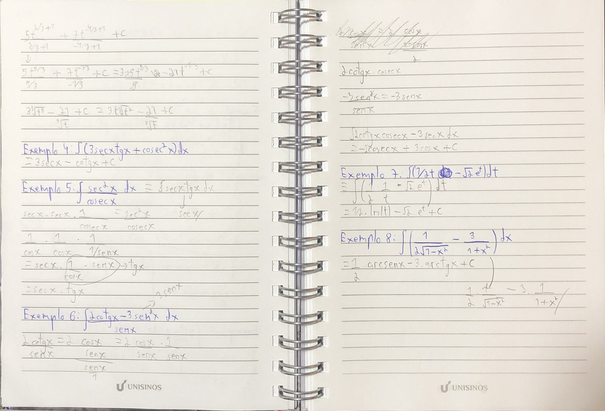

DATA: 21/Agosto/2024
# Integração por substituição
Todo o objetivo dessa substituição é para facilitar o cáculo. Pense que integrais muito verbosas (e.g.: S(2x+7)(x²+7x+3)^(4/3)dx) são mais complexas de vizualizar resoluções (apesar de ser possível se você for o bichão memo).
A substituição não vai alterar a integral para sempre, apenas momentaneamente para que o cáculo seja facilitado.
Esse processo é análogo ao da regra da cadeia, uma vez que mais processos de derivação são adicionados para chegar à um resultado.
"Fazendo u = g(x), du = g′(x)dx e substituindo na equação acima, temos:
∫ f (g(x)).g′(x)dx = ∫ f (u)du = F(u)+ C
Note que o integrando tem dois fatores, um sendo a função composta e outro sendo a derivada g′(x) da função interna da composição.
Na prática, devemos então definir uma função u = g(x) conveniente, de tal forma que a integral
obtida seja mais simples."

- Na regra da cadeia básica deriva os de fora e vai multiplicando as derivações de dentor
- integração pega a derivada grande vai dar as funções das derivadas "aninhadas"
- precisa identificar alguém como sendo *u* -> essa deriviação faz uma integral em função de u - aí integra normalmente
    - ainda precisa substituir o *u* pelo *g(x)*
    - substituição por algo mais simples
- [1 ]
- normalmente se escolhe para *u* o que está elevado ao expoente (se houver)
- o objetivo é uma integral mais fácil
    - se dificultar a escolha do *u* foi errada

DATA: 28/Aug/24
# Integral definida e integral deinida por substituição
Antigamente se utilizava o método da exaustão para saber qual a área (aproximada) abaixo de uma curva de função. Inclusive foi assim que se descobriu a área de um círculo. Consistia basicamente em somar várias formas geométricas abaixo da curva até que se chegasse à uma área próxima do suficiente. *soma de Riemann*. Essa soma forma um limite básico entre as formas e a função.
A integral se utiliza desse limite para calcular áreas abaixo dessas mesmas curvas (é uma formalização matemática)
Ele vai basicamente pegar a integral e limitar a área de ação dela.
**Teorema: Se uma função f é contínua em um intervalo fechado [ a,b ], então f é integrável em [ a,b ]**
Caso a função não tenha nenhum valor abaixo de zero no intervalo dado, o resultado da integral é o mesmo da área abaixo dessa função.
    Caso contrário, exista algo abaixo do eixo x, a integral representa a soma das duas áreas diferentes (*área líquida*). Para se encontrar a área total, é necessário tratar a função como modular.

- sempre um númer
    - área de região ou líquida com sinal
- arrumar o problema de uma área de função aleatória com um eixo
- antes era o método de exaustão
    usar figuras conhecidas pra chegar perto da área real
    - usualmente se chega em um resultado apropriado
    - somatório n i=1 f(Ci)deltax
    - a ideia é inserir zilhões de subintervalos pra chegar o mais próximo possível da área
    - [1 ]
    - a integral definida é uma soma de áreas
- quando função positiva o resultado é a área
    - se negativa em alguns momentos - o resultado é uma área líquida
        - dá o resultado da soma das duas áreas -> não é o tamanho da área compreendida
            - pra isso precisa colocar o negativo em módulo
- sempre dá pra resolver se a função for contínua no intervalo dado
    - intervalo fechado

## propriedades
Essas propriedades são basicamente as mesmas das integrais não-definidas. Existem poucas mudanças realmente.
Com a adição de que se f é integrável nos três intervalos determinados por a, b e c, posso quebrar a integral em dois com os respectivos intervalos.

- limites iguais -> integral = zero
- a -> b sempre (sentido positivo)
    - com limites trocados o resultado é o oposto (resultado negativo)
- propriedades das indefinidas ainda se mantém
- se existir um ponto c entre a e b (c) posso separar a integral em 2
- sempre que for positiva - resultado positivo
- com duas funções do mesmo intervalo segura a com maior área
- funções ímpares tem valores opostos se inverter o sinal do input
- funções pares mantém o sinal mesmo que inverta o imput

## Teorema fundamental do cálculo
Esse teorema diz basicamente que podemos calcular uma integral definida como uma indefinida e depois adicionar os limites lateralmente, diminuindo do limite inferior do superior. Isso se torna bastante útil nos momentos de resolução (é uma das principais ferramentas).
**Se uma função f é contínua no intervalo fechado [ a,b ], então**
**a_S^b f(x)dx = F(b) - F(a)**
**onde F é qualquer função tal que F'(x) = f(x) para todo x em [ a,b ].**
Nesse caso, omitir o "+C" é recomendável, uma vez que a organização da equação vai cortar ele mesmo.
Lembrando que é sempre possível trocar a variável já que é uma *variável muda* e cuidar com curvas não-contínuas (o resultado da área será errôneo).

- função contínua dentro do intervalo
- acha a primitiva
- depois troca os limites de integração nela 
    - começa pelo superior e subtrai o result do inferior
- a constante de integração se cancela algebricamente

-> Área
- toda positiva
    - resultado integral definida do intervalo respresenta a área
- parte pos e parte negativa
    - área é a integral do módulo da função dentro do intervalo de a até b
    - integral de a -> c + c -> b
- [2 ]

## Integrais definidas por substituição
Esse tipo de integral é bastante comum de ocorrer e funciona basicamente igual à uma substituição em uma integral indefinida, mas com extra steps.
Um dos métodos (o mais simples e direto) usa o mesmo esquema da substituição de uma integral indefinida, mas precisamos continuar o cálculo após a substituição do *u* pelo valor quardado, assim como uma resulução normal de integral.

- existem duas formas de resolver
[3 ] - exemplos

### Imagens
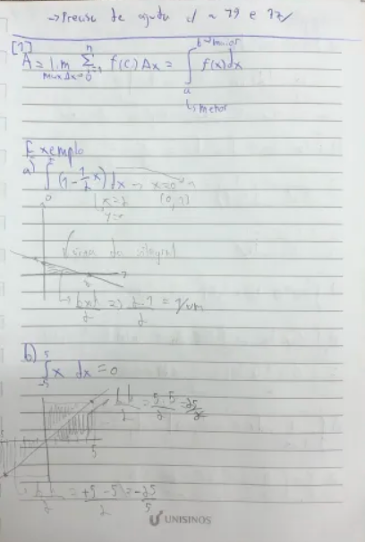
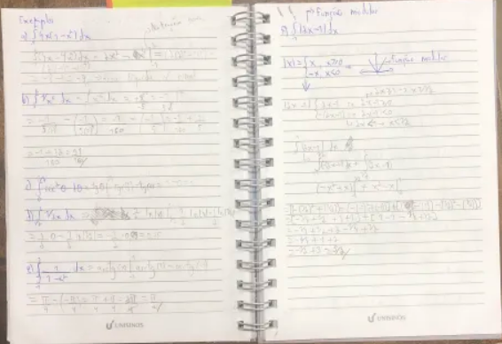
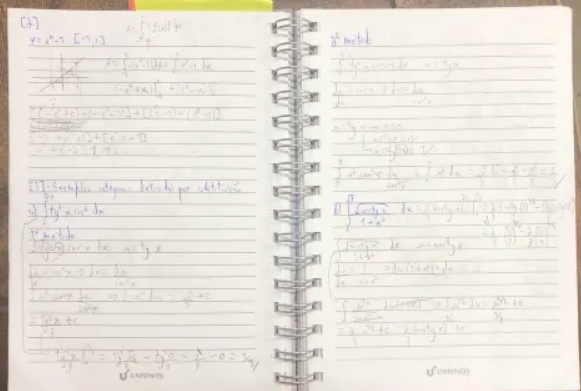
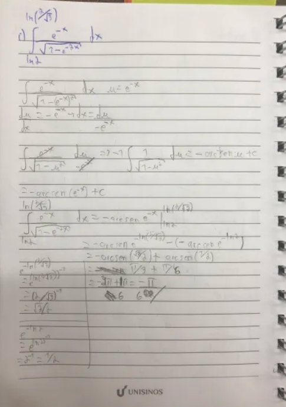

DATA: 04/Setembro/2024
# Área entre curvas
É uma área que se encontra entre duas curvas em um determinado intervalo de espaço. 
Nesse caso não é necessário se preocupar com a relação delas ao eixo x, ele não entre nesse cálculo

- é literalmente a área entre duas curvas
- divide o intervalo em subintervalos
- a ideia inicial é igual a exaustão    
    - meter um monte de retângulo entre as curvas e somar todas as áreas
    - somatório da diferença da função de cima menos a de baixo
- da mesma forma, esse somatório vai virar uma integral definida
- precisamo de algum apoio gráfico pra saber qual função é a de cima e qual a de baixo
[1 ]
- em casos que não existem limites claros, os limites são pontos (os pontos de intersecção das duas curvas)
    - podem existir um ou mais
    - é preciso igualar as duas funções para saber seus limites (os pontos para o cálculo da integral)

### Exemplos
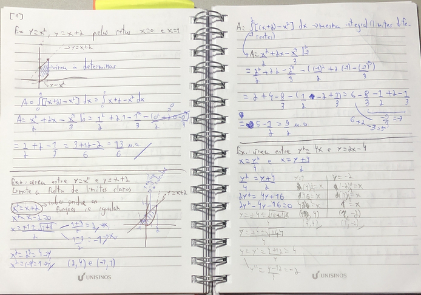
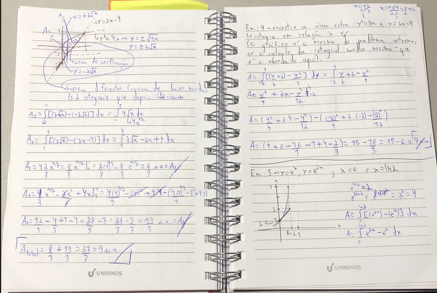

DATA: 11/Setembro/2024
# Volumes
- usualmente se faz uma integral da função da área do objeto
- a maioria se dá por eixos de revolução

## volume por discos perpendicales ao eixo dos x
- gira-se uma região em torno do eixo dos x (qualquer forma q ela tenha)
- integral definida de a até da Àrea da região em x
- tira uma faatia da região (área de um círculo nesse caso)
    - pir²
    - função representa o raio
- pi integral de a até b função ² de x
    - volume de sólido de revolução
- [1 ]

## Volume por arruelas perpendiculares ao eixo dos x
- elas tem um certo espaço entre o eixo dos x
- basicamente uma área entre funções e um giro pelo eixo
- ainda se tira uma fatia
- V = pi integral de a até b pela função de fora (fx) ² menos a função de dentro (g(x)) ²
- nesses contextos é ideal tem um gráfico
    - ou um rapidamente construído
- [2 ]

## Todas as propriedades para o eixos dos x também valem para y
- os calculos só precisam ser em favor de y
- [3 ]
- uma função por volume em x não necessariamente é igual para y
    - os sólidos gerados são diferentes, ou seja, ele necessariamente precisam ser iguais
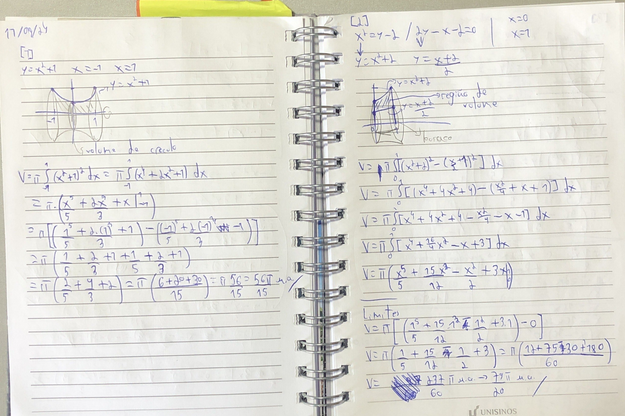
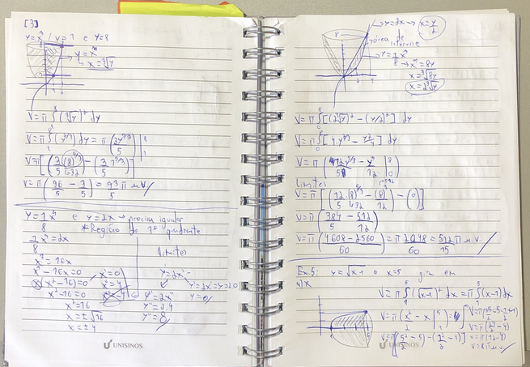
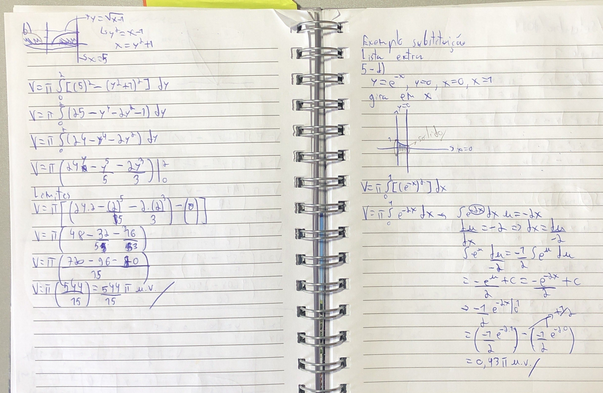

DATA:18/Setembro/2024
# Integração por partes
Essa forma de resolução é útil principalmente com funções muito complexas ou com fatores que fogem um pouco das normas pré-estabelecidas de cálculos.
Ela se baseia na derivada de um produto e basicamente nos auxilia a separar a equação em duas e resolver ambas as partes separadamente, juntando-as ao final.
O teorema básico é, considerando uma função contínua:
**∫udv = uv - ∫vdu**

Importante ressaltar que é mais fácil resolver tomando *dv* como o termo mais complexo (e que pode ser integrado). Sendo assim, *u* sobraria como uma derivada simples.

- resolve os problemas que a substituição não consegue
    - eventualmente ainda usa substituição
- baseado em regra da cadeia e função composta
- envolve produto de funções
    - regra da derivada de produto (em parte)
- tem uma fómula de utilização
- considere duas funções diferenciáveis
- mantém a primeira e multiplica pela derivada da segunda e soma com o inverso
- íntegrando a derivada pega a própria função
- nas integrais novas se simplifica os dx e se tem uma integral com duas variáveis
- [1 ]
- a integral u dv sempre precisa ser mais simples
- a mesma lógica se aplica para áreas e volumes

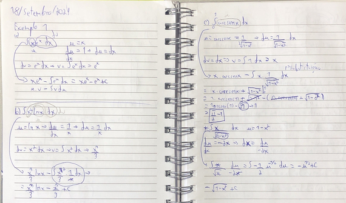
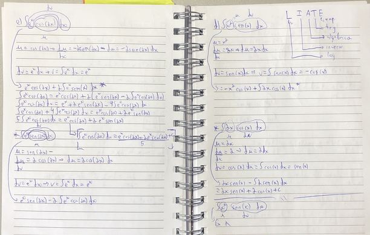
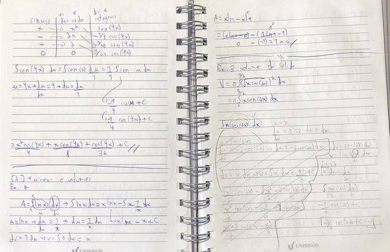
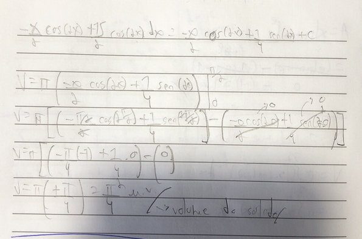

DATA: 25/Setembro/24
# Integração com frações parciais
Nesse tipo de integração, utilizamos algumas técnicas para resolver integrações de funções polinomiais.
Ela consiste de alguns passos importantes, conforme vou descrever aqui

**Passo 1: Identifique se a fração N(x)/D(x) (onde N(x) é numerador e D(x) é denominador) é imprópria**
Uma fração será imprópria se o grau do numerador for maior que o do denominador. Como em (x³+3)/x².
Divida o numerador pelo denominador. O resultado da divisão fica de fora e será somado ao resultado no final de todos os passos para obtermos o resdultado final.
Quanto ao resto da divisão, ela agora é o novo numerador. Utiliza-se o denominador antigo.
-> N(x)/D(x) => divisão => = (polinômio resultado) + N_1(x)/D(x) -> sendo N_1(x) resto da divisão.

**Passo 2: Fatore completamente o denominador**
Fatore o máximo possível mesmo, vamos espalhar os fatores ao longo de várias frações para o cálculo mais efetivo.
Podes usar na forma (px + q)^m ou (ax²+bx+c)^m onde qualquer um dos dois é irredutível.

**Passo 3: Fatores lineares**
Para cada um dos (px + q)^m, coloque-os na forma:
A1/(px + q) + A2/(px + q)² + A3/(px + q)³ + ...

**Passo 3.2: Fatores quadráticos**
Para cada (ax²+bx+c)^m coloque uma forma linear acima:
B1x+C1/(ax²+bx+c) + B2x+C2/(ax²+bx+c)² + B3x+C3/(ax²+bx+c)³ + ...

**Passo 4: Juntando os fatores**
Depois, junte os fatores como em uma soma de mínimo divisor comum para ter todos os termos acima de um denominador com a fatoração completa.

**Passo 5: Comparando**
Compare os fatores em x², x, etc das da nova equação com os da original e monte um sistema de frações. Com ele será possível identificar os valores de A1, B2, etc. e poderemos subsituí-los com as equações do passo 3.

**Passo 5: Encontrando as bases**
Encontre as bases do denominador da equação original e substituia abaixo de cada A1, B2, etc.

**Passo 6: Integrando**
Monte quantas integrais forem necessárias e integre uma a uma, depois junte seus resultados ao final e acabou o problema.
Caso tenha sido necessária uma divisão no passo um, some seu resultado com os das integrais.

Sempre lembre-se de simplificar ao máximo os integrandos antes de qualquer operação.

- grau denominador maior q o numerador -> fração própria
    - se n for precisa converter
- fatoração de denominador - máximo possível
    - fatores lineares de preferência
    - se não quadráticos
- as stuações variam com a forma das ráizes
- fração original e a sma de fatores mais simples
- [1 ] -> exemplos -> incluir pipeline de resolução

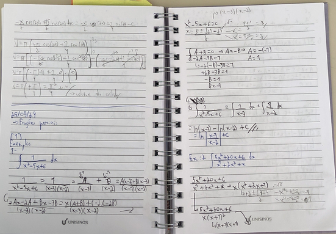
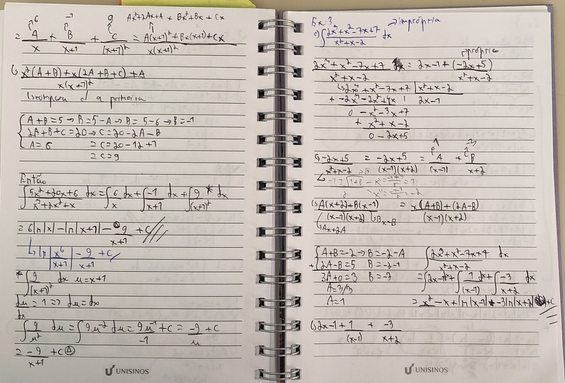
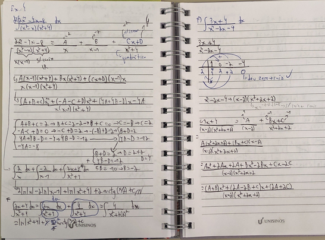
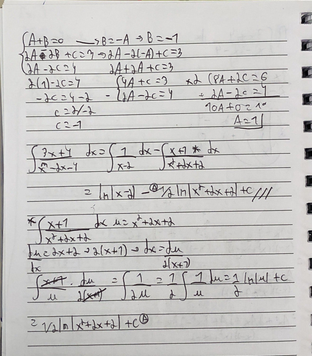

DATA: 2/Outubro/2024
# Integrais impróprias
Na definição geral, temos que uma integral tem um espaço de aplicação contínuo e finito, como em ∫^b_a f(x)dx.
Todavia, quando o caso é uma integral com um dos limites infinitos, a coisa muda um pouco de figura. Como não podemos provar que não exitem infinitas descontinuidades em um espaço infinito dado, precisaremos utilizar limites para completarmos o cálculo.
Para calcular uma integral imprópria, podemos trocar o limite infinito por um dado finito (b se superior e a se inferior), calcular a integral, e colocar o resultado dentro de um limite de b->∞ ou a->-∞ e aplicar o limite

**Definição**
1. Se f é contínua no intervalo [a, ∞), então
∫^∞_a f(x)dx = lim_(b->∞)∫^b_a f(x)dx

2. Se f é contínua no intervalo (-∞, b], então
∫^b_-∞ f(x)dx = lim_(a->-∞)∫^b_a f(x)dx

3. Se f é contínua no intervalo (-∞, ∞), então
∫^∞_-∞ f(x)dx = ∫^c_-∞ f(x)dx + ∫^∞_c f(x)dx em que c é qualquer número real (normalmente utiliza-se 1 - é considerado a "metade dos infinitos" - é meio arbitrário mesmo).
Observe que: "Em cada caso, se o limite existir, a integral imprópria converge; caso contrário, a integral diverge. No terceiro caso, a integral à esquerda do sinal de igualdade diverge se uma das integrais impróprias à direita diverge."

- não dá pra usar o teorema fundamental do cálculo
- quando tem limites infinitos ou descotinuidade da função
    - nesse momento não se utiliza as com descontinuidade
- [1 ]
- o resultado de uma integral com infinito é o limite do resultado dela 
- alguns resultados podem ser indeterminados (indeterminação matemática)
    - integral diverge (divergente)
- se o resultado é um número real ela converge (convergente)
- [2 ]