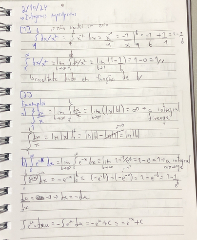
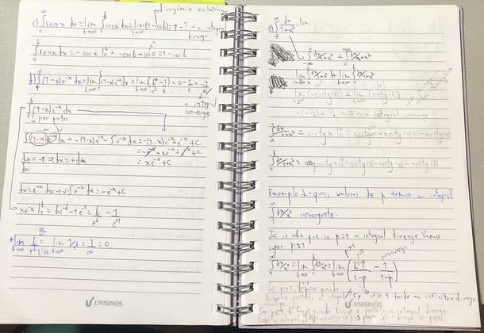
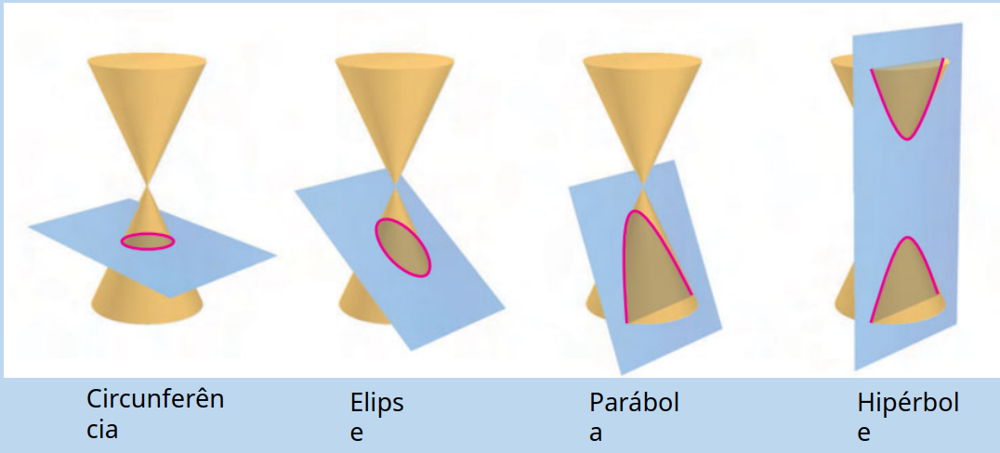
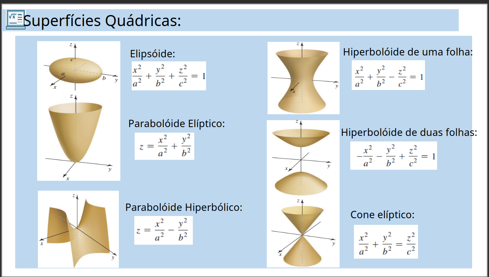

-> Anotações pertinentes da cadeira
Professora Zeliane

DATA: 14/Aug/24
# Integração
É o problema inverso de uma derivada. Agora vamos encontrar a função de uma derivada dada.
F'(x) = f(x)
**Teorema:** 
Se F é uma antiderivada de f no intervalo I, então G é uma antiderivada de f no intervalo I se, e só se, G tem a forma
G(x) = F(x) + C , para todo x em I
onde C é uma constante.
Note que a inclusão da constante C permite incluir uma família inteira de antiderivadas (uma soma ao final da função ainda é a integral/antiderivada).

Se y = F(x) é uma antiderivada de f, diremos que F(x) é solução da equação
dy/dx = f(x)
Ao resolver uma equação deste tipo, é conveniente reescrevê-la na forma diferencial, ou seja,dy = f(x)dx

A solução geral sendo:
y = S f(x)dx = F(x)+C

A diferencial dx serve para identificar x como variável de integração. O termo integral indefinida é sinônimo de antiderivada.
Portanto, a notação:
S f(x)dx = F(x)+C

Nesse sentido, note que F'(x) = f(x), ou seja, podemos substituir na fórmula:
S F'(x)dx = F(x)+C

E se F(x) é uma antiderivada de f(x), logo:
d/dx[S f(x)dx] = f(x) -> esse f(x) sendo a função que queremos encontrar.

**Teorema da integral indefinida**
Sejam F(x) e G(x) antiderivadas de f(x) e f(x), respectivamente, e c uma constante. Então:
(a) Uma constante pode ser movida através do sinal de integração; isto é,
S cf(x)dx = cF(x)+c

(b) Uma antiderivada de uma soma é a soma das antiderivadas; isto é,
S [f(x) + g(x)]dx = F(x) + G(x) +C

(c) Uma antiderivada de uma diferença é a diferença das antiderivadas; isto é
S [f(x) - g(x)]dx = F(x) - G(x) + C

- primitiva/anti-derivada
- letra maiúscula
- F'(x) = f(x)
- inversa das derivadas
- funções podem ter mais de uma primitiva
    - somar constante ainda mantém como primitiva
- Defina sempre com uma constante - entrega a família
[1 ]

## Integral indefinida
- resultado se entrega na forma diferencial
    - separa a derivada como se fosse uma fração
[2 ]
- O S da integral é realmente um S (de soma)
[3 ]
- Derivar uma integral te entrega a função (tipo exponenciar uma raiz)

## Fórmula básica de integração
- pra uma exponenciação simples, soma o expoente e divide -> bem o contrário da derivação nesse caso que multiplica e diminui o expoente
- Eu preciso achar a fórmula básica, logo, pra integrar alguma coisa e chegar na original, preciso integrar a derivação do negócio (ou considerar que a fórmula que tenho é uma derivada)
- Sf(x)dx = F(x)+C
    - S da integral
    - f(x) = F'(x) -> f(x) é a derivada de F(x), que é a fórmula que preciso
    - dx serve pra ser a representação da variável
        - não vai usar ele pra muita coisa
    - C -> representação da constante pra abrigar todas as famílias de repostas -> dá pra somar qualquer constante que a integral ainda é a mesma

## Anotações

DATA: 21/Agosto/2024
# Integração por substituição
Todo o objetivo dessa substituição é para facilitar o cáculo. Pense que integrais muito verbosas (e.g.: S(2x+7)(x²+7x+3)^(4/3)dx) são mais complexas de vizualizar resoluções (apesar de ser possível se você for o bichão memo).
A substituição não vai alterar a integral para sempre, apenas momentaneamente para que o cáculo seja facilitado.
Esse processo é análogo ao da regra da cadeia, uma vez que mais processos de derivação são adicionados para chegar à um resultado.
"Fazendo u = g(x), du = g′(x)dx e substituindo na equação acima, temos:
∫ f (g(x)).g′(x)dx = ∫ f (u)du = F(u)+ C
Note que o integrando tem dois fatores, um sendo a função composta e outro sendo a derivada g′(x) da função interna da composição.
Na prática, devemos então definir uma função u = g(x) conveniente, de tal forma que a integral
obtida seja mais simples."

- Na regra da cadeia básica deriva os de fora e vai multiplicando as derivações de dentor
- integração pega a derivada grande vai dar as funções das derivadas "aninhadas"
- precisa identificar alguém como sendo *u* -> essa deriviação faz uma integral em função de u - aí integra normalmente
    - ainda precisa substituir o *u* pelo *g(x)*
    - substituição por algo mais simples
- [1 ]
- normalmente se escolhe para *u* o que está elevado ao expoente (se houver)
- o objetivo é uma integral mais fácil
    - se dificultar a escolha do *u* foi errada

DATA: 28/Aug/24
# Integral definida e integral deinida por substituição
Antigamente se utilizava o método da exaustão para saber qual a área (aproximada) abaixo de uma curva de função. Inclusive foi assim que se descobriu a área de um círculo. Consistia basicamente em somar várias formas geométricas abaixo da curva até que se chegasse à uma área próxima do suficiente. *soma de Riemann*. Essa soma forma um limite básico entre as formas e a função.
A integral se utiliza desse limite para calcular áreas abaixo dessas mesmas curvas (é uma formalização matemática)
Ele vai basicamente pegar a integral e limitar a área de ação dela.
**Teorema: Se uma função f é contínua em um intervalo fechado [ a,b ], então f é integrável em [ a,b ]**
Caso a função não tenha nenhum valor abaixo de zero no intervalo dado, o resultado da integral é o mesmo da área abaixo dessa função.
    Caso contrário, exista algo abaixo do eixo x, a integral representa a soma das duas áreas diferentes (*área líquida*). Para se encontrar a área total, é necessário tratar a função como modular.

- sempre um númer
    - área de região ou líquida com sinal
- arrumar o problema de uma área de função aleatória com um eixo
- antes era o método de exaustão
    usar figuras conhecidas pra chegar perto da área real
    - usualmente se chega em um resultado apropriado
    - somatório n i=1 f(Ci)deltax
    - a ideia é inserir zilhões de subintervalos pra chegar o mais próximo possível da área
    - [1 ]
    - a integral definida é uma soma de áreas
- quando função positiva o resultado é a área
    - se negativa em alguns momentos - o resultado é uma área líquida
        - dá o resultado da soma das duas áreas -> não é o tamanho da área compreendida
            - pra isso precisa colocar o negativo em módulo
- sempre dá pra resolver se a função for contínua no intervalo dado
    - intervalo fechado

## propriedades
Essas propriedades são basicamente as mesmas das integrais não-definidas. Existem poucas mudanças realmente.
Com a adição de que se f é integrável nos três intervalos determinados por a, b e c, posso quebrar a integral em dois com os respectivos intervalos.

- limites iguais -> integral = zero
- a -> b sempre (sentido positivo)
    - com limites trocados o resultado é o oposto (resultado negativo)
- propriedades das indefinidas ainda se mantém
- se existir um ponto c entre a e b (c) posso separar a integral em 2
- sempre que for positiva - resultado positivo
- com duas funções do mesmo intervalo segura a com maior área
- funções ímpares tem valores opostos se inverter o sinal do input
- funções pares mantém o sinal mesmo que inverta o imput

## Teorema fundamental do cálculo
Esse teorema diz basicamente que podemos calcular uma integral definida como uma indefinida e depois adicionar os limites lateralmente, diminuindo do limite inferior do superior. Isso se torna bastante útil nos momentos de resolução (é uma das principais ferramentas).
**Se uma função f é contínua no intervalo fechado [ a,b ], então**
**a_S^b f(x)dx = F(b) - F(a)**
**onde F é qualquer função tal que F'(x) = f(x) para todo x em [ a,b ].**
Nesse caso, omitir o "+C" é recomendável, uma vez que a organização da equação vai cortar ele mesmo.
Lembrando que é sempre possível trocar a variável já que é uma *variável muda* e cuidar com curvas não-contínuas (o resultado da área será errôneo).

- função contínua dentro do intervalo
- acha a primitiva
- depois troca os limites de integração nela 
    - começa pelo superior e subtrai o result do inferior
- a constante de integração se cancela algebricamente

-> Área
- toda positiva
    - resultado integral definida do intervalo respresenta a área
- parte pos e parte negativa
    - área é a integral do módulo da função dentro do intervalo de a até b
    - integral de a -> c + c -> b
- [2 ]

## Integrais definidas por substituição
Esse tipo de integral é bastante comum de ocorrer e funciona basicamente igual à uma substituição em uma integral indefinida, mas com extra steps.
Um dos métodos (o mais simples e direto) usa o mesmo esquema da substituição de uma integral indefinida, mas precisamos continuar o cálculo após a substituição do *u* pelo valor quardado, assim como uma resulução normal de integral.

- existem duas formas de resolver
[3 ] - exemplos

### Imagens

DATA: 04/Setembro/2024
# Área entre curvas
É uma área que se encontra entre duas curvas em um determinado intervalo de espaço. 
Nesse caso não é necessário se preocupar com a relação delas ao eixo x, ele não entre nesse cálculo

- é literalmente a área entre duas curvas
- divide o intervalo em subintervalos
- a ideia inicial é igual a exaustão    
    - meter um monte de retângulo entre as curvas e somar todas as áreas
    - somatório da diferença da função de cima menos a de baixo
- da mesma forma, esse somatório vai virar uma integral definida
- precisamo de algum apoio gráfico pra saber qual função é a de cima e qual a de baixo
[1 ]
- em casos que não existem limites claros, os limites são pontos (os pontos de intersecção das duas curvas)
    - podem existir um ou mais
    - é preciso igualar as duas funções para saber seus limites (os pontos para o cálculo da integral)

### Exemplos

DATA: 11/Setembro/2024
# Volumes
- usualmente se faz uma integral da função da área do objeto
- a maioria se dá por eixos de revolução

## volume por discos perpendicales ao eixo dos x
- gira-se uma região em torno do eixo dos x (qualquer forma q ela tenha)
- integral definida de a até da Àrea da região em x
- tira uma faatia da região (área de um círculo nesse caso)
    - pir²
    - função representa o raio
- pi integral de a até b função ² de x
    - volume de sólido de revolução
- [1 ]

## Volume por arruelas perpendiculares ao eixo dos x
- elas tem um certo espaço entre o eixo dos x
- basicamente uma área entre funções e um giro pelo eixo
- ainda se tira uma fatia
- V = pi integral de a até b pela função de fora (fx) ² menos a função de dentro (g(x)) ²
- nesses contextos é ideal tem um gráfico
    - ou um rapidamente construído
- [2 ]

## Todas as propriedades para o eixos dos x também valem para y
- os calculos só precisam ser em favor de y
- [3 ]
- uma função por volume em x não necessariamente é igual para y
    - os sólidos gerados são diferentes, ou seja, ele necessariamente precisam ser iguais

DATA:18/Setembro/2024
# Integração por partes
Essa forma de resolução é útil principalmente com funções muito complexas ou com fatores que fogem um pouco das normas pré-estabelecidas de cálculos.
Ela se baseia na derivada de um produto e basicamente nos auxilia a separar a equação em duas e resolver ambas as partes separadamente, juntando-as ao final.
O teorema básico é, considerando uma função contínua:
**∫udv = uv - ∫vdu**

Importante ressaltar que é mais fácil resolver tomando *dv* como o termo mais complexo (e que pode ser integrado). Sendo assim, *u* sobraria como uma derivada simples.

- resolve os problemas que a substituição não consegue
    - eventualmente ainda usa substituição
- baseado em regra da cadeia e função composta
- envolve produto de funções
    - regra da derivada de produto (em parte)
- tem uma fómula de utilização
- considere duas funções diferenciáveis
- mantém a primeira e multiplica pela derivada da segunda e soma com o inverso
- íntegrando a derivada pega a própria função
- nas integrais novas se simplifica os dx e se tem uma integral com duas variáveis
- [1 ]
- a integral u dv sempre precisa ser mais simples
- a mesma lógica se aplica para áreas e volumes

DATA: 25/Setembro/24
# Integração com frações parciais
Nesse tipo de integração, utilizamos algumas técnicas para resolver integrações de funções polinomiais.
Ela consiste de alguns passos importantes, conforme vou descrever aqui

**Passo 1: Identifique se a fração N(x)/D(x) (onde N(x) é numerador e D(x) é denominador) é imprópria**
Uma fração será imprópria se o grau do numerador for maior que o do denominador. Como em (x³+3)/x².
Divida o numerador pelo denominador. O resultado da divisão fica de fora e será somado ao resultado no final de todos os passos para obtermos o resdultado final.
Quanto ao resto da divisão, ela agora é o novo numerador. Utiliza-se o denominador antigo.
-> N(x)/D(x) => divisão => = (polinômio resultado) + N_1(x)/D(x) -> sendo N_1(x) resto da divisão.

**Passo 2: Fatore completamente o denominador**
Fatore o máximo possível mesmo, vamos espalhar os fatores ao longo de várias frações para o cálculo mais efetivo.
Podes usar na forma (px + q)^m ou (ax²+bx+c)^m onde qualquer um dos dois é irredutível.

**Passo 3: Fatores lineares**
Para cada um dos (px + q)^m, coloque-os na forma:
A1/(px + q) + A2/(px + q)² + A3/(px + q)³ + ...

**Passo 3.2: Fatores quadráticos**
Para cada (ax²+bx+c)^m coloque uma forma linear acima:
B1x+C1/(ax²+bx+c) + B2x+C2/(ax²+bx+c)² + B3x+C3/(ax²+bx+c)³ + ...

**Passo 4: Juntando os fatores**
Depois, junte os fatores como em uma soma de mínimo divisor comum para ter todos os termos acima de um denominador com a fatoração completa.

**Passo 5: Comparando**
Compare os fatores em x², x, etc das da nova equação com os da original e monte um sistema de frações. Com ele será possível identificar os valores de A1, B2, etc. e poderemos subsituí-los com as equações do passo 3.

**Passo 5: Encontrando as bases**
Encontre as bases do denominador da equação original e substituia abaixo de cada A1, B2, etc.

**Passo 6: Integrando**
Monte quantas integrais forem necessárias e integre uma a uma, depois junte seus resultados ao final e acabou o problema.
Caso tenha sido necessária uma divisão no passo um, some seu resultado com os das integrais.

Sempre lembre-se de simplificar ao máximo os integrandos antes de qualquer operação.

- grau denominador maior q o numerador -> fração própria
    - se n for precisa converter
- fatoração de denominador - máximo possível
    - fatores lineares de preferência
    - se não quadráticos
- as stuações variam com a forma das ráizes
- fração original e a sma de fatores mais simples
- [1 ] -> exemplos -> incluir pipeline de resolução

DATA: 2/Outubro/2024
# Integrais impróprias
Na definição geral, temos que uma integral tem um espaço de aplicação contínuo e finito, como em ∫^b_a f(x)dx.
Todavia, quando o caso é uma integral com um dos limites infinitos, a coisa muda um pouco de figura. Como não podemos provar que não exitem infinitas descontinuidades em um espaço infinito dado, precisaremos utilizar limites para completarmos o cálculo.
Para calcular uma integral imprópria, podemos trocar o limite infinito por um dado finito (b se superior e a se inferior), calcular a integral, e colocar o resultado dentro de um limite de b->∞ ou a->-∞ e aplicar o limite

**Definição**
1. Se f é contínua no intervalo [a, ∞), então
∫^∞_a f(x)dx = lim_(b->∞)∫^b_a f(x)dx

2. Se f é contínua no intervalo (-∞, b], então
∫^b_-∞ f(x)dx = lim_(a->-∞)∫^b_a f(x)dx

3. Se f é contínua no intervalo (-∞, ∞), então
∫^∞_-∞ f(x)dx = ∫^c_-∞ f(x)dx + ∫^∞_c f(x)dx em que c é qualquer número real (normalmente utiliza-se 1 - é considerado a "metade dos infinitos" - é meio arbitrário mesmo).
Observe que: "Em cada caso, se o limite existir, a integral imprópria converge; caso contrário, a integral diverge. No terceiro caso, a integral à esquerda do sinal de igualdade diverge se uma das integrais impróprias à direita diverge."

Também existo o caso para que caso exista alguma descontinuidade infinita (daquele ponto ao infinito, positivo ou negativo) temos algumas regras, que funcionam basicamente como as anteriores:
**Definição 2**
1. Se f é contínua no intervalo [a, b) e tem uma descontinuidade infinita em b, então
∫^b_a f(x)dx = lim_(c->b^-)∫^c_a f(x)dx

2. Se f é contínua no intervalo (a, b], e tem uma descontinuidade infinita em a, então
∫^b_a f(x)dx = lim_(c->-a^+)∫^b_c f(x)dx

3. Se f é contínua no intervalo [a, b], exceto em c pertencente a (a, b), onde f tem uma descontinuidade infinita , então
∫^b_a f(x)dx = ∫^c_a f(x)dx + ∫^b_c f(x)dx

Observe que: "Em cada caso, se o limite existe, a integral imprópria converge; caso contrário, a integral diverge. No terceiro caso, a integral imprópria à esquerda do sinal de igualdade diverge se uma das integrais impróprias à direita diverge."

- não dá pra usar o teorema fundamental do cálculo
- quando tem limites infinitos ou descotinuidade da função
    - nesse momento não se utiliza as com descontinuidade
- [1 ]
- o resultado de uma integral com infinito é o limite do resultado dela 
- alguns resultados podem ser indeterminados (indeterminação matemática)
    - integral diverge (divergente)
- se o resultado é um número real ela converge (convergente)
- [2 ]

DATA: 16/Outubro/2024
# Seções Cônicas e Superfícies
Todas as seções cônicas existem a partir da segmentação de um cone duplo.

Assim como em espelhos, parábolas têm vértices, com focos e todos os pontos são equidistantes do dado foco em um dado eixo. E no estudo delas, uma bissetriz é posta sobre o foco, de modo que a distância entre o foco e a diretriz é 2p. Todas as parábolas em posição padrão tem o vértice no (0,0) e são simetricas ou no x ou no y.
Uma elipse é um círculo com dois focos ao invés de apenas um, dado que as somas das distâncias entre os pontos que o formam sejam iguais a uma constante dada.
Uma hipérbole é o conjunto de todos os pontos no plano tais que a diferença de suas distâncias a dois pontos distintos fixados é uma constante positiva dada, menor que a distância entre os dois pontos fixados.

- **Cônicas transladadas**
As equações de cônicas que estão transladadas de suas posições padrão podem ser obtidas substituindo x por *x - h* e *y* por *y - k* nas equações padrão. Para uma parábolam, isso translada o vértice da origem para o ponto (*h*,*k*); para elipses e hipérboles, isso translada o centro da origem para o ponto (*h*,*k*).

**Superfícies Quadráticas**

# Funções de Várias Variáveis
Basicamente uma integral dentro da outra.
Nesses casos, as terminologias tratarão de notações sempre com *x* e *y* em fórmulas e quais fatores serão integrados dependem diretamente de como e equação é gerada.
Sem definições explícitas ou claras, qualquer fórmula detém um **Domínio natural**.
Por definição, qualquer função com *n* variáveis precisa devolver uma resposta que associa um número real com algum conjunto com *n* dimensões; e para que a resposta seja válida, as viaráveis necessitarão de restrições, gerando os espaços de resposta para cada equação. (Aqui valem todas as regras de divisão por zero, logaritmo de número negativo, etc).

## Gráficos de funções de duas variáveis
Esses gráficos, diferentemente de funções de uma variável, precisam ser projeções 3d em cima de dois planos se expandindo no espaço.
Certos gráficos são bastante simples de serem esboçados e facilitam o cálculo.

### Curvas de nível
O exato mesmo recurso utilizado em cartografia para indicar altura e desnível de terreno é utilizado aqui para esboçar gráficos bidimensionalmente.
É literalmente a mesma técnica, nem tem o que mostrar.

### Superfícies de nível
Veja que, o número de dimensões de um gráfico é o de variáveis +1, o que significa que 3 variáveis geraria um plano 4D que não podemos demonstrar, a menos que uma das variáveis seja constante, aí podemos montar em função de um **nível constante k**.

# Derivadas parciais
Já que existem as derivadas e nossas funções agora possuem 2 variáveis, precisamos derivar em função de uma delas - é basicamente isso. Em uma função que possua *x* e *y*, deriva-se um (tratando o outro como constante) e depois o outro.

DATA: 23/Outubro/2024
# Máximos e Mínimos
Nesses casos, temos basicamente 3 tipos de pontos:
- Máximo 
- Mínimo
- Ponto de Sela

Logo, uma conclusão lógica, é que os extremos acontecem em pontos em que as derivadas são nulas, uma vez que as tangentes nesses pontos precisam estar perpendiculares uma a outra e em angulção (entre elas) em um 3° plano. Esses são os **pontos críticos da função**.
Todavia, nem todo extremo é um máximo ou mínimo.

## Método para encontrar pontos de extremo de funções de duas variáveis
Primeiro, monte um sistema com as derivadas de x e de y da função.
Depois, monte a identidade da matriz de todas as derivadas segundas à partir de fx e fy. Tendo, basicamente: *D = f_xx(X_0, Y_0)f_yy(X_0, Y_0)-f²_xy(X_0, Y_0)
Onde:
- Se D > 0 e f_xx(X_0, Y_0) > 0, então f terá um mínimo relativo em (X_0, Y_0).
- Se D > 0 e f_xx(X_0, Y_0) < 0, então f terá um máximo relativo em (X_0, Y_0).
- Se D > 0, então f terá um ponto de sela em (X_0, Y_0).
- Se D = 0, então nenhuma conclusão pode ser tirada.

DATA: 06/Novembro/2024
# Integrais duplas
Lembre-se que anteriormente, com apenas uma variavel, víamos a área abaixo de uma função. Nesse caso, vemos o **volume** abaixo de uma função com duas variáveis - com mais variaveis, vemos mais dimensões.
A forma mais simples, assim como anteriormente, é quebrar o problema em diversas retângulos (nesse caso, prismas ou paralelepípedos) e somar todos os volumes - V_k = ΔA_kf(X*_k,Y*_k).
Esse cálculo é posto em um somatório, que entre em um limite, limite esse que é invertido por uma integral dupla
V = ∫∫_R f(x,y)dA -> esse é a nossa integral.

- É basicamente o volume de um sólido
- Ao invés de retângulos temos paralelepípedos
- Mas a moral é a mesma de cologar vários retângulos pro volume se aproximar do real
- a soma dos volumes seria o volume do que seria o sólido
- precisa saber o limite do somatório
- [1 ]

## Integral dupla em regiões regulares
Um cálculo de integral dupla se dá pelo cálculo de duas integrais diferentes, uma baseada no x e outra no y (considerando que essas são as variáveis consideradas, a mesma coisa funciona com outras integrais).
Para qualquer região retangular, a ordem dos cálculos não altera o resultado da equação.

- tem uma integral dentro da outra
- em regiões retangulares a ordem das integrais não altera o resultado diretamente
- a-b -> integração em x
- c-d -> integração em y
- o resultado da integral de dentro vira a nova função da integral de fora
- [2 ]
- o resultado também é uma área líquida
    - se o resultado é negativo a maior parte do sólido está abaixo do plano xy
- em quadrados a ordem de integração não importa
- os intervalos acabam sempre mostrando retângulos
- a amostragem da região de integração (retangular) é facilmente exposta em [a,b ]x[c,d ]
- [3 ]

## Integral dupla em regiões não-retangulares
Por definição:
(a) Uma **região do tipo I** é limitada esquerda e direita por retas verticais x = a e x = b e é limitada abaixo e acima por curvas continuas y = g_1(x) e y = g_2(x), onde g_1(x) <= g_2(x) com a <= x <= b.
(b) Uma **região do tipo II** é limitada abaixo e acima por retas horizontais y = c e y = d e é limitada à direita e à esquerda por curvas continuas x = h_1(y) e x = h_2(y), que satisfazem h_1(y) <= h_2(y) com c <= y <=> d.
Ou seja, **se R for uma região do tipo I**, então primeiro calcule y e depois x.
**Se R for uma região do tipo II**, então primeiro calcule x e depois y.

- regiões não definidas
- pode ser do tipo 1 com limites em x
    - intervalo em y pelas funções
- ou tipo 2 com limites em y
    - intervalo em x pelas funções
- a ordem dos cálculos muda o resultado
- se for do tipo 1
    - intevalo definido em x e por funções em y
    - integra primeiro em y (funções)
    - depois integra em x
- se do tipo 2
    - intervalo definido em y e por funções em x
    - integra primeiro em x (funções)
    - depois integra em y
- [4 ]

DATA: 15/Novembro/2024
# Integrais Duplas em Coordenadas Polares
A lógica de uma coordenada polar á a mesma que a coordenada cartesiana. A diferença real é que o grid é cicular e utilizamos raio e ângulo ao invés de x e y.
Uma conversão básica seria:
**Retangular para Polar:**
- r² = x² + y² -> r = √(𝑥² + 𝑦² )
- tan 𝜃 = x/y -> 𝜃 = arctan(y/x)
**Polar para retangular**
- cos 𝜃 = x/r -> x = r.cons𝜃
- sen 𝜃 = y/r -> y = r.sen𝜃

O cálculo é feito em cima de um setor circular, o qual é subdividido em várias regiões com área calculável.
Dessa forma o mesmo princípio de aplicação de um somatório para encontrar a área total é aplicado.
Assim, forma-se a integral **∫_𝛼^𝛽▒∫_(ℎ_1 (𝜃))^(ℎ_2 (𝜃))▒〖𝑓(𝑟,𝜃)𝑟𝑑𝑟𝑑𝜃**.