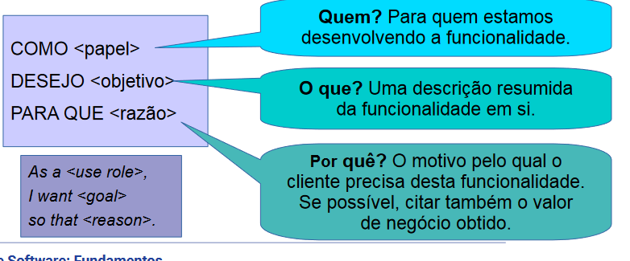
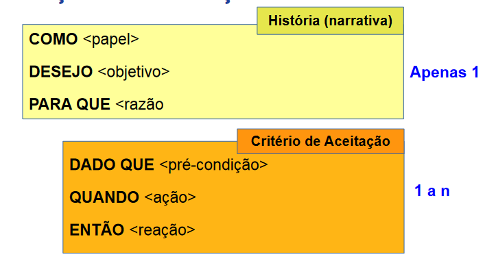
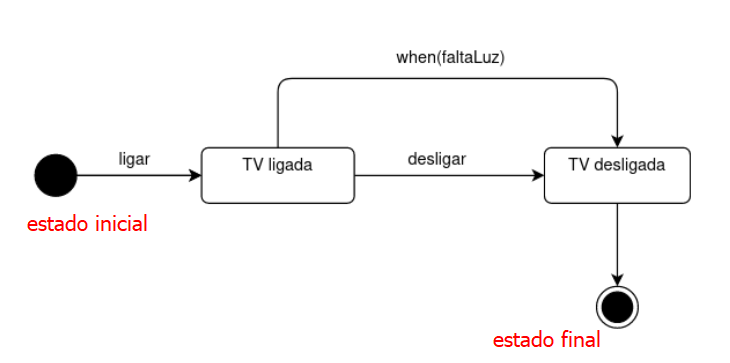
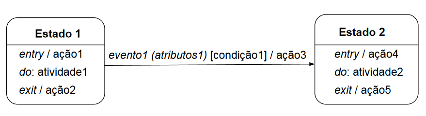

Anotações padrão da cadeira

# Trabalho do semestre
- exercício de construção de software dentro de um caso de uso
- https://trello.com/b/hxuWNBab/trabalho-engenharia-de-software-fundamentos -> link do trello
## avaliação
- sempre por sprint
- analisando o escopo 
- se tiver algum ajuste precisa revisar na próxima sprint
- na 4° a revisão é feita de todas
## Scrum
- trabalho por sprints 
- a lista de coisas à fazer é tratada como backlog
- o planejamento é feito de sprint em sprint
- o tamanho das sprints é sempre fixo
    - fazem divisões por semanas etc
    - es dentro da sprint n deu pra entregar tudo, entrega igual, mas sempre precisa alguma coisa pra entregar
- a moral é o usuário sempre ter alguma coisa pra verificar
    - teste, validação e feedback
- método ágil **precisa** necessariamente do feedback constante do usuário
- a mesma equipe sempre trabalha no mesmo projeto, sempre
- se sobrar tempo puxa do backlog priorizado
- times autogerenciáveis
    - em tese n precisaria ter um manager no time
    - teoricamente
### papéis
- product owner (PO)
    - definição de prioridades
    - às vezes é papal do cliente
    - se for alguém da TI ele fica bem próximo do cliente
- scrum master
    - ele precisa ajudar a desempenhar as tareds
    - alguns scrum masters tem vários times embaixo da asa
- equipe de desenvolvimento
    - pessoal que produz msm
    - os peão né
### cerimônias
- sprint planning meeting
    - planejamento do sprint
- daily meeting
    - trocar ideia com o pessoal
    - avisos
    - pedir ajuda ou compartilhar problemas e implementações
    - manter o time todo no mesmo pace
- sprint review
    - mostrar pro usuário o q foi feito no final da sprint
- sprint retrospective
## kambam + scrum
- a divisão todo, doing e done - basicamente um trello
- times autogerenciáveis tem acesso à lista de tarefas e elas podem pegá-las por conta pra fzr

# Obersvações pertinentes
 - Não existe Software sem bug
    - em algum lugar eles estão
- Software Craftmanship - artesanato de software?
    - https://manifesto.softwarecraftsmanship.org/
- Chaos report
    - https://www.infoq.com/articles/standish-chaos-2015
    - quantidade de caus instaurado dentro de projetos de software
    - a grande maioria é meio quebrado e é implantado com algumas coisas tortas
    - obviamente conforme aumenta o pojeto a taxa de sucesso diminui bastante
    - más escolhas de projeto, ainda no início, são os principais geradores de problemas
- sempre pregunte a necessidade/motivo dos pedidos de um customer
- https://developerslife.tech/pt/
- SOLID
    - princípios e boas práticas
    - aberto à altera~ções e fechado a modificações
    - dá pra fzr implementações sem alterar o código inteiro
    - o sistema precisa ser expansível
- Design Patterns
    - facilite o trabalho do suporte e dos implementadores
- a engenharia de requisitos nunca termina de vdd
- existe um cargo dentro de empresas (TEM  Q TER)
    - DPO - é o mano q cuida dos contatos de customers dentro da empresa
    - o customer pode chegar na empresa e pedir pra excluir tds os dados dele dos sistemas
    - é uma lei, n necessariamente seguida
- MVP - minimal viable product
- a organização de personas pode ser feita de muitas maneiras
    - tanto igual um perfil no insta quanto um txt sozinho com as informações descritas formalmente
- https://dannorth.net/introducing-bdd/
- Blog OneDayTesting - Gherking: Introduzindo seus conceitos e benefícios - https://blog.onedaytesting.com.br/gherkin/
- Selenium é bastante útil pra montar testes automatizados pra páginas web

## Ferramentas:
### Astah
- Licença free para contratos de estudantes
- http://astah.net/products/free-student-license
### draw.io
- Edição UML
- Não é exatamente uma ferramenta montada pra isso mas faz bem o trabalho
- http://www.draw.io
- Uma dica de uso é integrar com o Google Drive
### PlantUML
- Edição de UML
- Diagram as code
    - dá pra fzr uma sheet cheia de código .plantuml e deixar salvo junto com o código fonte
- Várias IDE's têm plugin
### Trello
- http://trello.com
- free
- extremamente simples pra acompanhar trabalho de administração de recursos e tempo
### Pencil
- desktop e open-source
- https://pencil.evolus.vn
### Justinmind
- desktop free
- https://www.justinmind.com
### MockFlow
- ferramenta web, versão free limitada
- https://mockflow.com
### Figma
- web
- versão free com algumas limitações
- https://www.figma.com

DATA: 27/Fev/24
# Introdução à Engenharia de Software: conceitos, princípios, padrões e práticas
- Por que sempre se começa com as apresentações pessoais?
    - uma pergunta que sempre me faço
- "...aplicação de uma abordagem sistemática..." - IEEE Std 610.12 (1990)
    - pensar em quem vai dar manutenção é MARAVILHOSO -> por favor faça isso
    - documente seus códigos
    - pense na escalabilidade
        - provavelmente nenhum programa vai ficar igual pra sempre
Tenha sempre em mente que códigos monolito são bastante caros e, apesar de poderem servir para aplicações mais simples, o ideal é montar todo e qualquer código com escalabilidade e o mínimo de separação entre os serviços dentro dele.
Sei que algumas vezes é muito fácil de se deixar levar, mas é necessário ter controle sobre as próprias criações
- eng. de Software data de 60
    - obviamente era tecnologia militar - NATO (OTAN), 1960
        - Boa parte das tecnologias eram para uso militar ou tem alguma relação belicosa de demonstração de poder
        - Internet inclusive só surgiu por causa da Corrida Especial
    - NATO (OTAN) Conference on Software Engineering, 1968
- em 1970 praticamente n tinha Software
    - n tinha padrão de montagem
### Crise do Software
- isso englobava problemas básico de engenharia civil, mas com Software
Normlamente no início de trends é assim, sem muito padrão de projeto ou de execução.
Aqui no caso, o pessoal fazia a programação no estilo freestile mesmo, sem se preocupar demais com nada.
Os problemas da crise do software englobam problemas básicos de engenharia; todavia, eles ainda existem devido ao fato de:
- Softwares aumento de complexidade continuamente
- Novos processos (usualmente mais ágeis) quebram os paradigmas antigos
- Simplesmente surgem problemas novos que as documentações precisam revisar que simplesmente não existiam na época de escrita do texto.
### IEEE SWEBOK
- é um dicinário (bíblia) para padrões de projeto
- Software Engineering Body of Knowledge
- https://www.computer.org/education/bodies-of-knowledge/software-engineering para pegar a versão mais atualizada
## mensuração de preço de aplicação
Da mesma forma que saber construir uma casa não é só saber uma laje, produzir um software comercial não é só programar
- sempre vai depender
- projetos corporativos podem chegar a milhões de dólares e anos pra serem desenvolvidos
- preços, prazos, etc, sempre são variáveis
Variabilidade nos preços e escalas também depende bastante da criticalidade do projeto.
Certamente projeto mais simples como uma agenda são mais tolerantes a erro e requerem menos cuidado (apesar de que nunca se deve programar despretenciosamente) do que um projeto de OS para uma aeronave.
O Boeing 777 por exemplo, lançado em 1995 e o primeiro problema de software causou 2 mortes apenas em 2006, depois do avião em particular ter 36000 horas de voo e 5000 decolagens/aterrisagens
### problemas e erros são caros (normalmente)
- erros de implementação, principalmente em projetos OnPremise e sem atualizações em tempo real, podem ser fatais pra produtos(vide exemplo do Boeing 777)
    - ainda mais se a aplicação for bastante utilizada
    - problemas escalam dependendo do contexto
        - erros em sistemas aviônicos ou de saúde podem ser fatais
- Therac 25
    - essa máquina de raio-X mandava tiros 100x maiores de radiação pra exames
    - umas 5 pessoas morreram pelo menos 
    - não haviam alertas de erros
- metodologias e tamanhos de projeto determinam bastante a taxa de sucesso dele
    - Pojetos menores sã obivamente mais simples de realizar
## Processo de software
Qualidade de software é tão importante quanto quantidade.
Ninguém vai usar um software bugado
- antes de desenvolver precisa organizar o esquema
    - e um tipo de hierarquia
### cascata
- faz cada parte cascateado
- n abraça nenhuma mudança
    - ai quero mudar requisitos - azar
- bastante problemático e enxuto, mas ainda usam
- modelo de 1970
Claramente um modelo fruto de seu tempo
### iterativo
- similar ao cascata mas altera muitos requisitos durante o Processo
    - modula os requisitos e implementa em partes
- o modelo espiral tá aqui dentro
- trabalhos com ciclos de tempo
    - a falha aqui é menor já
    - a validação vai ser constante dentro dos ciclos
Dificilmente vai ficar pronto na primeira versão.
"Andar sobre a água e desenvolver software a partir de uma especificação é fácil. Se ambos estiverem congelados..." - Edward V. Berard (Engenheiro de Software renommado)
Ao final de cada iteração o projeto avança uma parte, mas muda em outras para acompanhar a evolução do projeto.
- Exemplo de mês:

Dias    | Trecho
:-----: | :--------:
9       | Análise
6       | Projeto
12      | Desenvolvimento
3       | Testes

### ágil
Metodologias ágeis funcionam muito bem com projetos de MVP e testes de conceito, que realmente precisam de rapidez elevada.
Alguns adeptos dessas metodologias esquecem de fazer documentações.
- http://agilemanifesto.org
- manifesto ágil de 2010
- mais proximidade com o usuário
    - a validação do sistema é feita diretamente por eles
- pessoal ignorou a documentação kkkkkkkkkkk
    - como vou dar manutenção sem documentação?
    - GO HORSE!!!
    - https://gohorse.com.br/
- Scrum e eXtreme Programming são bastante abrangentes e distribuídas
    - frameworks né
- aqui recursos e tempo valem mais que o escopo (manter padrão)
## ciclo de vida de software 
- sempre vai existir
- projeto precisa:
    - especificação
        - problemas
    - estruturação
        - modelagem
        - especificação de funcionalidade
            - no fim as regras de negócio e validação de software dependem bastante do usuário (customer)
    - codificação
    - testes
    - manutenção
- o esmero dessas fases depende bastante de projero pra projeto

DATA: 06/Mar/2024
# Engenharia de Requisitos
Entenda que requisitos bem explícitos são extremamente importantes para o processo de software. Requisitos mal feitos normalmente geram projetos bugados e consideravelmente mais caros.
- Sempre escute o usuário e MANDE ele te passar o processo completo errar menos
- se acontecer alguma coisa a culpa sempre vai ser da TI
- alguns sistemas já existem
    - se o requisito pede alguma coisa q já existe, usa o existente caraio
- a técnica de descobrir o q fzr exatamente ainda é trabalho do mano da TI
- requisitos bem definidos evitam erros de comunicação e implementações tortas entre software (ou pedaços dele)
## Causas de falha
- Requisitos mal elaborados geram erros de implementação e bugs futuros.
- Requisitos com fraca relação com os stakeholders.
  - Trabalho que provavelmente o cliente não vai usar.
- Dificuldade de alterar requisitos durante o desenvolvimento do software.
- Frequentemente, as implementações fogem do planejamento.
  - Mesmo assim, é necessário documentar tudo e alinhar expectativas.
  - Acreditar que alterações não acontecerão é um erro.
- Defina bem o escopo e mantenha o cliente sempre próximo (mesmo que seja chato).
  - Tenha processos de negócio bem definidos (às vezes nem o cliente realmente sabe).
    - Às vezes, o analista precisa desenhar o processo junto com o cliente.
### Por que requisitos?
- planejamentos
- estimativas (monetárias, principalemtne, softwares são caros)
- definição de escopo de projeto
    - às vezes precisa limitar o usuário nos pedidos (sim, eles pedem coisa pra caralho no mesmo ticket/projeto, n necesariamente relacionadas)
- planejamento de testes de qualidade
- administração de riscos
    - n atender uma norma pode gerar uma multa
        - é um risco querendo ou n
    - ou ainda aplicações de alto risco de vidas em caso de erro
## visão geral de projeto de desenvolvimento

Análise de Requisitos    | % do custo de desenv. | % dos erros introduzidos | % dos erros encontrados | Custo relativo de correção
-------------------------|:---------------------:|:------------------------:|:-----------------------:|:---------------------------:
Modelagem e Projeto      | 5                     | 55                       |  18                     | 1
Codificação              | 25                    | 30                       | 10                      | 1-1,5
Teste                    | 50                    |                          |                         | 
Validação e Documentação | 10                    | 10                       | 50                      | 1 - 5
Manutenção               |                       | 5                        | 22                      | 10 - 100

- erros de modelagem e projeto são os mais custosos de se corrigir (e onde mais eles aparecem)
    - esses se propagam até o fim do projeto se deixar 
    - aí a manutenção precisa arrumar o trem andando
- custos de correção só dps na manutenção é pior q parar no meio e voltar
## Requisitos
São, de certo modo, acordos entre os desenvolvedores de software e os clientes.
Da mesma forma que seria bastante complexo para o cliente montar a solução por própria conta, também é bastante complexo dos desenvolvedores elaborarem um software sem nenhum norte para seguir.
Além disso, eles evitam problemas futuros quando o software estiver pronto e não ser exatametne o que o cliente queria ou ainda questões do presente, tais qual aumento indevido do escopo do projeto.
“consiste no uso sistemático e repetitivo de técnicas para cobrir
atividades de obtenção, documentação e manutenção de um
conjunto de requisitos, que atendam aos objetivos de negócio e
que sejam de qualidade.” (VAZQUEZ; SIMÕES, 2016)
### Níveis de requisitos
Existem diferentes níveis de requisitos para que haja uma diferenciação mínima entre os assuntos, mesmo dentro do ambiente de elaboração de requisitos.
A separação de temas e divisão entre os mais técnicos e gerais é importante durante a gerência do projeto.
- basicamente o q precisa fzr
    - n é o como
- normalmente usuários tentam vir com soluções de primeira
    - sempre pergunte o suficiente pra entender a issue dele
    - normalmente a necessidade n é atendida pela solução dele
    - sim, tu é um psicólogo pra entender

#### Requisitos de usuário
- imaginação forte do usuário
- extremamente alto nível
- expectativas do user
- públicos alvo são bastante diferentes
    - gerência e contratantes
    - arquitetos

#### Requisitos de sistema
- feito pela TI
- é bem mais específico
- precisa detalhar o proceso feito pelo time
- um refinamento "natural" dos requisitos do usuário
- público engloba
    - arquitetos analistas e desenvolvedores 
    - às vezes coloca o usuário final pra acompanhar a montagem

#### Requisitos funcionais
- funcionalidade de sistema
- permite algumas funções pelo usuário
- geridos por equipes um tanto mais técnicas

#### Requisitos não-funcionais 
- regras de negócio
- leis (trabalhistas)
    - privacidade de dados (LGPD e GDPR)
    - encarecem os sistemas - ainda mais se n tem preocupação com segurança desde o início
    - seguança da informação tá bem requisitada hj em dia (inclusive a área de testes)
- relacionamento com infra-estrutura
    - às vezes precisa considerar o ambiente de execução
- vira uma característica do sistema

### classificando requisitos
- tem uma árvore inteira de requisitos n-funcionais

## Atividades
- estudo da Viabilidade
    - ver se dá pra fzr o q o customer pede pra fzr
    - dependendo do projeto pode levar bastante tempo
    - relatório de Viabilidade
- elicitação e análise de requisitos
    - começo da modelagem
- especificação
    - docuemtação de como o sustema funciona pra modelagem e codagem
- validação
    - processo de double-check com o user pra dar seguimento
    - provalvemente feito em várias rodadas
- em tese esse trabalho diminui com o tempo de desenvolvimento
- precisa fzr gestão de rastreabilidade
- ciclos de requisitos são sempre presentes
- as atividades mais efetivas são realizadem em organizações de ciclos entre as fazes de elicitação, organização, priorização e especificação dos requisitos

DATA: 13/Mar/24
### Elicitação de análise de requisitos
A descoberta de requisitos se baseia bastante no encontro de requisitos por via de diferentes formas das quais é de bom tom não se valer apenas de uma das formas de agrupamento de informações, uma vez que informações podem ficam de fora conforme a situação.
- é bastante necessário identificar verdadeiramente quais os requisitos e necessidades do customer
#### Entrevistas
    - bastante comum
    - pega um dos funcionários e entrevistar
    - entender o que a pessoa faz e entender o processo
    - quais dados ela precisa vizualisar, informar, inserir, etc
    - às vezes é complicado pq a pessoa pode esquecer alguns pedaçoes
    - aberta
        - sem nada mto definido
        - normalmente no começo do processo
    - fechada
        - questões especificas
        - mais no meio, quando parte da situação já foi entendida
    - tutorial 
        - literalmente um tutorial do processo
        - processo bastante específico do meio do projeto
    - é um problema ter pessoas que falam de mais
#### Leitura de documentos
    - entender a dcuentação da empresa
    - manuais de processos
    - normas, leis, recomentações, etc
    - ter acesso à intranet da empresa pode ser batante interessante
    - vai atrás de documentação útil pro ptoblema
#### Questionários
    - quando precisa atingir muitas pessoas
    - 100 usuários? n dá ra entrevistar todos
#### Observação
    - entendo o processo ao ver o usuário trabalhar
    - santar junto com ele mesmo
    - é realmente bastante tempo investido apenas nisso (desvantagem grande)
#### Reutilização de requisitos
    - seja cuidadoso e valide antes de mandar pra producção
    - mas economiza tempo
#### Prototipação
    - MVP
    - entendimento mútuo do que ambos estão esperando
#### Histórias de usuário
    - usuários contam histórias
    - é mais fácil de colocar um contexto
#### Caso de uso
    - execução do sistema em casos específicos
    - quais funiconalidades são necess´raias em casa interaçõa
    - como o sistema responde
#### Participação ativa do usuário
    - nem todo projeto tem isso
    - deixar o usuário por dentro e deixar ele entender o que tá acontecendo
#### Classificação e organização de requisistos
- revisar as anotações e entender o q elas dizem
- agrupar os requisitos
    - regras
    - legislações
    - etc
    - regras de negócio basicamente
#### Priorização e neogciação
- é bastante difícil n tirar o priorizar requisitos
- algumas coisas são iteressantes msa n precisam estar presentar na primeira versão
- a montagem do sistema precisa ter uma ordem lógica de montagem
- MVP - minimal viable product
- é interessante usar checklists e tentar buscar os problemas apresentados (evita esquecimento)
#### Especificação de requisitos
- utilize algum tipo de padrão
- wikis jira, confluence - precisa ter tudo em algum lugar 
- referenciamento de requisitos é bastante importante dentro da documentação
- glossário de termos facilita o trabalho pra tds terem a mesma linguagem durante o projeto - principalmente pra pessoas novas

DATA: 20/Mar/24
# Prototipação
A ideia toda da prototipação é colocar todos os envolvidos no projeto na mesma página.
De nada vai adiantar uma porrada de reuniões se ninguém conseguir se entender efetivamente.
- melhor ideia nunca vem de primeira
## prototipação de sistemas
Os protótipos são versões inacabadas e completamente toscas do que seria o produto final.
Eles não têm nenhuma intenção se não **imitar** o que talvez virá a ser o final do processo.
- desenvolvimento super rápido
- é um MVP mesmo, use cutting corners e esquemas
- demonstração rápida de ideias e feedback ligeiro
- reduz o risco de falha de comunicação
- onjetivo é um feedback em cima do protótipo
    - ele vai ser jogado fora posteriormente
### evolucionária
Esse aqui é um caso interessante.
Apesar da Internet ter sido montada nesse estilo, normalmente não é recomendado usar esse tipo de processo, já que os tipos de organização variam com o tempo e provavelmente o que era acordado no início será mudado no final. Sem contar que para ficar uma bagunça é dois toques.
- o mesmo protótipo existe desde o começo e ele vai sendo reaproveitado até sair pra produção
### descartável
Mais rápido e fácil de montar. Sem contar que a culpa de alguns tipos de teste é inexistente.
- protótipo de validação e dps joga fora
- a maioria dos casos
- muitas vezes protótipos ficam muito mexidos e manter padrão é mais complicado
#### níveis de protótipos
São diferentes tipos para diferentes ocasiões.
É bastante comum mais de um tipo ocorrer durante o desenvolvimento do software.
- baixa fidelidade
    - rascunhão mesmo
    - dá pra fzr a mão, azar
    - storyboard ou sketches
    - Storyboard
        - foco é nas ideias q precisam ser transmitidas sobre o processo
        - entendimento de contexto geral e momentos de uso
    - sketches
        - já tem algum tipo de interação do usuário
        - pode ser feito em papel msm azar
        - usuário se engaja bastante com apicações físicas e lúdicas assim
- média fidelidade
    - normalmente feito com ferramentas mais robustas 
    - sem recursos gráficos de verdades
    - wireframe
        - esqueletão da implementação
        - compnentes e alguns dados já existem
        - td sem UI ou esquematização de arte
- alta fidelidade
    - mockup
    - validação de layout com o usuário
    - esquema de cores, componentes, etc
    - validação de UI
    - mais complexos de montar
        - use com equipes de UX/UI
    - mockups
        - componentes e uso mais interativo
        - vários dos componentes já são os finais
        - ainda são desenhos mais alguns botões já funcionam
## avaliação de protótipos
- n precisa ficar guardando
    - o time de desenvolvimento usa apenas de referência
- estudo de usabilidade
    - algumas interações ou componentes podem ser previamente validados ou marcados como pontos de atenção
    - ambientes simulados pra ver como o user se comporta
- survey
    - questionários q os usuários podem responder
    - n vê o cliente usando de verdade
        - às vezes o cliente mente
- focus group
    - grupos de usuários (especiailistas que conhecem bastante o processo)
    - n tão grandes, 5 pessoas
    - ás vezes acontecem discussões de negócio entre os usuários
    - tome cuidado para ouvir as pessoas q n falam muito
- feedback de especialistas
    - sistemas extremamente específicos
    - e.g.: gerenciamento de usina nuclear
        - precisa de users efetivos e q sabem o q estão fazendo
- avaliação comparativa
    - interessante quando o user n sabe com o q comparar pra achar bom ou ruim
        - pd ser interessante montar mais de uma versão pra existir um tipo de comparação
- observação de participantes
    - mais rara
    - observação do usuário usando o sistema
        - às vezes usam câmeras
    - feito com tarefas específicas a serem executadas dentro do sistema
## características
Bons protótipos representam ideias, não soluções.
Atente-se sempre para não dar com a lingua nos dentes ou pular processos importantes na hora de elaborar um software. Mantenha as soluções simples e faça propostas o quanto antes, os processos andam mais dessa maneira.
- se demorar muito tá errado
- deve ser fácil de alterar (em uma reunião mesmo)
- evite
    - 1 só pra discussão de ideais -> faça mais de uma para testes
    - NÃO EXISTE protótipo funcional
        - n tem consulta, é tudo dado físico
- o objetivo é fazer perguntas até chegar na resposta

DATA: 27/Mar/24
# Personas
As personas precisam de um conjunto básico de dados para poderem funcionar, normalmente com:
– Dados demográficos (idade, sexo, renda, localização)
– Características de personalidade
– Comportamentos e hábitos
– Necessidades e objetivos
já se está de bom tamanho

- uma das maneiras de ajudar o cliente a montar uma soluação de software
- é necessário entender o que o cliente realmente precisa
- ainda é nosso papel pensar em uma solução decente (como desenvolvedores de sistemas)
- Allan Copper, 90's
- É uma ferramenta de construção de pessoas fictícias
    - vários projetos são concetrados nas necessidades do usuario
    - ter um exemplo palpável é sempre interessante para saber o lugar para correr
    - algumas equipes de marketing trabalham com personas (malditos marketeiros)
- Personas **não** são completamente inventadas
    - a criação delas é baseada nas informações retiradas do grupo de pessoas alvo
    - a montagem é com base em dados demográficos/sexo/renda/personalidade/hábitos/etc...
- fique atento para n ser preconceituoso (complexo)
    - a criação de personas é um estilo de user, não um esteriótipo
    - isso deve ser cuidado por quem cria tanto por quem lê o material
## coleta de dados
Coleta de dados precisa ser feita de uma maneira ou de outra, do contrário talvez algum pré-conceito ou imaginário dos desenvolvedores fale mais alto que alguns dos fatos.
Usualmente os processos normais de adquirir informações são usados (entrevistas, consultas, serveys, etc)

- pega os dados em mãos ou usa todas as técnicas de adquirir dados externos
    - survey, entrevistas com x usuários, etc
- Tenha certeza que sua solução funciona para todos os grupos de pessoas com deficiências
- devem ser easy-to-read
## proto-persona
A mesma coisa que uma persona comum, mas sem a parte da pesquisa.

- são personas criadas pelas visões pessoais dos integrantes do projeto
- faz sentido em inícios de projeto ou para discussões internas antes de realmente desenvolver o software
- a equipe ainda n usa dados reais (bem mais fácil de ter preconceitos inseridos kkkkkkk)

## Refinamento das informações
É bastante comum de se adquirir mais informações que o necessário ou ter algumas inúteis.
Não que conseguir informações demais seja o problema, muito pelo contrário, pegue o máximo delas. A razão aqui é gerar informações úteis, até porque dado que não importa só polui e não auxilia desenvolvimento.

- precisa rolar uma peneira de dados pra retirar o q realmetne seja interessante

# Histórias de usuário
Pegue as personas/usuários e crie situações que o produto final **será** utilizado.
Essa ferramenta serve apenas de contexto geral para liderar o desenvolvimento do projeto.

- como criar especificações que possam ser lidas por qualquer nível dos envolvidos no desenvolvimento do sistema?
    - todos precisam entender (pré-requisito)
- boas histórias de usuário não envolvem absolutamente nada da arquitetura do sistema

### Exemplo
Existem alguns grandes exemplos para histórias de usuário, mas a mais famosa está na imagem abaixo.
Usualmente se coloca um desses templates como o padrão para uso e depois um ou mais critérios de avaliação, conforme o template abaixo.
- O usuário pode pesquisar vagas.
- A empresa pode divulgar novas vagas de emprego

## Conceito 3C
- cartão
- conversação
- confirmação
- um modelo pra identificar exatamente o que precisa ser implementado e confirmar pontos

## modelo INVEST
- outro modelo de montagem de software
- Independent
- Negotiable
- Valuable
- Estimable
- Small
- Testable

## padrão de escrita
- COMO [<papel>]
- DESEJO [objectivo]
- PARA QUE [razão]
- implementações precisam ter um motivo
    - mas n dá pra seguir as regras segamente
    - sabendo o q tá acontetendo dá pra discutir a solução antes de implementar de verdade

## critérios de aceitação
Esses critérios são baseados no contexto do projeto e variam bastante. Normalmente são formulados com acordos entre os desenvolvedores e clientes.

- complementos das histórias de usuário
- BDD (Behavior Driven Development)
    - uma das técnicas de aceitação
- normalmente as histórias caem sobre situações-chave
- dado que ... o sistema faz ...

### Exemplo

DATA: 10/Abr/2024
# Casos de uso
Componentes de casos de uso auxiliam durante as fases de *Requisitos* e *Análise e Design* do desenvolvimento de software

DATA: 17/Abr/24
# Especificação do modelo de caso de uso
Funciona como uma sequência de informações que demonstram os passos que o usuário teria conforme usa o programa.
Em algumas implementações de cenários são necessários *desvios*, possibilidades dentro daquele cenário de que o previsto para o caso de sucesso não aconteça.
Os casos alternativos são também chamados de fluxos alternativos para os cenário principal (fluxo principal) 

- baseado bastante em cenários de execução
    - sequências de ações
- casos completos demonstram casos de sucesso e fracasso
    - sucessso é tudo dar certo
    - existem mais casos de fracasso q sucesso
    - precisamos entender todos os passos onde podem surgir problemas

## Casos de uso resumido
- Um um parágrafo dá pra entender completamente o que a funcionalidade faz

## Casos de uso informal
Esse tipo de caso de uso é bem livre e só precisa das possibilidades listadas nos fluxos

- pega o caminho feliz e coloca alguns dos cenários alternativos

## Caso de uso completo
Casos de uso geralmente detém exceções, pequenos elses que podem ocorrer no meio do processo principal (em tese o correto/melhor saída).
Determinadas informações como os problemas em aberto e variações podem gerar caminhos alternativos que podem voltar ao fluxo original, servindo apenas como um pequeno desvio, ou tomar um rumo diferente e acabarem em si.
Outro ponto importante de se lembrar é que apenas entram no fluxo partes do processo feitas dentro do sistema, ou seja, se uma, por exemplo, autenticação for executada por fora do sistema, como pelo Facebook, ela **não** vai entrar na conta do caso de uso.

- várias informações
- várias condições precisam ser atendidas
- dentre eles:
    - **Identificação/Nome do caso de uso**
    • Ator principal
    • Requisito funcional
    • Interessados e interesses
    • **Pré-condições**
        - o q ter já pronto no sistema no momento de usar a funcionalidade
    • **Garantia de sucesso (pós-condições)**
        - ao final do caso de uso, oq deve ser alcançado?
        - se tudo der certo
    • Cenário de sucesso (fluxo principal)
    • Extensões (fluxos alternativos)
    • Requisitos especiais
    • Lista de variantes tecnológicas e de dados
    • Problemas em aberto
- os marcados normalmente são os mais utilizados
- existem vários sublistas dentro dessa lista
- procure utilizar a forma numerada para demonstração de passos
- a situação feliz é o fluxo principal
- fluxos alterantivos são outros caminhos q o usuário pode seguir e ainda chega no mesmo lugar
- fluxos de exceção acontecem por n atender à alguma regra de negócio
    - são caminhos indesejados
    - esses fluxos são indesejados mas precisam existir a fim de que o sistema seja completo
- variantes e requisitos extras dessa especificação em específico podem ser colocadas junto

## Boas práticas
- use verbos no infinitivo para criação das especificações
- atores atuantes apenas são os necessários
    - n é pra criar histórias fora do sistema, é dó da interação do ator com o sistema
    - como ele pega os dados pra preenchimento, uso, azar, não importa, n está dentro do sistema
- coloque passos firmes e exatos
    - **NUNCA** coloque opções lá dentro
        - se precisar disso provavelmente é questão de existir um fluxo alternativo
- ou o passo do caso de uso começa com o sistema ou com o nome do agente
- se a organização do fluxo pedir muitos alternativos, provavelmente a arquitetura da solução tem algum problema

### Checklist
( ) Como uma ajuda na hora de crias os casos, pode ser interessante utilizar esse checklist:
( ) O nome do caso de uso inicia com um verbo no infinitivo?
( ) Todos os passos do fluxo são afirmações?
( ) Todos os fluxos alternativos representam um caminho que
o usuário pode seguir por conta própria e substituem um
passo no fluxo principal?
( ) Todos os fluxos de exceção são um erro imprevisto, onde
o usuário não escolheu seguir?
( ) Todos os fluxos alternativos e de exceção indicam para
onde vão após serem executados? Ou voltam para um
determinado passo do fluxo principal ou finalizam o caso
de uso.

DATA: 29/MAIO/2024
## Casos de uso 2.0
A parada aqui é que todo projeto e implementação (tanto de engenharia e software) requere duas coisas: segurança, agilidade e documentação (a documentação entra mais no caso que lidamos com software, mas podemos colocá-la junto da segurança, já que uma boa documentação permite implementações mais amigáveis no futuro e uma manutenção mais rápida).
O ponto é que, no mundo real, para criarmos soluções rápidas, deixamos a segurança de lado. Para criarmos soluções seguras, deixamos a rapidez e agilidade de lado. É óbvio que podemos ter as duas coisas, mas a pergunta certa é: você tem o **dinheiro** necessário para criar algo seguro e feito rapidamente? (Obrigado pela visão, Lito, do Aviões e Músicas).
Casos de uso 2.0 querem o seguinte:
1. Keep it simple by telling stories.
2. Understand the big picture.
3. Focus on value.
4. Build the system in slices.
5. Deliver the system in increments.
6. Adapt to meet the team's needs.
Acontece? Algumas vezes, mas como todo processo, quando mais longe da origem, mais diferenciado fica (foggy).
Em casos de uso é bastante interessante ter em mente a quantidade deles. Saiba que sistemas grandes usam em torno de 12 casos de uso, o que já considerado muito segundo Ivar Jacobson. Sistemas pequenos, com funcionalidades focadas, podem ter uns 2 ou 3 casos de uso. Mas não se engane, mesmo com 1 caso de uso, o sistema ainda pode ser bastante complexo. Esses casos ajudam a manter o norte à vista e gerar definições de objetivo.

Tudo isso é bastante interessante, mas agora os casos de uso acabaram de ficar um pouco mais complicados. O problema é: raramente os casos são utilizados em sua plenitude, serão agora que ficaram mais complexos? (FINITO - Use Case 2.0: Você precisa dele? (11/01/2012))

- a primeira aparição do conceito da ideia de caso de uso é bastante antiga
    - á princípio na conferẽncia OOPSLA de 1987
- manifesto ágil veio em 2001 e foi implementado em diversas empresas
    - onboarding ficou mais rápido
    - até então existiam outros modelos preditivos (normalmente as empresas trabalhavam no modelo cascata)
    - ainda assim existiam outras metodologias ágeis
        - eXtreme Programming
        - etc
    - a rapaziada que montou já participava disso e tinha vários braços em outros segmentos de modelagem de software
    - um problema do manifesto ágil é que o pessoal **não documentava** -> sistemas viram legado com menos de 1 ano de idade e qualquer manutenção é terrível
- a versão 2.0 é diferenciada
    - se baseia em pequenas entregas
    - quebra sistemas maiores em peças bem menores e divide em diversas entregas para o cliente
    - a vantagem de entregas de fatias é receber feedback constante do usuário
    - outro ponto é obrigar a montar o sistema em encrementos
        - pode facilitar para montar sistemas modulares e em cascas
        - manutenção e montagem de documentação é bastante facilitada
- a manutenção de diagramas é bastante chata e trabalhosa
    - e no fim das contas ninguém olha artefatos de diagramas
    - bem mais simples ler textos e mandar ver
    - óbvio que isso depende da equipe, elas funcionam de maneiras diferentes
- todos os casos de uso também são quebrados em partes menores
    - as entregas são divididas
    - imagino que sempre exista algum tipo de "oraganização" entre os times para não existir retrabalho de recursos
- aquele mesmo esquema do fluxo principal e dos fluxos alternativos possíveis dentro de um caso de uso
- eventualmente os casos de uso terão implementações futuras
    - por exemplo um novo tipo de modo de autenticação
    - se preocupe em entregar algo e ter alguma coisa funcionando
        - outras implementações e recursos podem ser adicionados no futuro
- caso de uso pode ser bem interessante para testes
    - uma vez que o cenário entrega um norte padrão
    - os testes derivam do fluxo principal

DATA: 12/Junho/2024
# Diagrama de Estados
Objetos dentro do software se encontram em *estados* particulares, assim como objetos no mundo real (um semáforo ou uma jarra de suco).
Ações externas a esse objeto o fazem mudar de estado por meio de *transições*.
Essas relações podem ser desenhadas para um software utilizando o *diagrama de transição de estados* (DTE) - escrito em UML.

## Estado
Um estado é uma condição regular do sistema dada uma determinada situação.
O estado tem algumas características simples:

## Transições
É uma linha de conexão entre os estados e se dá por meio de um parâmetro e um evento associado.

### Eventos
Podem ser dos mais diversos tipos, com alguns exemplos sendo:
– Evento de chamada: recebimento de uma mensagem de outro objeto.
– Evento de sinal: recebimento de um sinal.
– Evento temporal: passagem de um intervalo de tempo predefinido.
– Evento de mudança: uma condição que se torna verdadeira.

## Condição de guarda
Coloca um parâmetro (ou *treshold*) para evitar o disparo desenfreado a transição.
Essa condição pode ser baseada nos parâmetros passados no evento.
Uma transição sem esse guarda sempre ativa quando a situação surge.

## Ações e atividades
Assim como as classes em prog OOO, aqui os estados também podem ter ações e/ou atividades (usos do estado mesmo)
- Ação - não pode ser intorrompida no meio
- Atividade - sempre acontece, precisa ser interrompida para o programa continuar com a execução

## Ponto de junção
É uma bifurcação dos fluxos de diagrama - ao depender da resposta de uma condição da transiçao, o programa pode tomar caminhos diferentes.

## Resumo da notação

Cabe lembrar que é sempre um bom começo ir para os casos de uso antes de montar um diagrama de estados e que nem todas as classes do programa precisam de um diagrama, apenas aquelas com um comportamento muito dinâmico.

DATA: 19/Junho/2024
# Modelagem ágil
Tenha em mente que a modelagem ágil foi montada com o intuito não de ser super rápida, mas sim de evitar problemas constantes em outros tipos de modelos.
Lembre-se de que não necessariamente fazer algo lentamente é lerdo, o problema real está em fazer rápido e de qualquer jeito, que resulta em mais manutenção posteriormente.

- valores
    - comunicação
    - simplicidade
    - feedback
    - coragem
    - humildade
- n é sinônimo de rapidez
    - é fazer no momento certo o q precisa fazer
    - faça lento para fazer direito
        - faça direito para fazer bem
            - faça bem para ser ágil
                - faça lento para fazer ágil
                - krl chutei o Agile Modeling kkkkkkkkk
- mantenha tudo simples
    - evite criar dificuldades desnecessárias no produto
    - n coloca o framework da moda no produto se n precisa
- nunca de disposal pro user
    - seja humildão e sempre valide as informações e pergunte pros usuários
    - comportamentos podem falar mais do que entregas
- modelagens precisam de requisitos mínimos, não dá pra simplesmente liberar qualquer coisa
    - n vamo passar trabalho pra fazer coisa minúscula
- pequenas interações pra validação é tipo montar o código em pequenas partes e ir testando
- código n é pra ser a única atividade
- é bom tomar a decisao se vai manter o descartar a documentação montada pro sistema
    - se precisar atuaizar muita documentação vai ser um problema pra tds as atualizações
- código fonte n deveria ser a única fonte de informação existente
- é ruim ter apenas uma pessoa modelando um projeto
    - necessariamente em grupo
- pequenso exemplos trazem segurança pra implementar projetos com ferramentas novas
- todas as pessoas precisa participar das implementações e conversar
    - decisões e discussões precisam estar no grande grupo
    - e nada deve ser nomeado, as produções são do time - todos trabalham na mesma cooisa

## Diagrama de atividades
Apesar de ser bastante semelhante à um diagrama de estados, o diagrama de atividades se concentra mais em mostrar como chegar nos estados que nos estados em si.
Mas sim, a montagem é bastante semelhante.

- também é diagrama de UML
- representa fluxos de trabalho
    - fala mais do que apenas o sistema
- dividão de tarefas em um fluxo - *workflow*
- dá pra modelar negócio
- BPMN - Business Process Modeling Notation
    - bem mais recursos que o diagrama de atividades
    - automação de processos
    - RPA - Robot Process Automation
        - automação robótica
    - maioria das ferramentas de automação de processos
- foco em fluxo e representações simples
- condição entre "estados" em colchetes
- usualmente n saem duas setas
    - se usa um losango pra até 3 opções de caminho
- a barra bloqueia a próxima atividade
    - tudo que está acima precisa estar concluído antes
    - JOIN (o FORK é uma barra que separa)
- dá pra fzr subatividades (símbolo dentro de um subfluxo)
- RAIAS - Swimlane
    - papéis específicos por raias
    - é pra ser conciso
    - o fluxo anda pelas raias

## Referências:
● Introdução do BDD (Ana Carolina Hermann)
    – Disponível em: https://www.slideshare.net/inovacaoDBServer/semana-da-mulher-na-tecnologia-introducao-ao-bdd
● Gherkin: Introduzindo seus conceitos e benefícios
    – https://blog.onedaytesting.com.br/gherkin
● Gherkin Syntax (Cucumber Docs)
    – Disponível em: https://cucumber.io/docs/gherkin
● Utilizando UML e Padrões (Craig Larman) 3ª. Edição.
● Princípios de Análise e Projeto de Sistemas com UML. 2ª. Edição. Eduardo Bezerra.
● AMBLER, Scott W. **Agile modeling: effective practices for extreme programming and the unified process**. New York: John Wiley & Sons, 2002. xvi, 384 p. ISBN 0-471-20282-7
● **Agile Modeling** 
    - http://agilemodeling.com
● The Values of Agile Modeling (AM) 
    – http://agilemodeling.com/values.htm
● An Introduction to Agile Modeling 
    – http://agilemodeling.com/essays/introductionToAM.htm
● Agile Modeling: Where Do I Start? 
    – http://agilemodeling.com/essays/whereDoIStart.htm
● The Principles of Agile Modeling 
    – http://agilemodeling.com/principles.htm
● Material Prof. Ricardo Roberto de Lima, UNJPE
● Meterial Prof. Ricardo Melo Bastos, PUC-RS