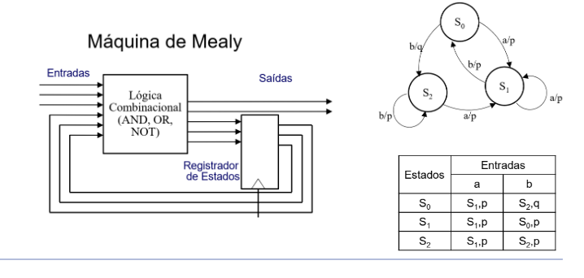

## Pertinências
- processadores ainda n conseguem manipular sinal analógico
- um overflow é uma operação com resultado maior do que os bits suportados
- LSB - bit menos significativo
- MSB - bit mais signigicativo
- ULA é o principal componente de um bloco de dados 
- [img do 1° slide com o ciclo de dados]
    - o processador é montado pela ula e o controle
    - quem calcula mesmo é a ULA
- considções de reset são representadas com setas nas máquinas de estado 
    - normalmente n são representados nas tabelas, mas variam à vontade, é só configurar direito
- memória RAM n faz parte do processador
    - a única são os registradores
- ISA - Conjunto de Instruções de uma Arquitetura
- PC - registrador de indexação das memórias
- o tamanho do barramento de memória n depende tanto assim da arquitetura
    - a qunatidade de memória RAM possível de ser endereçada varia conforme a quantidade de endereços que o sistema pode dar
- 'end' são as marcações de endereço que estou buscando

DATA: 27/Fev/2024
# Revisão de sistemas digitais, circuitos sequencias e fsm, Simulador de Computador
## Processador
Faz parte da arquitetura de Von Neuman. A arquitetura abrange uma Unidade de controle que manda nos comandos e um Ciclo de dados elaborado com flip-flops JK, em sistemas sequenciais de estado (o processador tem uma máquina de estados dentro dele basicamente)
- calcular, processsar e devolver o processamento
- circuito digital
    - Recebe instruções que dizem como o dado processado deve se comportar
- processadores são programáveis e tem instruções definidas pra processamento dos dados q ele recebe
- o simples é entender que ele é um operador simples
- memórias são elementos externos ao processador
    - apesar de algumas interfaces dele terem memórias
        - a principal no caso
    - registradores ficam dentro do processador (na maioria dos casos)
## Arquitetura x organização
### Arquitetura
- atributos visiveis ao programador e impactam diretamente a execução do programa
- conjuntos de instruções, qtde de bits e mecanismos de E/S influenciam
### Organização
- referente à parte interna
- implementação do hardware
- sinais de controle ,tecnologia de memória, transistores, ...
- n necessariamente interfere na programação, mas sim como ele funciona por baixo dos panos
## Sistemas digitais
- números limitados de valores (0 e 1)
- pulso ou n pulso
    - embasamento do sinal digital
- Bit - unidade mínima (0 ou 1)
- Byte - 8bits
- Palavra - sequência de bytes do tamanho da arquitetura
- Trabalha-se com bases:
    - decimal
    - binária
    - octal - bem pouco utilizada
    - hexadecimal - escalas de cor ou texto em arquivos
### Conversão de decimal
- fazer por divisões sucessivas
- pega o valor decimal e divide ele várias vezes pelo valor da base
- quando chegar em um valor igual ou menor q a base, para
- monta a sequência na ordem invertida e monta o binário, hexadecimal, etc
## Aritmética binária
- é igual uma soma decimal só q com 2 números
- um bit de estouro é um carry
- a subtração tbm é igual a decimal
## Circuitos combinacionais fundamentais
### Multiplexador (mux)
- tem um seletor de entradas pra escolher um pra saída
- Ele basicamente escolhe qual das entradas vai ir pra saída
### Demultiplexador
- Um entrada é quebrada em uma das saidas
- tbm possui um seletor dentro pra dizer qual saída foi agraciada
### XOR - C=A(+)B
- ou exclusivo
- comportamento dela é identico a uma soma binária
- entradas precisa estar em estados diferentes pra saída ser c/ carga (1) - verdadeira
### Meio somador - Half adder
- as entradas vão pro XOR e saem um ADD com C
- [inserir img do meio somador]
### Somador completo (full adder)
- leva em conta o carry out das operações anteriores
- tem basciamente um meio somador dentro pra geração de carry
- [img do somador completo]
- com somadores complestos dá pra fzr uma soma binária de palavra
### Unidade Lógica Aritmética (ULA)
- ula é um componente de operação de unidades lógicas aritméticas
- so uma das operações é mapeada pra saída
- a ula permite um número x de operações
- bota 2 valores q chegam nas entradas do multiplexador
- o seletor pega qual das operações vai ser realizada
## Circuitos sequenciais
- sempre precisa ter uma maneira de resetar
    - n dá pra garantir q tá em zero
        - só com reset
- Execução de sequência
- Precisa de um sinal de clock
- Depende das entradas e do estado anterior do ritmo
### Flip flop SR
- retem informação dentro do clock
- mantém essa info até uma condição ser feita
- base pra elementos de memória
- as duas entradas positivas vão dar abiguidade e n retornar uma saída (manter a q existe muito provavelmente)
### Flip flop D
- montam os registradores dos processadores
- veirifca entradas nas bordas de subida ou descida
- saída só muda no momento de alteração de clock
- sem o clock ele n muda o dado de entrada nunca
    - tá sempre sobreescrevendo o dado salvo
    - se necessário posso deixar de reter a info por querer
### Registrador
Esses registradores são máquinas puras de estado montadas com flip-flops JK. Precisam existir tantos quantos bits o processador processa.
- clocks comuns
- uma saída pra cada flip-flop FK
- unidade de memória mais básica do processador
### FSM - Finite State Machine - máquinas de estados finitos
Máquinas de estado finitos normalmente são ou de Mealy ou de Moore. Normalmente a usabilidade de uma máquina de Mealy é mais simples.
- um contador tem uma só sequencia, mas é bastante parecido com um FSM
- percorrem sequências de estados
- definição de sequencias de passos
- a função é gerar sequências de controle
- Mealy
    - saída depende de estado e entradas
    - estado é um circulo com o nome
    - cada estado da máquina de estados é uma contagem
    - dependendo da condição pra chegar no estado tal o valor de saída pode mudar
    - saída é apresentada na transição
- Moore
    - só depende do estado
    - estado é um circulo com o nome e a saída
    - trocou o estado a saída modifica
- máquinas de estado só os principais componentes dentro de um bloco de controle
- máquinas de estado normalmente levam pra algum lugar
- 
### Flip-flop JK
- clock na subida
- guarda info
- J e K regem as condições de transição
- J=0 e k=0 Q n muda
- J=1 e K=1 Q inverte
- J=1 e K=0 -> 1
- J=0 e K=1 -> 0
- as operações devem ser feitas bit a bit - as respostas são as condições que mudam do atual pro próximo
- vai ter um flip-flop pra cada bit
- Aqui nesse cálculo dá pra aplicar Karnaugh

DATA:12/Mar/24
# Arquitetura e organização de computadores: visão geral, Componentes do computador e organização interna.
- dentro do bloco de controle existe uma máquina de estados
    - alterações nesses estados dependem de entradas
- bloco de dados processa as operações
    - composto de ULAs
## Von Neuman
- memória única pra dados e instruções
### Processador Neandor
- n existe implementação física - e para fins educacionais
#### Arquitetura
- copmutador pega o código e manda pra assembly > depois ainda monta os bits (linguagem de máquina) - que é realmetne gravado na memória RAM
- como o código é escrito independe da arquitetura
    [adicionar marcador 1]
    - mas o assembly disso depende bastante
    - versionamento está presente
[Adicionar table ISA do slide]
- os registradores funcionam como variáveis
- CISC
    - possui várias funções com acesso à memória
[adicionar marcador 2]
##### Formato das instruções
- NOT, NOP - 1byte
- STA, OR, AND, LDA, ADD, JMP, JN, JZ - 2 bytes - 1 pro dado e outro pra marcação de variável
##### características gerais
- propósito geral armazenam dados
    - 8bit
- propósito específico tem funções específicas
    - PC - 8bit
- de estado
    - 2bit
- sempre calculados em múltiplos de 2
##### ciclo de busca
- busca
    - buscar instrução e copiar com o RI (registrador)
        - vai ser trabalhado aqui
    - PC incrementa pra próxima operação
    - 
- decodificação
- busca de operandos

#### Organização
- 256 posições x 8 bits
    - nessa arquitetura de 8bits
    - arquiteturas mais robustas tem mais endereços de memória (precisam de mais bits)
- sempre com 2 flipxflops
##### transferências necessárias
- AC, PC, RI, RDM, REM, N, Z - todos registradores
- todos os elementos têm controles

#### trans entre regs.
- NOP
    - busca a instrução da memória 
    - joga pro registrador
    - incremente no PC
    - REM <- PC
    - read; incremento
    - RI <- RDM
- STA - armazena acumulador
    - 2 bytes
    - busca é sempre igual
    - tem a fase de execução
        - armazenamento
        - lê o endereço de armazenamento
        - incrementa o PC
        - pega o dado do AC (acumulador)
        - salva na memória
    - REM <- PC
    - read; incremento
    - RI <- RDM
    - REM <- PC
    - read; incremento
    - REM <- RDM
    - RDM <- AC
    - write
- LDA
    - mesmo esquema do STA
    - N e Z indicam se o valor do registrador é Negativo ou Zero
- ADD (soma)
    - busca e execução
- OR 
    - igual
- AND
    - muda só a operação
- NOT
    - busca e inverte o valor direto de AC pra AC
- Funções de desvio incondicional
    - JMP (jump)
        - onde estou
        - para onde desvio
        - busca e puxa da mem(PC)
- devio condicinal
    - JN (jump condicional)
        - parecido com o jump, mas antes tem uma valização nas flags N e Z
    - JZ
        - igual
- HLT (halt)
    - finalização do programa
#### sistema de memória
- memória tem coneçoes de entrada e saída
- o PC define onde é escrito
    - mas existe uma porta (REM - Registrador de Endereço de Memória) que manda a informação de endereço
- quem realmente escreve é o RDM - Registrador de Dado de Memória
- read and write são marcadores da função a ser feita
    - vem da unidade de controle
[colocar marcação 3]
##### Operações
- x <- MEM(y) na realidade tbm tem passos dentro
    - REM <-
    - read
    - x <- RDM
    - esses processos acontecem dentro da memória 
- o PC é quem regitra o valor do y
- incremento do PC pode ser feito em paralelo
- 

## Harvard
- duas memórias, uma de dado e outra de instruções
- em tese posso ler duas informações ao mesmo tempo
### processador MIPS
- utilizado dentro do Harvard

## Tipos de instruções
- existem tipos de instruções para o processador
### RISC
- instruções simples
- LOAD e STORE
    - únicas funções que acessam memória
- limitada nos acessos ao hardware
    - ainda pode acessar registradores
- normalmente usado por arquiteturas harvard
### CISC
- instruções complexas
- qql instrução pode acessar memória 
    - pode gerar problemas
- podem operar com dados de registrador e memória para fzr qualquer cálculo
- normalmente usado por arquiteturas von neuman
- comandos com tamanhos de bytes diferentes
- diferentes tempos pra processamento