Anotações da cadeira

# Conceitos universais
- rede n funcional n é mais uma rede
- internet - núcleo de liga~çao de borda - rede q liga redes
- usar como infraestrutura n é trabalhar com ela
- cabo de par trançado n pd ter mais de 100 metros
    - ou dobrar > 45°
- sinal 5G é fraco, corpo humano barra
    - dentro dela n dá pra ver a 2,5G
    - são duas redes diferentes dentro do transmissor
- servidor em rede é um prestador de serviço
    - um celular mandando uma msg é um servidor tbm
- onda de rádio é um meio físico
    - preciso de controle do meio físico pra transmissão
- transmissões
    - simplex
        - só um lado faz a transmissão
    - half-duplex
        - só um pode falar por vez
        - walkie-talkie
            - controle de meio
    - duplex
        - coms duplas
        - telefone
- maioria dos pacotes n criptografam
- dois sinais na mesma rede é a física básica de ondas
    - se amplificar pode queimar alguma coisa
- o roteador de casa é um roteador de borda, mas essecialmente ele é só um switch
    - primeiro roteador, na borda da Net
    - trabalha como switch na camada de enlace
    - o roteamento é só com outro roteador
- enlace é uma ligação física entre as máquinas
- rede cabeada e wi-fi são diferentes (n tem rota)
    - alguns fazem um bridge entre as duas redes
    - com bridge vai ser sempre a 5G por ser mais rápida e n derrubar a latência do resto da rede
        - velocidade baseada no mais lento
- preocupação atual de rede é streaming 
- Aplicação de internet é uma aplicação distribuída
- tempo de carregamento online é troca de server
- normalmente velocidade é o parametro de desempate
    - ás vezes precisa de aplicação com mais espaço
- não dá pra transmitir dois sinai na mesma frequências no mesmo canal
- nunca use uma informação de regra de negócio pra arquitetar nenhum sistema
- o controle das informações da rede é feito completamente pela rede - os OS n tem nada a ver com isso
- Um 'ack' é uma confirmação de resposta do par de dados enviados
- checksum tá em basicamente todas as camadas
- pseudoheader não percorre a rede


DATA: 29/02/24
# Introdução a redes de computadores
- ideia básica de redes surgiu por causa dos mainframes
    - um mainframe gigante e vários terminais burro
    - isso e uma arquitetura pai de redes
    - esse troço ficou mto lerdo e resolveram quebrar o processamento
- necessidade de rede era pra compartilhar recurso
- comuniação de rede é toda por pulso de luz
    - a voltagem tem espaços de volts pra análise
Redes hoje em dia não necessariamente são compostas apenas por computadores. Ficou bastante comum o uso de microcontroladores e outras peças de hardware que não são exatamente computadores. Vide os sensores coectados na rede.
Já meio batido mas para deixar claro, as redes funcionam com trocas de bits entre os computadores e a rede. Precisa-se converter o sinal na entrada e na saída.
## Evolução de rede
- depois de montagem de rede ela teve uma fase alta e continuou desenvolvendo
- trocar info cada vez mais rápido - menor custo facilita
- internet era uma segunda linha de coms pra manter os EUA em pé em caso de invasão de quebra das comunicações telefônicas
    - caminhão de dinheiro federal pra montagem da arpanet
A necessidade de uma rede alternativa à telefônica era por motivos bélicos, mas se tornou uma ferramenta indispensável na mão dos civis. 
A troca de informações barata e rápida com compartilhamento de informação e recurosos supera bastante a da rede telefônica.
### preocupações de rede
- transmissão precisa ser com luz, piscando, e o receptor precisa ser bom o suficiente pra pegar e o envio precisa ser sinconizado o suficiente pra n atrasar
- inicialmente todas as redes eram corporativas
    - transmissão de pulso era em cima de rede telefônica
    - já existiam alguns tipos de rede pessoal
## Tipos de redes

dist. entre proces | proces. no mesmo 
:-----------------:|:-----------------:
       0.1 m       | Placa-msm pc      
         1 m       | Sistema-multicomp 
        10 m       | Sala-rede local   
       100 m       | Prédio-rede local 
         1 km      | Campus-rede local 
        10 km      | Cidade-MAN        
       100 km      | Estado/País-WAN   
      1000 km      | Continente-WAN    
     10000 km      | Planeta-Internet  

## Visão geral de rede
- transmissor (origem)
    - geralmente é dinâmico (pode enviar e receber)
- receptor (destino)
    - mesmo caso do transmissor
- dado enviado/recebido
    - em binário
- canal de coms (link)
    - transporta o dado
- interface - conexão da máquina no meio físico
    - precisa de um meio físico - wifi tbm tem (onda)
    - pega o pulso e transforma em binário
## Rede local
- LAN - Local Area Network
- são privadas por definição
- tamanhos definem LAN
    - se n precisa de roteamento ainda é uma LAN
- taxa de erro baixa por n ter roteamento - broadcast - transmite pra todos
### Topologia
- maneiras de ligar uma rede
- estrela
    - 90% da conexão
    - um switch centralizando a coms da rede
    - se derrubar o centro mata a rede
- barra
    - velha
    - barramento com td mundo ligado lá dentro
    - conector vampiro
    - todo mundo recebe a msg
    - n podia ter duas transmissões ao msm tempo
- anel
    - msg em único sentido
    - token
        - quem tem podia transmitir
## Redes metropolitanas
- transmissão de sinal de wi-fi é um barramento
- td mundo recebe a informação
- MAN - Metropolitan Area Network
- o próximo passo da rede é conectar a rede com outra rede
- necessita de criação e rotas
- rotas diferentes pra chegar em algum lugar
### Topologia
- DQBD (Dristributed Queue Dual Bus)
Aqui dois cabos interligam os computadores, um para cada direção, não existe um barramento único ou um anel entre eles.
## Redes geograficas distribuidas
- internet foi feita com infra de telefonia
- WAN - Wide Area Network
- qql coisa gera interferência
    - redes grandes podem usar rádio em alguns momentos
- logicamente tem roteamento
- internet é um modelo de WAN
    - ou pode ser um miolo da porrada de rede
    - sem acesso de borda a internet n funciona
Esse tipo de rede não tem necessariamente um único tipo de topologia, ela pode usar múltiplas inclusive.
O roteamento de dados aqui é imprescindível, uma vez que roteamento mal feito pode atrasar muitas partes do sistema.
## Redes sem fio
- cresce absurdamente
- custo de infra é bem menor
- segurança ainda é problemática
    - barramento mto simples - sinal compartilhado
O maior investimento na área de rede sem fio é em segurança, já que é um barrameto bastante simples. Ha não muito tempo era possível escutar (colocar o computador em modo promíscuo) diversos emails e compartilhamento de dados caso estivesse em um ambiente muito movimentado (aeroportos por exemplo).
A maioria das soluções nesse sentido estão na área mais high level, de software e aplicações com criptografia de ponta a ponta.
## Internet
- se levar em conta qql sensor ou IoT tem bilhões de disp dentro dela
- equipamentos são sistemas terminais/hosts
- aplicaçções de internet são programas de aplicação de rede 
Existe uma grande discussão se a internet é ou não uma rede ou um hub de várias redes. A resposta provavelmente está no que ela seria sem um monte de redes de borda para alimentá-la, nada, porque ela não "existe" de verdade.
### Componentes da internet
- Cabos coaxais/fibra óptica/cabos normais de rede
- TCP/IP - são dois protocolos diferentes
- protocolos tão tds prontos
- redes em 4 camadas
- links são enlaces -> tempo do disp até o access point
    - eles formam a rede basicamente
    - uso de meio físico
- equip de comutação
    - troca
    - infindável
    - serve pra trocar pacotes
    - quando o pacote chega lá a linha morre
    - roteadores (routers)
        - quem faz a comutação
A distribuição de rede é levemente hierárquica, o que significa que existem apenas alguns componentes e camadas de comunicação. A maioria delas é referente à componentes de borda.
### intranet
- intranet são redes isoladas de internet
- internet privada.

DATA: 07/Mar/2024
- Provedores de Serviços de Internet (ISP's)
    - é um provedor 
    - pdser um de borda ou ISP regional pra coectar regiões e ir pra fora
### tipos de Serviço
- orientado a conexão
    - garante envio correto
    - 
- nã-orientado a conexao
    - n necessariamente garante informação chegando certo do outro lado
    - streaming usa esse tipo de informação
        - velocidade é mais importante q confiabilidade
    - evita bastante latência

## Entidades básicas
Uma das premissas da rede é que qualquer comunicação entre as máquinas pode ser cliente-servidor para qualquer um dos lados.
Dessa forma, um dos pontos são os diferentes tipos de servidores:

Tipo           | Função
:-------------:|:--------
Arquivos       |  Serviços de armazenamento e acesso às informações
Banco de dados | BDs e processos de consulta
Impressão      | Serviços de impressão
Comunicação    | Procedimentos de acesso à rede e interface com os dispositivos dos usuários
Gerenciamento  | Tráfego da rede, desempenho, identificação de falhas
...            | ...

- sempre vai ser comuniação cliente e servidor
- dá pra saber claramente a rota e os domínios
- modelo de predomínio na internet
    - servidores dedicados
- hosts:
    - clientes
        - estações de trabalho normais
        - pedem determinado serviço
    - servidores
        - mais forte pra prover serviço pra tds
        - mais processamento
- aplicação distribuída só significa q a aplicação n tá salva no cliente 

## Meio de transmissão
O meio físico é indispensável dentro do esquema da rede, por isso existem algumas diferentes formas de transmissão de informação.
Usualmente essa comunicação é feita com pulsos elétricos ou raios de luz. 
- sempre tem um caminho físico
    - guiado
        cabo coaxal, fibra óptica
        - toda capacidade é distância e tipo da rede
            - cabos tem distância de garantia de conexão
            - a tensão pdser n chegar
        - transmissão bit/segundo
### cabo coaxial
- transmissor de entrana no meio e um outer conducter por fora
- tem um isolante no meio
- largura depende do tamanho do cabo
- cabos de 1km chega a 1 ou 2 Gbps - garantido
- bidirecional
- substituição por fibra óptica
### cabo de par trançado
Normalmente esse tipo de cabo é usado na última milha - muitas vezes entre o switch/modem de borda a as máquinas.
- UTP Unshielded Twisted Pair
- STP (Shielded Twisted Pair)
- categoria 3 a 7 (7 é Ethernet de 10Gb)
### cabo de fibra óptica
- fibra de vidro ultrafina
- pulso de luz (lazer)
- Ethernet de 100 Mbps
- transmissão de alta velocidade
- qualidade deve ser bem alta
- situações mto extremas estragam o cabo (ressecamento)
- tem um núcleo com uma capa reflexiva (casca) pra n perder sinal
- quase na velocidade da luz
- normalmente quebra fora da casca

### Não-guiados
- atmosfera ou espaço
- satélite, infravermelho, microondas
- precisa de um direcionamento das antenas
- direcionada
- bem menos seguro
- usa onde precisa
    - deserto, pântano, difícil acesso
#### satélites
- 50Mbps - único problema é a latência
#### microondas
- ondas de rádio
- interferência pacas
    - em frequências altas
- 155Mbps
#### infravermelho
É tão terrível que nem os controles com funcionalidades em infravermelho funcionam corretamente.
Para isso ser viável e necessário 
- desgraça

## Protocolos
Regras de comunicação entre os computadores/dispositivos.
As máquinas precisam de alguma maneira de entender o que aquele conjunto de bits significa, para tal, eles precisam ser organizados de uma certa maneira.
Essa é uma das premissas de os arquivos terem extensões e cabeçalhos.
- conjunto de regras de coms
- o q é o primeiro bit
- definem formato e ordem de mensagens 
- divide entre sinalização e informação
    - msg de conexão tem bem mais sinal q info 
- overhead - informações a mais de cabeçalho
    - protocolos diferentes tem cabeçalhos completamente diferentes
    - n considerada na velocidade efetiva da coms

### Camadas de protocolo
- programação de camadas
- separação de camadas facilita na hora de atualizar e montar diferentes tipos de camadas
- melhor maneira de montar sistemas complexos
- Modelo Ozi é o ideal (referência) de rede - mas a maioria é TCP/IP
- cada camada fala com ela mesma no outro lado
- camadas de baixo presta serviço pra td mundo
- o request vai descendo e conforme vai as informações das camadas acumulam, quando chega no destino ele sobe
#### Aplicação
- app
- ftp, smtp, http
#### Transporte
- TCP, UDP
- transportes entre terminais
- bota no processo correto
#### Rede
- IP
- rota
- comunicação com máquinas distantes
#### Enlace
- PPP, Ethernet
- lig de 2 pontos
#### Física (tá dentro do enlace)
- modulaão de bit no meio
#### Hierárquicos
- um monte de etapa vinculada uma com a outra 

DATA: 14/Mar/24
## Modelo de camadas
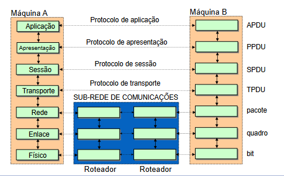
- Modelo OSI (de referência)
- criado por universidades européias
    - modelagem acadêmica
    - mais pensado antes de executar
- funcionaria pra qql tipo de rede e protocolo
- na coms lógica só o receptor se preocupa em entender
    - só quem abre é a msm camada na outra máquina
- primeira boa versão veio depois q o TCP/IP tava bombando
    - http foi pensado pra funcionar em TCP/IP
    - internet era mais simples q o modelo OSI
- n necessariamente precisa usar todas as camadas
    - n tem roteamento em LAN
    - rede n deve exigir todas as camadas
A divisão da rede em camadas é uma ideia absolutamente interessante e deve ser levada em conta; todavia, colocar camadas demais, que seja necessário utilizar banda pra dizer que elas não serão utilizadas, pode ser um problema.
Mas esse é um modelo teórico, o mais utilizado hoje (desde sempre, afinal foi o mais prático de implementar e foi feito pelos "inventores" da internet) é o modelo de 4 camadas.
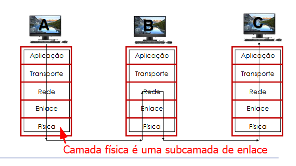

### nível físico
- transmissão de bits pelo meio físico
- detém o controle de acesso ao meio 
### nível de enlace
- quadros (frames)
- detecta erros de transmissão e pode tentar corrigi-los
- parte em software outra em firmware - permanente dentro da placa de rede
### nivel de rede
- roteamento e localização
- sedex do processo
- entrega como o processo certo
### nível de transporte
- preocupação entre os dois pontos finais
- quem localiza e entrega a mensagem
- gerenciamento de processos
- cuida da ordem certa pra entrega na aplicação
### nível de sessão
- tempo máximo de interação
### nível de apresentação
- formatação dos dados pra aplicação
- compressão de dados e descompressão seria aqui
    - inclusive criptografica
    - aplicação n precisa entender nada
### nível de aplicação
- terminal
- jogo
- etc...
- criação dos programadores

### TCP/IP
- aplicação
    - FTP (arquivo), SMTP (email), HTTP (web)
- transporte
    - TCP (conexão), UDP (transferência não confiável - não existe no modelo OSI, n entra nos parâmetros, serve só pra transmissão de dados rápida)
    - garantir q a msg chega no nível de transporte pode gerar uma lentidão pq o protocolo precisa cuidar do reenvio do pacote
    - identifica as portas abertas das aplicação e entrega os pacotes (se a aplicação existir, caso contrário o pacote é descartado)
- rede
    - IP
- enlace (junto do físico)
    - arestas da rede
    - ligações entre os hosts
    - PPP, Ethernet
- físico
    - bit no cabo

### Coms
- cada camada consegue ver o q a outra camada fez
    - comunicação horizontal
- Overhead é o cabeçalho da informaçao e vem de cima
    - comunicação vertical
- roteador só abre a rede pra saber onde precisa mandar

### Camadas e protocolos de dados
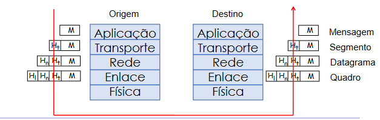
- comunicação é sempre com socket
    - são as portas entre as camadas
- dados gerados são mensagens
- cada camada mete um cabeçalho em cima (uma porta)
    - aplicação envia dados pras camadas abaixo - mensagem
    - transporte tem a porta da aplicação e quem tá mandando - segmento
    - ordenação da mensagem
    - rede precisa saber o tempo de vida dele (pacote pode se perder) - datagrama
    - enlace precisa do sabeçalho dele pra fzr validação de erros - quadro 
- aplicação cuida da camada de sessão

## Atrasos
Sempre existirá atraso/latência, é fisicamente impossível viver sem isso.
Assim sendo, a maior parte do trabalho é voltado para diminuir o tempo de transmissão, já que isso é relacionado à largura de banda.
- pra cada enlace
- 5 tipos diferentes de atrasos
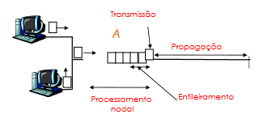

### dproc - processamento nodal
- precisa abrir todos os cabeçalhos e identificar pra onde precisa mandar
- pequeno hoje em dia
### dqueue - enfileiramento
Aqui é importante dizer que essas filas existem para entregar os pacotes da maneira correta no ponto de destino. Eles precisam estar organizados para que possam ser lidos propriemente.
Quando um link está congestionado, quase certamente o buffer de dados está completamente cheio e aquele não é mais um caminho interessante, apesar de ser batante rápido.
Além disso, não adianta ter uma alta capacidade de banda se o roteador/roteador de borda não consegue acompanhar
- filas podem ser grandes no buffer
- pode ser 0 se n tiver ngm na fila
### dtrans - transmissão
- tempo pra colocar os bit no enlace
- tempo pra colocar o fluxo de bits dentro da rede
- Taxa R - largura de banda
    - Ethernet - 10Mbps, taxa de R=10 Mbps
- aumenta com uma taxa de transmissão menor
- L = taxa de bits
- L/R -> tempo de transmissão (pacote completo)
### dprop - propagação
- tempo q o bit leva pra chegar da máquina té o access point
- velocidade pelo espaço
- sempre na mesma velocidade
- D(distância)/S(velocidade) -> tempo de propagação
- luz trafega a ~2.10^8m/s dentro da rede
### dnodal - nodal total
- soma de todos

### Descarte de pacote
Conforme a necessidade de tráfego aumenta a quantidade de pacotes perdidos também cresce.
Normalmente n é muito perceptível pois não muitos pacotes se perdem, mas é notável quando uma página normalmente rápida demora a carregar ou uma música em streaming começa a cortar o áudio e criar gaps.
- pacote pode se perder
    - n chegar no destido ou ser descartado
- se a fila ficar cheia é morte

## Exercícios
1.) Considere dois hosts A e B, conectados por um Unico enlace com taxa de R bits por segundo (b/s). Suponha que
estes dois hosts estejam separados por d metros, e que a velocidade de propagação neste enlace seja de s metros
por segundo. O host A tem que enviar um pacote de L bits ao host B. Pede-se:

a) Escreva o atraso de propagação dprop em termos de d e s.
**A propação desse pacote terá o cálculo de dprop=d/s**
b) Determine o tempo de transmissão dtrans, em termos de L e R.
**dtrans=L/R**
c) Suponha que o host A comece a transmitir o pacote no instante t = O. Neste caso, no instante t = dtrans onde estarå
o último bit do pacote? Justifique.
**O último bit do pacote vai estar dentro do link de rede pronto pra percorrer todo o caminho**
d) Suponha que dprop é MAIOR que dtrans. Onde estará o primeiro bit do pacote no instante t = dtrans ?
**Dentro do link físico de rede**
e) Suponha dprop seja MENOR do que dtrans. Onde estará o primeiro bit do pacote no instante t = dtrans ?
**Ainda vai estar dentro do link de rede junto com o resto do pacote**
f) Suponha que s = 2,5x10^8 m/s, L= 100 bits e R = 28 Kbps. Para qual distância d temos dprop igual a dtrans?
```sql
dprop = dtrans
d/2,5x10^8 = L/R
d/2,5x10^8 = 100/28
d = 892 857,14285714285714285714285714 km
```
g) Considere dois hosts X e Y, conectados por um Unico enlace com taxa de 50 Mbps. Estes dois hosts estão separados
por 300 quilômetros, e a velocidade de propagação neste enlace é de 2,5x10^8 metros por segundo. Que tamanho de
pacote seria necessário para que o atraso de transmissão fosse igual ao atraso de propagação?
```sql
enlace = 50 Mbps
d = 300 km
dprop = 2.5x10^8 m/s

dtrans = dprop
L/R = d/s
L/50 = 300 000/2.5x10^8
L = 0.06 Mb
L = 61,44 kb
```

DATA: 21/Mar/24
# Camada de aplicação; Protocolo HTTP e FTP
Existem poucos protocolos para a camada de redes, mas diversos pra aplicação. A diversidade de aplicações deve ser comportada por vários protocolos diferentes que, muitas vezes, são específicos de uma aplicação x ou y.
Como dito antes, as comunicações entre as camadas de rede se dá por *portas* ou *sockets*. Eles podem chegar a casas de 60 mil, mas algumas dessas portas já são conhecidas e reservadas pelo OS para determinados protocolos de aplicação. Algumas das mais famosas são a 80 (http), 443 (https) ou 108 (IBM Systems Network Architecture (SNA) gateway access server).
O endereçamento, claro, é feito com endereços IPv4.
- por mais q tenha conceitos acima, é sempre cliente e servidor pros dois lados se entenderem
- os protocolos todos dependem bastante de sockets
- camada mais próxima dos usuários
- o servidor DNS usa o protocolo DNS
- aplicação pede serviçço pra todos
- protocolo IP n se preocupa em integridade de pacote por exemplo
- cada protocolo faz uma tarefa só
- cada aplicação tem um protocolo específco (alguns mais q 1, email, por exemplo)
    - ficariam complexo e atrasado pra gerenciar
- essa camada é a razão da rede existir
- distribuição de no mínimo 2 pontos
- toda aplicação tem comunicação por troca de mensagem
    - a rede trata tudo como mensagem transmitida por pacotes
    - a única mudança é na apresentação
- ainda não são a aplicação
    - é só uma parte
    - quais mensagens são trocadas e como responder as msg
- o OS n entra mto na jogada pq a organização é uma mensagem entre processos de duas máquinas diferentes
- primeiramente precisa definir
    - tipo de mensagem trocada
        - pedido é diferente de resposta
- paradigma cliente-servidor
    - solicitação de serviço e entrega
- API - Application Program Interface
    - definição da interface de comunicação pra camada de transporte
- socket
    - já é a camada de transporte
    - = tomada
    - porta API da internet
    - aquela porta é do servidor/cliente como a internet
- precisa existir uma comunicação pra saber qual processo pediu/recebeu
    - endereço IP do outro processo - IP ADDRESS
        - IP identifica a interface de conexão, n a máquina
        - depois precisa identificar qual porta o aplicativo tá usando
        - normalmente servidores estão na porta 80
        - nos servidores tem uma porta q fica só ouvindo e assigna pra outras portas a conexão com clientes
        - dois pontos dps do IP identificam a porta
## características de trasnporte
Algumas vezes é aceitável ter uma perda maior de dados em favor de uma maior velocidade de funcionamento de uma aplicação, como em streamings, em outras, a qualidade e confiabilidade tem mais valor, como em transações bancárias.
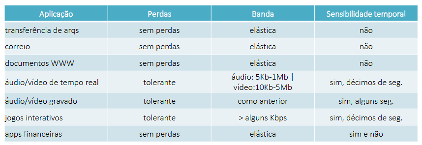

- posso ou n perder dados?
    - algumas podem
        - streaming de áudio pode perder dados, ela n mata a aplicação
    - outras n
        - operações bancárias n podem ter perda de dados de maneira nenhuma
- temporização
    - a latência deveria ser a mínima possível pra n estragar a experiência
- largura de banda
    - aplicações de multimídia requerem pouca banda pra funcionar mas é bastante sensível
    - outras n precisa necessariamente de largura grande, são elásticas, o problema é a velocidade de transmissão

### TCP
- orientado a conexão
    - conexão lógica
    - existem mensagens de estabelecimento de conexão antes da aplicação
    - comunicação constante
    - protocolo se responsabiliza pela entrega
- controle de fluxo
    - impôe um limite de tratamento de mensagens para as máquinas n terem overload
    - placas de rede tem buffer
    - a ordem de entrega precisa ser correta
    - garante n afogamento dos switcher dentro da rede
- controle de congestionamento
    - roteador do meio do caminho tá com buffer cheio e descartando pacote
        - se mta mensagem estiver sendo lançada, ele obriga a aplicação a segurar pra desengarrafar
    

### UDP
Apesar de parecer inútil, esse protocolo é bem mais rápido e viabiliza o streaming de áudio e vídeo (por isso a qualidade é ruim grande parte das vezes).
- não orientado a conexão
    - transferência de dados não confiável
    - sem garantia de nada
    - rede n tem responsabilidade nenhuma
        - a aplicação pode ter alguma responsabilidade de garantir a coms com o server
- a aplicação precisa fzr a bufferização nesse caso
- se acontecer congestionamento azar
- temporização e banda mínima n são garantidas
- O UDP é usando quando precisa de muita velocidade de entrega - fluxos constantes e erros são tradados na aplicação
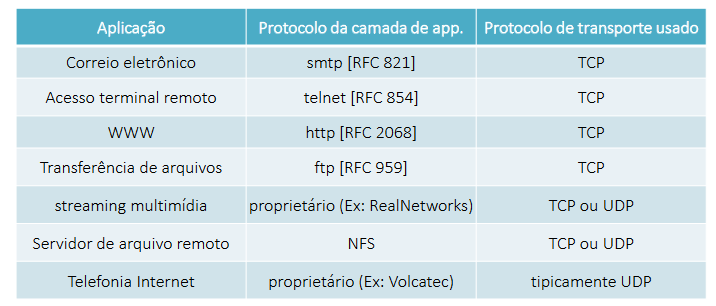

## HTTP e FTP
### HTTP
- HiperText Transfer Protocol
- WWW
- criado pelos suiços
- troca de dados na web é feita por HTTP
- camada de aplicação
    - faz uma request e o outro dá uma response
- http1.0 - 1945 -> versão absurdamente burra (funcionava só no laboratório)
- http1.1 - 2068
- usa TCP - orientado a conexão
- socket é sempre a porta 80
- processo começa sempre rodando o handshake do TCP (servidor precisa aceitar antes de pedir os pacotes e trocar as mensagens)
    - depois encerra a conexão azar
- http é stateless
    - guardar estado é coisa de browser (cookies)
    - manter login aberto é coisa de cookie
    - manutenção de estado é bastante complexo

#### Conexão não-persistente
- sempre exatamente uma requisição e fecha a conexão
- se tem 11 objetos tem 11 conexões geradas
- http ainda n tinha a configuração de uma web page -> geração de problemas
- as especificações RFC1945 e 2616 dizem como os browsers devem se comportar
- sempre 2 RTTs pra trazer cada objeto
- sobrecarrega a rede
- sempre alocava recurso pra conexão nova
- browsers costumavam abrir conexões paralelas
    - alocava muito do sistema operacional

#### RTT
Esse modo de contar o tempo de uma conexão TCP é interessante. Quanto menos RTTs se usa pra gerar uma conexão, normalmente significa que ela "trava" menos, devido ao menor custo de pacotes e banda.

- Round Trip Time -> tempo de iniciar a conexão e fechar uma conxão
- 1 RTT estabeleceu meu handshake
- tem uma sobrinha no RTT de informação por causa do atraso de transmissão
- o cálculo é sempre em RTT + tempo de transmissão

#### Conexão persistente
- deixa a porta aberta por um certo período de tempo
    - na aplicação, se n rolar um novo pedido em 30s pd fechar
- ao invés de abrir uma conexão toda vez ele pede tudo de uma vez só
- 2 RTTs pra tudo
- http usa tudo de uma vez só
- ainda permitia paralelismo
    - chamava o index uma vez só, mas todos os objetos em paralelo
    - padrão no http

### WWW
- tudo q precisar puxar de outra pasta dentro do código é um objeto
    - td q tiver dentro do endereço do ip
- o agente é o browser
- servidor web é o www - normalmente montados em apache

## Portas
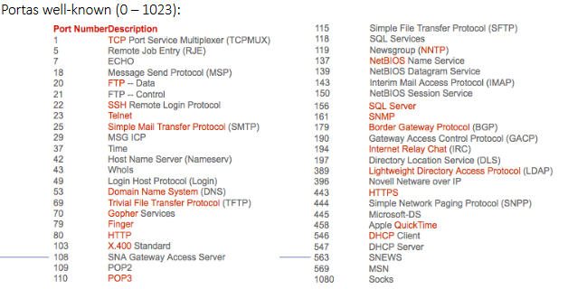
- comunicçaão de 2 host
- 4 informações
    - IP origem
    - IP destino
    - Porta origem
    - Porta destino
- no pedido o cliente sempre manda IP e porta dele junto
- esses dados formam uma tupla
- o q muda de verdade é a porta destino
- sempre indique a porta de origem
- n dá pra adivinhar a porta q o servidor usa
    - existem algumas well-known ports
        - http é 80 por exemplo
        - protocolos básicos tem portas definidas
        - 1023 primeiras portas dos OS já são utilizadas
        - 1024 até 65535 dá pra usar de boa
    - sempre tem a porta "listener" - fica escutando os pedidos
        - dps cria uma thread nova e joga uma porta porta mesmo lá dentro

DATA: 04/Abr/24
## Tipos de mensagem HTTP
- Existem 2 tipos:
    - pedido
    - resposta
- Essas mensagens são transmitidas em ASCII (legível por humanos)
- As mensagens de requisição seguem um protocolo parecido com o seguinte:
*protocolo de GET*
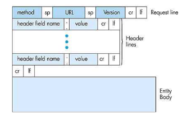
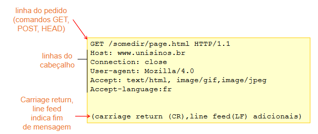

*protocolo de GET response*
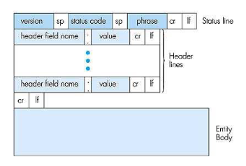
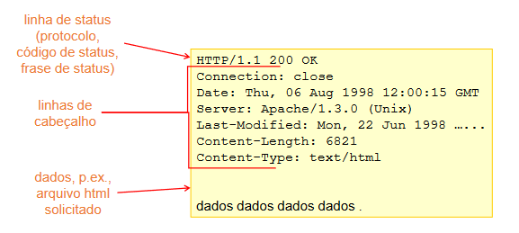

### POST
- usado em páginas com formulários de entrada
- dados preenchidos e enviados pelo browser para o servidor
- normalmente associado à páginas de login

## Códigos de status https
https tem vários códigos de status para indicar a situação da conexão, alguns deles são:
• 200 OK: Sucesso. Objeto pedido segue mais adiante nesta mensagem.
• 301 Moved Permanently: Objeto pedido mudou de lugar, nova localização especificado mais
adiante nesta mensagem (Location:)
• 400 Bad Request: Mensagem de pedido não entendida pelo servidor.
• 404 Not Found: Documento pedido não se encontra neste servidor.
• 505 HTTP Version Not Supported:Versão de http do pedido não aceita por este servidor.

## Cookies
Pra isso funcionar o server manda um set-cookie a pega os dados do user. Ele os guarda dentro do servidor mesmo e entrega um ID pro browser. A validação mais simples é de esse ID ser o mesmo entregue na hora da coleta dos cookies, aí dá show.
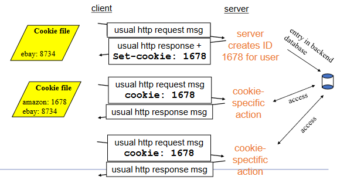

- idea de estado na conexão
- o browser segura algumas informações
    - ou o servidor mesmo
- se ainda n tiver cookies ele manda tu aceitar
    - manda um cabeçaho com set cookie 
    - depois o cookie sempre via ser armazenado
- carrinho de compra, login, preferências do site, etc
- servidor sempre verifica se já tem cookies
    - a resposta pede um set-cookie e um código praquele usuário
    - o servidor pega as informações específicas do banco de dados
    - a relação é do browser com o server

## Cache www
A ideia desse cache é diminuir o tempo de acesso à alguma informação requisitada.
Funciona em sua totalidade quando muitos usuários de uma rede acessam determinado tipo de conteúdo (veja que esse servidor de cache normalmente fica na boa da conexão da rede com a internet externa)

- proxy
- aproximar cliente do servidor
- era proxy de rede
    - servidor na entrada da rede
- antes de entrar no site vai no proxy ver as informações q precisa tão lá
    - economiza uma viagem longa de server
- alguns browsers tem um proxy interno pra facilitar ainda mais (f5 pra buscar versões novas)
- sites bastante acessados evitam fluxo de informações com servidores de proxy antes de chegar no servidor principal
    - às vezes a informação do proxy são meio defasadas
- é valido colocar na entrada da rede pra evitar problema

### GET condicional
Funciona como um pedido pra atualizar o servidor de cache WWW

- vai no proxy e o proxy mandar uma msg pra ver a última modificação
- se tem GET condicional ele **precisa** verificar com o server origem
- verifica com base na data do último pacote

## FTP - transferência de arquivos
- servidores remotos p/ arquivos
- server é só um hospedeiro
- porta 21
- vai ter user interface ou linha de comando
- usa TCP -> conexão de controle
    - persistente
    - p/ interface gráfica
    - dá pra dx o dia inteiro aberto q n usa banda pra nada
- em baixo tem uma conexão na porta 20 pra mandar os arquivos
    - não-persistente
    - ela dura durante a execução de um comando de contrle
- google drive é em FTP por exemplo 
    - dá pra baixar as parada pelo menos

# Sockets
- Todas as linguagens de programação usam sockets
- sempre usam sockets quando precisa de redes
- aplicações normalmente usam a rede
    - ou seja, elas precisam cair na camada de transporte
- uma interface de habilitação de porta
- só precisa entregar pro OS e tá livre
    - quem cuida do resto e como o TCP entrega é o OS e azar
- linguagens de mais baixo nível pegam diretamente em sockets
- pra comunicação acontecer o server precisa estar de pé
- o server escolhe uma porta pra rodar
- preciso saber o IP do customer e do server
- quando cria o socket ele cria uma conexão TCP (caso seja TCP msm)
- com um firewall levantado n vai deixar passar
    - deixa o firewall levantado pelo amor de Deus

## Exercícios
1 - Por que o HTTP e o FTP rodam sobre TCP e não sobre UDP?
**Porque são protocolos de informação e precisam de garantia de entrega.**
2 - Por que se diz que o FTP envia informações de contrle "fora da banda"?
**Porque ele mantém uma conexão intermitende pela porta 21 entre servidor e cliente, ou seja, os dados de controle não são enviados juntos com os pacotes na porta 20**
3 - Descreva como o cache WWW pode reduzir o atraso na recepção de um objeto desejado. O cache Web produzirá o atraso para todos os objetos requisitados por um usuário ou somente para alguns objetos? Por quê?
**Sim, o cache Web auxilia no atraso na recepção uma vez que ele mantém as informações mais próximas do cliente, que agora não precisa mais ir até o servidor de origem pegar os dados todos. Claro, o cahce Web vai manter as informações depois que elas passarem por ele apenas, então o atraso da primeira vez ainda existe caso você seja o pioeniro, mas seu coleguinha vai ter o benefício, enquanto a informação durar no cache Web pelo menos. Mas o benefício é apenas para alguns objetos, já que volta e meia uma requisição GET condicional obriga o cache a perguntar para o servidor origem se alguma atualização existe, se sim, os pacotes novos são requisitados pelo cache e existe um atraso para o pioneiro denovo.**

DATA: 06/Jun/2024
# Camanda de transporte
Essa camada lida com as aplicações e dados.
Usualmente os dados devem já estar tratados na camada de enlace, mas a de transporte age como última instância e auxilia os dados a serem estruturados.
Não se preocupa com *qual* terminal a mensagem deve ser entregue, esse é o trabalho da camada de Rede.
Um dos trabalhos dessa camada é entender onde (qual aplicação) os pacotes devem ser entregues.
- Sempre identifique host e aplicação
- porta destino precisa ser identificada pra entender onde entregar o pacote
- essa camada é logo abaixo da aplicação
    - 3° camada
- na identificação de conexão é trabalho do cliente mandar os dados

# UDP
Protocolo de rede mais básico e menos confável no sentido de garantir a entrega da mensagem. Mas ele não corrige nenhum dos erros possíveis dentro da rede e deixa a mensagem quebrar se acontecer. Ele até pode avisar, mas o trabalho de reenvio e verficiação de erros deve ser feito nas costas do programador.
Vale lembrar que apesar de ser um protocolo pouco confiável, ele é ótimo para realização de streaming de qualquer tipo. 

- modelo mais básico de transporte
    - nem se encaixa no modelo OSI
    - não é confável
    - até identifica erros mas não corrige nada
- não estabelece conexão lógica
- sabe identificar a mensagem e dizer qual das aplicações precisa da mensagem
    - mensagens pequenas normalmetne usam UDP porque não é tão caro mandar denovo
- precisa lidar com quase todas as características de confiabilidade
    - como o UDP não avisa nada, todo o trabalho deve ser feito nas costas do programador
    - se vira aí pra ver se a mensagem chegou e se tem erro de conexão
- datagrama/pacote é streamado na rede formando um cabeçalho
- tudo desenhado com 32bits

0             16|16            31
----------------|----------------
Porta Origem    | Porta Destino 
Tamanho         | Checksum
Dados           |   Dados

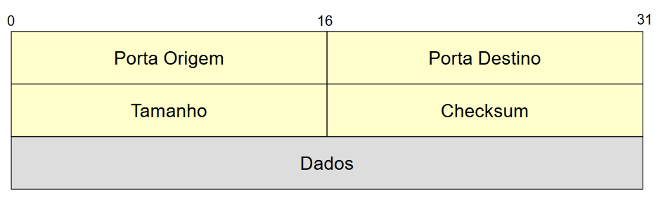

*Cabeçalho da mensagem de verdade*

O arquivo fica dividido em blocos de palavras de 16bits como mostrado na imagem.
Os dados ficam abaixo desse pseudocabeçalho e existe uma flag no final que indica o começo dos dados de verdade.
Um dos pontos interessantes aqui é a presença de Checksum, que faz uma verificação simplista da integridade dos dados. Ou seja, o UDP até pode avisar que os dados estão meio quebrados, mas não faz nada quanto a recuperá-los.

- tamanho total do pacote (cabeçalho mais dados)
    - relacionado a contagem de octetos (bytes)
    - menor pode ser 8 (64bit - tamanho do cabeçalho - divide por 8 = 8)
- checksum
    - existem vários tipos de técnicas pra verificação de erros
    - pra verificar se o datagrama contém erros


- dados
    - a mensagem basicamente

## Encapsulamento
O UDP ainda usa a lógica de encapsulamento uma vez que permanece dentro da logica das camadas de rede:
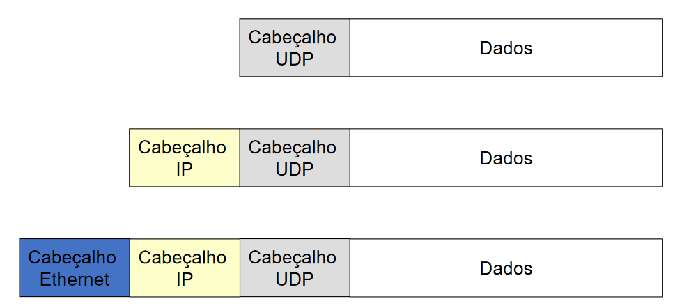

Mutiplexação e demultiplexação são baseados nisso
    - pegar os dados e jogar os cabeçalhos encima
    - UDP
    - IP
    - Ethernet
    - vai tudo pra rede saber qual porta passar e etc

### Multiplexação
    - acrescentado dados de mais camadas
    - adicionando informações
### Demultiplexação
    - olha e retira os dados adicionados para saber onde entregar
    - retira os cabeçalhos de camada e entrega os dados puros
- Erro ICMP - port unreacheable - Porta Inalcansável
- não ter sequenciamento de mensagens faz bastante falta

- só entrega mesmo
- aplicações como Voz sobre IP (VoIP) precisa desse tipo de simplicidade
- quando se fala em segurança é a garantia de chegar no outro lado, não de ser facilmente invadida

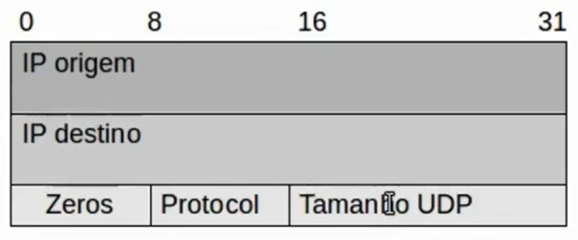

## checksum
- se todos os valores forem zero é a marcação pra não usar
- o cálculo do checksum é feito com base no pseudocabeçalho (que não é transmitido, só usa pra calcular checksum)
    - soma o cabeçalho + cabeçalho + dados UDP
- ideia do UDP é ter pouco overhead
    - checksum é opcional
    - só meter uns zeros se n quiser usar
- aumenta o número de dados transmitidos
    - pega um pseudocabeçalho
    - aumenta o número de valores do cálculo durante a repetição
    - não é enviado pela rede, só é feito o cálculo
- cálculo do checksum
    - soma sempre 16bit com 16bit
    - se estourar o tamanho ele retorna os estourados e soma-os no resultado
    - ou ele só vai descartando todas as casas que sobram
    - mete um complemento de um
        - inverte 0 com 1 e vice-versa
- o destido calcula do checksum denovo com os dados que chegaram
    - se qualquer coisa for diferente ocorreu uma falha
    - soma tudo com o complemento de 1 do checksum do destino
    - somar tudo com o remetente em complemento de 1 vai resultar em zero
- Checksum é todo feito com somas e complemento de um pra ser o mais leve e mais rápido de calcular possível
    - soma é a operação de execução mais rápida de das ULAs (consequentemente dos processadores)

# TCP
TCP foi muito importante na história das redes pra definição de processos mais seguros e livres de erros
Todas as validações de segurança são garantidas, inclusive recuperação de dados de pacotes.
A utilização de Buffers auxilia na manutenção da ordem de entrega dos pacotes (evita engasgos ou reloads em jogos online, por exemplo). Conexão full duplex (A -> B e B -> A)
O funcionamento básico dos ACKS consiste em timers mesmo, se mandar e não obtiver resposta dentro de um tempo específico, vapo neles e manda outro.

- implenta TODAS as funcionalidade q o UDP não faz
- implementação absurdamente mais complexa
    - overhead bem maior
- pensado pra funcionar independente dos erros da camada de enlaçe 
    - o resto pra baixo *não é confiável* - pelo menos nos ealy days
- é melhor para tratar grandes volumes de dados
- orientado a streams
    - fluxo de bits
    - eras
    - durante todo 
- circuito virtual
    - sabe onde o pacote está e mantém comunicação constante
- transmissão bufferizada
    - ele guarda o que cehgou e joga na fila
    - sem o buffer ele n guarda as informações enquanto uma interrupção não trigga
    - cada aplicação transmite o quanto quiser
    - dá pra dividir da maneira que quiser
        - se guardar na sequência correta dá pra dividir em vários pedalços de pacote
    - sempre manda o maior pacote possível dentro do enlace
- conexão full-duplex
    - da A -> B e de B -> A
- funciona com **Confirmação Positiva com Retransmissão**
    - *Positive Acknowledgement with Retransmission*
    - o destinatário responde com mensagem de confirmação (ACK)
- o pacote é enviado com um certo tempo pra retornar o ACK
    - se n voltar nesse tempo ele manda o pacote denovo
- se o ACK se perde o TCP manda o pacote denovo
    - mas do outro lado ele identifica o pacote igual e manda outro ACK
    - funciona bem em redes com pouco fluxo
    - com muito fluxo ir e voltar pode ser um problema
        - sobrecarregamento de rede
## janela variável 
- o tcp diferencia o tamanho dos pacotes dependendo da rede q ele está
- fragmentação de pacotes funciona dentro da TCP - ainda precisa entregar os pacotes fragmentados tds juntos 

## Pacote TCP
- segmento ou pacote - unidade
- o ack pode ser retornado com um piggyback e a informação necessária/pedida
    - quando n demora tanto pra acessar a informação
- cabeçalho e dados
- header de TCP é bastante maior que o anterior
- porta origem e destino (16bit)
- sequênca (num pacote) - 32bit e ACK
- tem uma parte reservada pra uso futuro (ainda n foi usado)
- tem algumas flags e montagens de opções do header ainda pra poder ordenar o esquema
- tamanho do cabeçalho é em palavras de 32bit
    - tem no mínimo 5 se opção nenhuma
    - o tamanho do cabeçalho diz quando chega na parte de informações

## Opções TCP
- opções tem 1 octeto de possibilidades
    - pode mostrar e arrumar o tamanho mínimo de pacote (ou máximo)
    - MTU - TAmanho de Pacote Máximo
        - capacidade de rede
        - o link de conexão já faz a checagem do menor link de rede
        - o máximo tem a capacidade do menor
        - maior pacote possível q caiba e tds os links
        - ainda pode dar errado e os pacotes mudarem de path
            - existe fragmentação
- Go-back-N - substituido pela retransissão seletiva
- retransmissão seletiva - pode guardar pacotes e todos os pacotes tem ACK
    - tds tem timer
    - 2 lados com janela
    - buffer no lado receptor
    - ainda vai mandar todos mas eles ficam esperando o atrasado chegar

## abertura de conexão
- handshake dos dois lados
- controle de conexão
    - estabelecer
        - handshanke de 3 vias
        - msg c/ flag SYN
        - retorno SYN e ACK
        - ACk de confirmar a conexão
    - transmissão
        - 
    - encerramento
        - encerra de um lado antes e o outro ainda funciona enquanto a onexão precisar disso
        - normalmente termina com 4 mas sem dados pra serem transmitidos dá pra ser com 3 tbm
    - aqui ele usa o RST pra restartar se necessári

## Política de transmissão
- buffer sempre diz o tamanho da janela q ele tem possível e confima as parada

## Síndrome de Janela Boba
- manda atualização de janela minúsculas
- resolve mandando o MSS ou o tamanho da metade do buffer quando for liberada
    - é o maior pacote q ele pode mandar

### Exercícios de revisão para prova
1 - Marque V para as sentenças verdadeiras e F para as falsas. Justifique as que julgar serem falsas
(cada resposta errada anula uma correta). ATENÇÃO: justificar não significa arrumar a sentença,
mas sim explicar o motivo de estar errada.
a. [ F ] O Modelo OSI possui 7 (6) camadas e é amplamente (poucamente) utilizado nas redes de
computadores.
Modelo OSI possui 6 camadas (Aplicação, Apresentação, Sessão, Transporte, Rede, Enlace/Física) e foi uma tentativa europeia para disputar com o TCP/IP, não funcionou muito.

b. [ F ] São protocolos da Camada de Aplicação: HTTP, FTP, SMTP, TCP(Transporte), POP e IMAP.
TCP é um protocolo da camada de Transporte. O resto são protocolos de aplicação.

c. [ V ] A utilização do GET Condicional diminui o tráfego na Internet.
Sim, partindo do princípio que os servidores de Proxy estarão ativos e guardarão a informação do GET usual mais perto dos usuários e o GET Condicional vai atualizar esse servidor.

d. [ F ] O POP é um protocolo utilizado por usuários nômades, que acessam seus emails em
computadores diferentes, possibilitando que seus emails não fiquem "divididos" em
várias máquinas.
O protocolo POP é realmente um protocolo para troca de emails; todavia, ele baixa a imagem do servidor no computador e não deixa uma cópia dentro do servidor. Ótimo para segurança, mas ruim para os usuários nômades que precisam acessar em mais de um dispositivo.

e. [ F ] Cookies servem para informar ao usuário quando um vírus está presente no anexo
do email.
Cookies servem para salvar o estado de uma página no servidor, relacionado ao usuário. 
Podem ser usadas para autenticação, carrinho de compras, alguma mensagem por fazer, etc.
Salvam estados, não relacionada com vírus em email.

f. [ F ] O HTTP Persistente com paralelismo é um pouco mais lento que o HTTP Não-
persistente.
O HTTP persistente vai ser mais rápido a partindo do princípio que ele não precisa enviar várias mensagens para estabelecer conexão e envia todos os pacotes de uma vez só. Sendo paralelo envia ainda mais rápido.
HTTP não-persistente ainda gasta tempo demais para estabelecer a conexão necessária toda vez que precisa de mais um pacote.

g. [ F ] As mensagens que trafegam pela rede sofrem atrasos. A ordem que os atrasos (os
mais importantes) acontecem é PROCESSAMENTO, FILA, PROPAGAÇÃO e
TRANSMISSÃO.
À princípio, saindo da máquina, a ordem dos atrasos (com os nomes) correta é: nodal (processamento), enfileiramento (fila), transmissão, propagação.

h. [ V ] Uma rede do tipo WAN abrange uma área maior do que uma rede do tipo MAN.
WAN é Wide Area Network (pode ser o mundo todo) - MAN é Metropolitan Area Network - dentro de uma cidade

i. [ F ] O FTP possui 2 conexões TCP persistentes, uma para controle e uma para dados. Por
esta razão, é dito um protocolo que trabalha "fora de banda".
Portas 20 e 21. Porta 21 é para Controle, essa é persistente.
Porta 20 é para dados, não-persistente
A porta de controle *controla* o sistema, ela pede a abertura da 21 se necessário.

j. [ F ] Para enviar anexos nas mensagens de email, o protocolo POP utiliza uma extensão
chamada MIME.
Essa extensão MIME é utilizada como parte do SMTP (recursos adicionais).
Permite mensagens não ASCII, arquivos binários, vídeos e dados de áudio por email.


2. Um grupo de estudantes precisa criar um site na Internet para realizar um trabalho da
faculdade. No servidor, os alunos possuem uma conta (usuário e senha) e transferem (de
maneira remota) os arquivos sempre que precisam atualizar a página (cerca de uma vez por
semana). Considerando o cenário descrito, quais protocolos da camada de Aplicação e
Transporte serão acionados desde o momento em que se necessita fazer uma atualização até
o momento em que a página é visualizada no browser? Explique onde cada protocolo entra no
processo e a camada (da pilha de protocolos TCP/IP) em que se encontra.
HTTPS - Aplicação - HTTP seguro para conseguirem logar no servidor e vencer a criptografia de rede (segurança da informação)
FTP - Aplicação - Para realizarem a troca de arquivos e atualização dos dados do site à partir do momento em que estão logados no servidor.
TCP - Transporte - Para o envio dos pacotes dos dados dos computadores locais dos estutantes até o servidor do site.

Para visualização no browser:
HTTP (ou HTTPS) - Aplicação - Aqui tanto faz, depende da segurança do site, mas à princípio seria o HTTP
TCP - Transporte - Para envio dos dados para a rede. Nesse caso as informações precisam chegar do outro lado; confiabilidade na entrega dos dados é necessária


3. A Internet oferece 2 tipos de serviço: orientado à conexão e não-orientado à conexão. Qual a principal diferença entre eles? Cite no mínimo 2 aplicações para cada um destes tipos de serviço.
Orientado à conexão: 
- confiabilidade da entrega dos dados
- um estabelecimento de conexão entre cliente e servidor
- controle de fluxo de dados para evitar "afogamento"
- controle de congestionamento - a rede tem uma administração quando fica muito carregada

- Interessante para carregar páginas da web e aplicativos de banco

Não Orientado à conexão:
- transferência de dados não é confiável
- não cria uma conexão cliente-servidor, sem confiabilidade, controle de congestionamento, fluxo ou garatia temporal e de banda mínima

- interessante para jogos online (evita engasgos) e streaming de dados (áudio e vídeo)


4. Considere dois hosts X e Y, conectados por um único enlace com taxa de 150 Mbps. Estes dois hosts estão separados por 50 quilômetros, e a velocidade de propagação neste enlace é de 2,5 x 108 metros por segundo. O host X tem que enviar um pacote de 4 Mbits ao host B. Para qual distância d temos dprop igual a dtrans?
R (banda do enlace) = 150Mbps
d (distância) = 50km
s (velocidade) = 2,5.10^8 m/s
L (tamanho do pacote) = 4Mbits

dprop = dtrans
d/s = L/R
d/2,5.10^8 = 4/150
d = 4/150 * 2,5.10^8
d = 6.666.666,667 m = 6.666,667 km -> distância necessária para dprop e dtrans serem iguais para esse tamanho de pacote e essa banda de rede


5. Diferencie meios de transmissão guiados dos meios de transmissão não-guiados. Quais são os 3 meios de transmissão guiados mais comuns em redes? Qual destes 3 é o mais rápido?
Os meios de transmissão guiados utilizam cabos e fibras. Os tipos mais comuns são cabos coaxais, cabos de fibra ótica e cabos de par trançado.

Os meio de de transmissão não-guiados envolvem uso de ondas não passando por guias (cabos). Microondas, infravermelho, wi-fi, são todos meios não-guiados.

Dos 3 meios de transmissão guiados citados, o mais rápido (e mais recente) é a fibra óptica, uma vez que utiliza a luz (maior velocidade conhecida) para realizar a comunicação binária.


### Exercícios: Camada de transporte
1. Qual a vantagem de usar UDP?
Evita engasgos em dados que precisam ser constantemente enviados (como streaming)

2. Quais os campos do cabeçalho do UDP? Descreva-os.
Porta origem - 16bits, valor da porta de origem
Porta destino - 16bits, valor da porta de destino
Tamanho - contagem de octetos - diz o tamanho total do pacote incluindo cabeçalho e dados
Checksum - soma de verificação (cabeçalho e dados) - verifica mas não recupera dados

3. Como é calculado o checksum?
Some todas as palavras (cabeçalho e dados) na origem e faça um complemento de 1.
No destino, se a soma de todas as palavras (cabeçalho, dados e checksum) resultar em zero, pacote tá com tudo certo (pela verificação do checksum ao menos)

4. Simule o envio de 3 mensagens utilizando TCP, sem a ocorrência de erros.
SYN -------------------> Recebe SYN
Recebe SYN e ACK <------ Envia ACK

Envio pacote 1 e ACK --> Recebe pacote 1
Recebe ACK 1 <---------- Envio do ACK 1

Envio pacote 2 --------> Recebe pacote 2
Recebe ACK 2 <---------- Envio ACK 2

Envio pacote 3 --------> Recebe pacote 3
Recebe ACK 3 <---------- Envio ACK 3

FIN -------------------> Recebe FIN
Recebe ACK e FIN <------ Envia FIN
Envia ACK -------------> Recebe ACK

5. Simule o envio de 3 mensagens utilizando TCP, onde a segunda mensagem chegou errada ao destino.
SYN -------------------> Recebe SYN
Recebe SYN e ACK <------ Envia ACK

Envio pacote 1 e ACK --> Recebe pacote 1
Recebe ACK 1 <---------- Envio do ACK 1

Envio pacote 2 ---X----> Recebe pacote 2

Envio pacote 3 --------> Recebe pacote 3 (descartado)
Recebe ACK 3 <---------- Envio ACK 3

Envio pacote 2 --------> Recebe pacote 2
Recebe ACK 2 <---------- Envio ACK 2

Envio pacote 3 --------> Recebe pacote 3 (descartado)
Recebe ACK 3 <---------- Envio ACK 3

FIN -------------------> Recebe FIN
Recebe ACK e FIN <------ Envia FIN
Envia ACK -------------> Recebe ACK

6. Simule o envio de 3 mensagens utilizando TCP, onde o ACK da segunda mensagem não chegou ao destino.
SYN -------------------> Recebe SYN
Recebe SYN e ACK <------ Envia ACK

Envio pacote 1 e ACK --> Recebe pacote 1
Recebe ACK 1 <---------- Envio do ACK 1

Envio pacote 2 --------> Recebe pacote 2
Recebe ACK 2 <----X----- Envio ACK 2

Envio pacote 2 --------> Recebe pacote 2 (descartado)
Recebe ACK 2 <---------- Envio ACK 2

Envio pacote 3 --------> Recebe pacote 3
Recebe ACK 3 <---------- Envio ACK 3

FIN -------------------> Recebe FIN
Recebe ACK e FIN <------ Envia FIN
Envia ACK -------------> Recebe ACK


Considere 2 hosts A e B, com uma conexão TCP já estabelecida. Considere que o host A deseja enviar 17 mensagens para o host B. Sendo os pacotes numerados de 1 a 17 (considere, neste exemplo, que os números de sequência e ACKs são valores inteiros) e uma janela de tamanho 4, desenhe os diagramas para ilustrar o envio das mensagens:

-> Utilizando Go-Back-N, sem erros de envio
Host A                   Host B
SYN -------------------> Recebe SYN
Recebe SYN e ACK <------ Envia ACK

Envio pacote 1 e ACK --> Recebe pacote 1
Envio pacote 2 --------> Recebe pacote 2
Envio pacote 3 --------> Recebe pacote 3
Envio pacote 4 --------> Recebe pacote 4

Recebe ACK 1 <---------- Envio do ACK 1
Recebe ACK 2 <---------- Envio ACK 2
Recebe ACK 3 <---------- Envio ACK 3
Recebe ACK 4 <---------- Envio ACK 4

Envio pacote 5 --------> Recebe pacote 5
Envio pacote 6 --------> Recebe pacote 6
Envio pacote 7 --------> Recebe pacote 7
Envio pacote 8 --------> Recebe pacote 8

Recebe ACK 5 <---------- Envio ACK 5
Recebe ACK 6 <---------- Envio ACK 6
Recebe ACK 7 <---------- Envio ACK 7
Recebe ACK 8 <---------- Envio ACK 8

...

FIN -------------------> Recebe FIN
Recebe ACK 17 <---------- Envio ACK 17
Recebe ACK e FIN <------ Envia FIN
Envia ACK -------------> Recebe ACK


-> Utilizando Retransmissão Seletiva, sem erros de envio
Host A                   Host B
SYN -------------------> Recebe SYN
Recebe SYN e ACK <------ Envia ACK

Envio pacote 1 e ACK --> Recebe pacote 1
Envio pacote 2 --------> Recebe pacote 2
Envio pacote 3 --------> Recebe pacote 3
Envio pacote 4 --------> Recebe pacote 4

Recebe ACK 1 <---------- Envio do ACK 1
Envio pacote 5 --------> Recebe pacote 5

Recebe ACK 2 <---------- Envio ACK 2
Envio pacote 6 --------> Recebe pacote 6

Recebe ACK 3 <---------- Envio ACK 3
Envio pacote 7 --------> Recebe pacote 7

Recebe ACK 4 <---------- Envio ACK 4
Envio pacote 8 --------> Recebe pacote 8

Recebe ACK 5 <---------- Envio ACK 5
Envio pacote 9 --------> Recebe pacote 9

Recebe ACK 6 <---------- Envio ACK 6
Envio pacote 10 --------> Recebe pacote 10

Recebe ACK 7 <---------- Envio ACK 7
Envio pacote 11 --------> Recebe pacote 11

Recebe ACK 8 <---------- Envio ACK 8
Envio pacote 12 --------> Recebe pacote 12

...

FIN -------------------> Recebe FIN
Recebe ACK 17 <---------- Envio ACK 17
Recebe ACK e FIN <------ Envia FIN
Envia ACK -------------> Recebe ACK


-> Utilizando Go-Back-N, com erro na mensagem 6
Host A                   Host B
SYN -------------------> Recebe SYN
Recebe SYN e ACK <------ Envia ACK

Envio pacote 1 e ACK --> Recebe pacote 1
Envio pacote 2 --------> Recebe pacote 2
Envio pacote 3 --------> Recebe pacote 3
Envio pacote 4 --------> Recebe pacote 4

Recebe ACK 1 <---------- Envio do ACK 1
Recebe ACK 2 <---------- Envio ACK 2
Recebe ACK 3 <---------- Envio ACK 3
Recebe ACK 4 <---------- Envio ACK 4

Envio pacote 5 --------> Recebe pacote 5
Envio pacote 6 ---x----> Recebe pacote 6
Envio pacote 7 --------> Recebe pacote 7 (descartado)
Envio pacote 8 --------> Recebe pacote 8 (descartado)

Recebe ACK 5 <---------- Envio ACK 5
Recebe ACK 7 <---------- Envio ACK 7
Recebe ACK 8 <---------- Envio ACK 8

Recebe ACK 6 <---------- Envio ACK 6
Recebe ACK 7 <---------- Envio ACK 7
Recebe ACK 8 <---------- Envio ACK 8
Recebe ACK 9 <---------- Envio ACK 9

Recebe ACK 6 <---------- Envio ACK 6
Recebe ACK 7 <---------- Envio ACK 7
Recebe ACK 8 <---------- Envio ACK 8
Recebe ACK 9 <---------- Envio ACK 9

...

FIN -------------------> Recebe FIN
Recebe ACK 14 <---------- Envio ACK 14
Recebe ACK 15 <---------- Envio ACK 15
Recebe ACK 16 <---------- Envio ACK 16
Recebe ACK 17 <---------- Envio ACK 17
Recebe ACK e FIN <------ Envia FIN
Envia ACK -------------> Recebe ACK


-> Utilizando Retransmissão Seletiva, com erro na mensagem 6
Host A                   Host B
SYN -------------------> Recebe SYN
Recebe SYN e ACK <------ Envia ACK

Envio pacote 1 e ACK --> Recebe pacote 1
Envio pacote 2 --------> Recebe pacote 2
Envio pacote 3 --------> Recebe pacote 3
Envio pacote 4 --------> Recebe pacote 4

Recebe ACK 1 <---------- Envio do ACK 1
Envio pacote 5 --------> Recebe pacote 5

Recebe ACK 2 <---------- Envio ACK 2
Envio pacote 6 ---X----> Recebe pacote 6

Recebe ACK 3 <---------- Envio ACK 3
Envio pacote 7 --------> Recebe pacote 7

Recebe ACK 4 <---------- Envio ACK 4
Envio pacote 8 --------> Recebe pacote 8

Recebe ACK 5 <---------- Envio ACK 5
Envio pacote 9 --------> Recebe pacote 9

Envio pacote 6 --------> Recebe pacote 6

Recebe ACK 7 <---------- Envio ACK 7

Recebe ACK 8 <---------- Envio ACK 8

Recebe ACK 9 <---------- Envio ACK 9
Envio pacote 10 --------> Recebe pacote 10

...

FIN -------------------> Recebe FIN
Recebe ACK 17 <---------- Envio ACK 17
Recebe ACK e FIN <------ Envia FIN
Envia ACK -------------> Recebe ACK